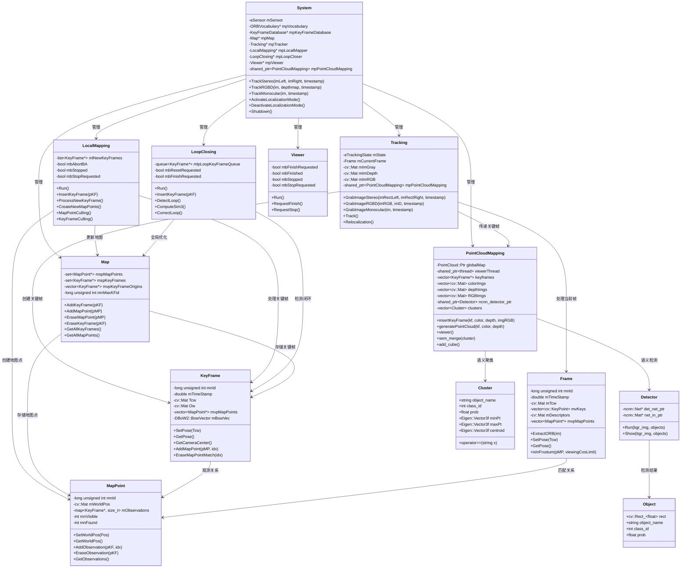
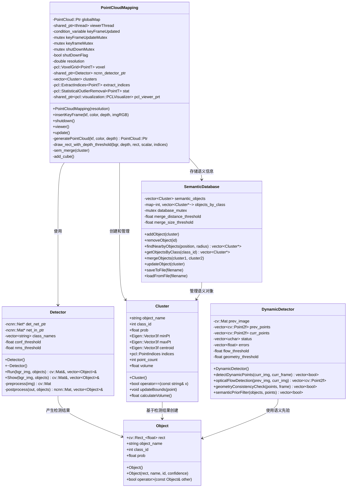
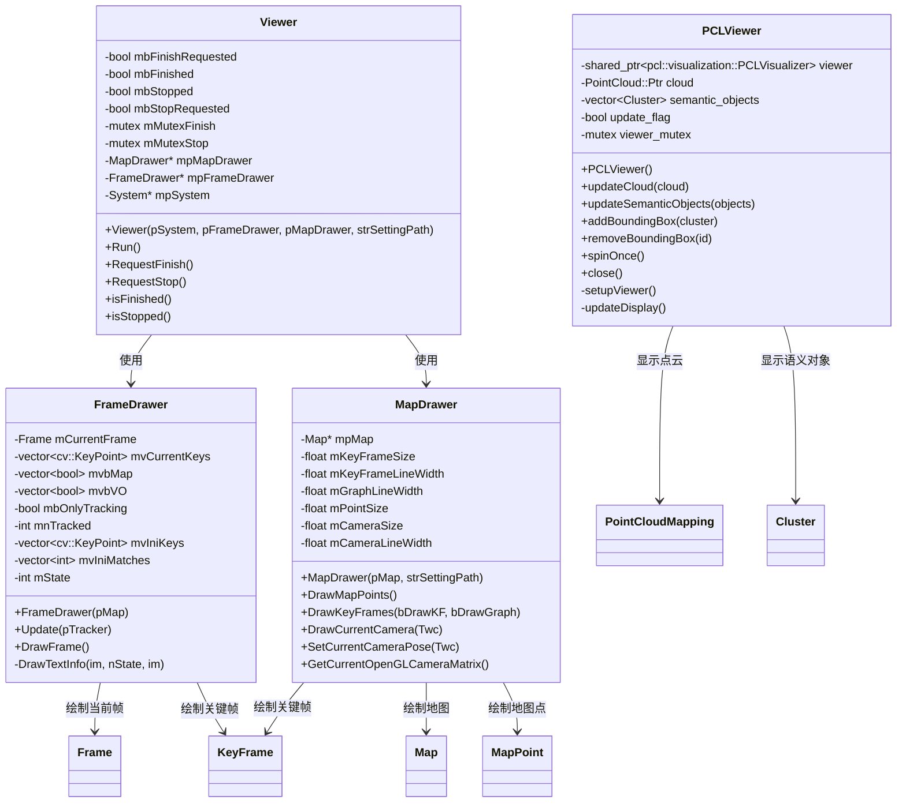

# ORB-SLAM2 SSD语义SLAM系统类图设计

## 核心类关系图

## 语义增强模块类图

## 可视化模块类图

## 数据结构类图

```mermaid
classDiagram
    %% 核心数据结构
    class ORBVocabulary {
        +ORBVocabulary()
        +loadFromTextFile(filename) bool
        +loadFromBinaryFile(filename) bool
        +transform(features) BowVector
        +score(v1, v2) double
    }
    
    class KeyFrameDatabase {
        -vector~list~KeyFrame*~~ mvInvertedFile
        -mutex mMutex
        +KeyFrameDatabase(voc)
        +add(pKF)
        +erase(pKF)
        +clear()
        +DetectLoopCandidates(pKF, minScore) vector~KeyFrame*~
        +DetectRelocalizationCandidates(F) vector~KeyFrame*~
    }
    
    class ORBextractor {
        -int nfeatures
        -float scaleFactor
        -int nlevels
        -int iniThFAST
        -int minThFAST
        +ORBextractor(nfeatures, scaleFactor, nlevels, iniThFAST, minThFAST)
        +operator()(image, mask, keypoints, descriptors)
        +GetScaleFactor() float
        +GetScaleFactors() vector~float~
        +GetInverseScaleFactors() vector~float~
        +GetScaleSigmaSquares() vector~float~
        +GetInverseScaleSigmaSquares() vector~float~
        +GetImagePyramid() vector~Mat~
    }
    
    class ORBmatcher {
        -float mfNNratio
        -bool mbCheckOrientation
        +ORBmatcher(nnratio, checkOri)
        +SearchByProjection(F, vpMapPoints, th) int
        +SearchByBoW(pKF, F, vpMapPointMatches) int
        +SearchForInitialization(F1, F2, vbPrevMatched, vnMatches12, windowSize) int
        +SearchForTriangulation(pKF1, pKF2, F12, vMatchedPairs, bOnlyStereo) int
    }
    
    class Optimizer {
        +static BundleAdjustment(vpKFs, vpMP, nIterations, pbStopFlag, nLoopKF, bRobust)
        +static GlobalBundleAdjustemnt(pMap, nIterations, pbStopFlag, nLoopKF, bRobust)
        +static LocalBundleAdjustment(pKF, pbStopFlag, pMap)
        +static PoseOptimization(pFrame) int
        +static OptimizeEssentialGraph(pMap, pLoopKF, pCurKF, NonCorrectedSim3, CorrectedSim3, LoopConnections, bFixScale)
        +static OptimizeSim3(pKF1, pKF2, vpMatches1, g2oS12, th2, bFixScale) int
    }
    
    %% 初始化器
    class Initializer {
        -vector~cv::KeyPoint~ mvKeys1
        -vector~cv::KeyPoint~ mvKeys2
        -vector~cv::Point2f~ mvbMatched12
        -int mK
        -float mSigma
        -float mSigma2
        +Initializer(ReferenceFrame, sigma, iterations)
        +Initialize(CurrentFrame, vMatches12, R21, t21, vP3D, vbTriangulated) bool
        -FindHomography(vbMatchesInliers, score, H21) bool
        -FindFundamental(vbInliers, score, F21) bool
        -CheckRT(R, t, mvKeys1, mvKeys2, mvMatches12, vbInliers, K, vP3D, th2, vbGood, parallax) bool
    }
    
    %% 关系定义
    KeyFrameDatabase --> ORBVocabulary : 使用词典
    Frame --> ORBextractor : 特征提取
    Tracking --> ORBmatcher : 特征匹配
    Tracking --> Initializer : 初始化
    LocalMapping --> Optimizer : 局部优化
    LoopClosing --> Optimizer : 全局优化
```

## 设计模式与架构特点

### 1. 单例模式
- `System`类作为系统入口，管理所有子模块

### 2. 观察者模式  
- 各线程通过条件变量和互斥锁协调工作

### 3. 工厂模式
- `ORBextractor`根据参数创建不同配置的特征提取器

### 4. 策略模式
- `Optimizer`提供多种优化策略

### 5. 模板模式
- PCL点云处理使用模板类支持不同点类型

这种模块化的类设计使得系统具有良好的可扩展性和维护性，各模块职责明确，便于独立开发和测试。