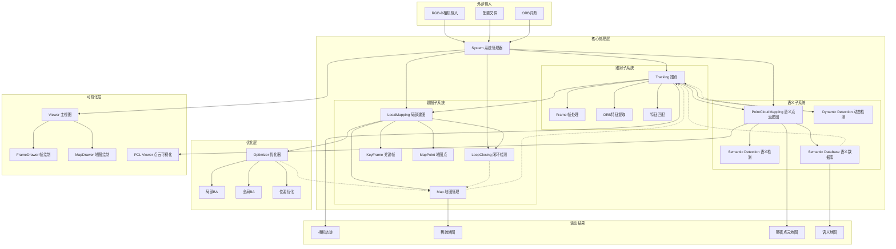
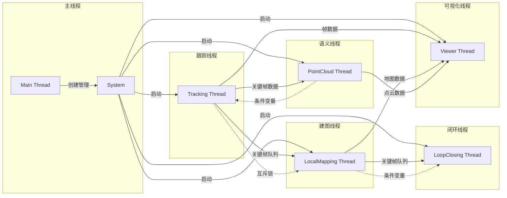
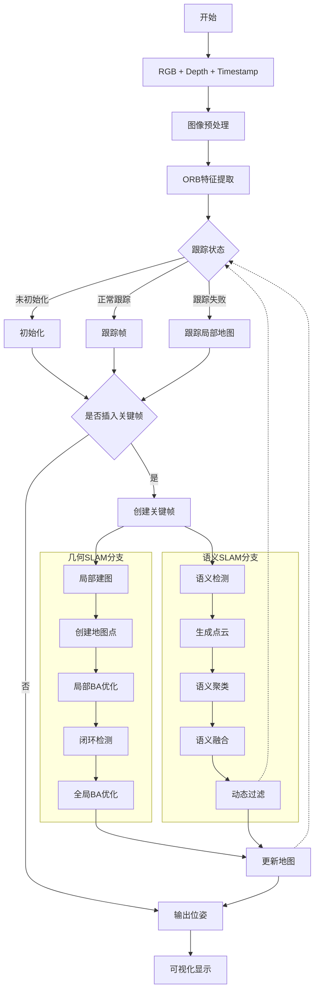
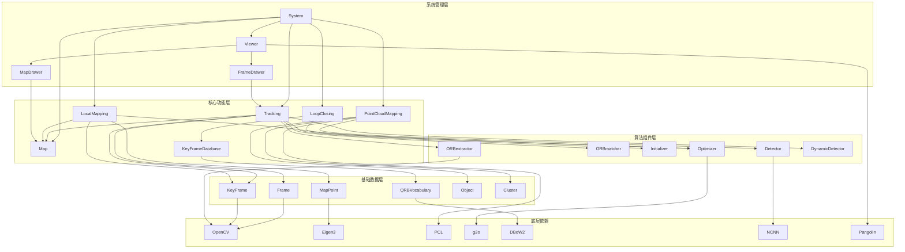
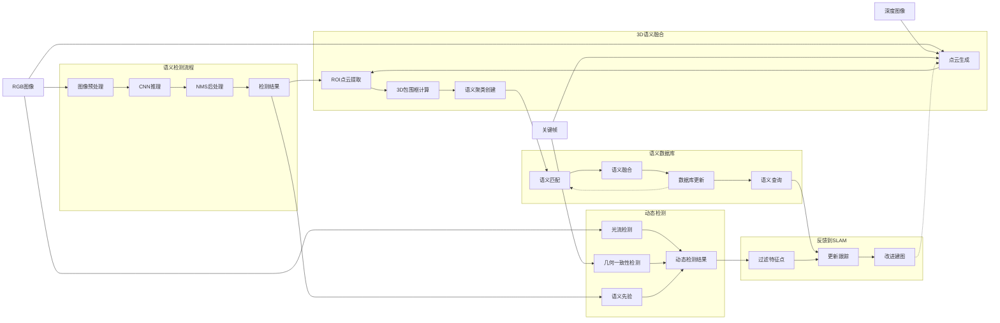
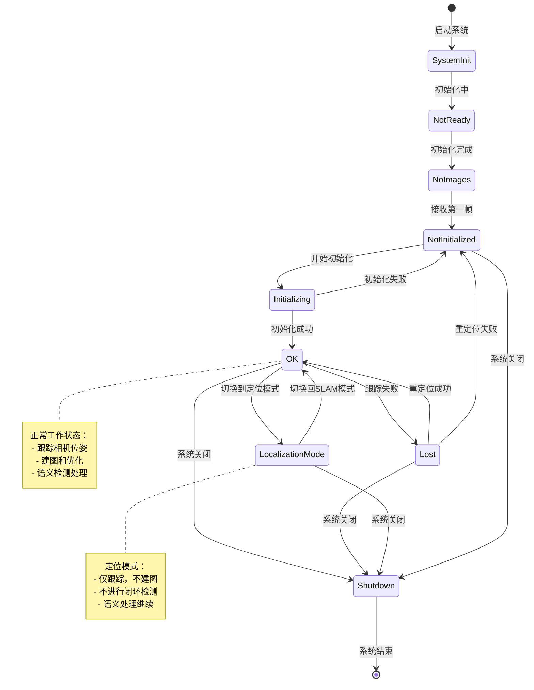
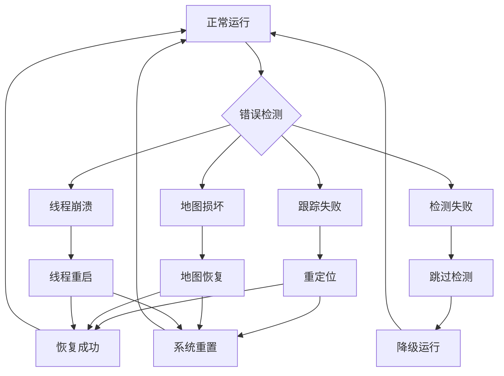

# ORB-SLAM2 SSD语义SLAM系统交互图

## 系统整体交互图

```mermaid
graph TB
    %% 外部输入
    subgraph "外部输入"
        CAM_INPUT[RGB-D相机输入]
        CONFIG[配置文件]
        VOCAB[ORB词典]
    end
    
    %% 核心处理层
    subgraph "核心处理层"
        direction TB
        SYS[System 系统管理器]
        
        subgraph "跟踪子系统"
            TRACK[Tracking 跟踪]
            FRAME[Frame 帧处理]
            ORB_EXT[ORB特征提取]
            ORB_MATCH[特征匹配]
        end
        
        subgraph "建图子系统"
            LMAP[LocalMapping 局部建图]
            LOOP[LoopClosing 闭环检测]
            MAP[Map 地图管理]
            KF[KeyFrame 关键帧]
            MP[MapPoint 地图点]
        end
        
        subgraph "语义子系统"
            PC_MAP[PointCloudMapping 语义点云建图]
            SEM_DET[Semantic Detection 语义检测]
            DYN_DET[Dynamic Detection 动态检测]
            SEM_DB[Semantic Database 语义数据库]
        end
    end
    
    %% 优化层
    subgraph "优化层"
        OPT[Optimizer 优化器]
        LOCAL_BA[局部BA]
        GLOBAL_BA[全局BA]
        POSE_OPT[位姿优化]
    end
    
    %% 可视化层
    subgraph "可视化层"
        VIEWER[Viewer 主视图]
        FRAME_DRAW[FrameDrawer 帧绘制]
        MAP_DRAW[MapDrawer 地图绘制]
        PCL_VIEW[PCL Viewer 点云可视化]
    end
    
    %% 输出层
    subgraph "输出结果"
        TRAJ[相机轨迹]
        SPARSE_MAP[稀疏地图]
        DENSE_MAP[稠密点云地图]
        SEM_MAP[语义地图]
    end
    
    %% 交互关系
    CAM_INPUT --> SYS
    CONFIG --> SYS
    VOCAB --> SYS
    
    SYS --> TRACK
    SYS --> LMAP
    SYS --> LOOP
    SYS --> PC_MAP
    SYS --> VIEWER
    
    TRACK --> FRAME
    TRACK --> ORB_EXT
    TRACK --> ORB_MATCH
    TRACK --> LMAP
    TRACK --> PC_MAP
    
    LMAP --> MAP
    LMAP --> KF
    LMAP --> MP
    LMAP --> LOOP
    LMAP --> OPT
    
    PC_MAP --> SEM_DET
    PC_MAP --> SEM_DB
    TRACK --> DYN_DET
    
    OPT --> LOCAL_BA
    OPT --> GLOBAL_BA
    OPT --> POSE_OPT
    
    VIEWER --> FRAME_DRAW
    VIEWER --> MAP_DRAW
    PC_MAP --> PCL_VIEW
    
    TRACK --> TRAJ
    MAP --> SPARSE_MAP
    PC_MAP --> DENSE_MAP
    SEM_DB --> SEM_MAP
    
    %% 反馈连接
    MAP -.-> TRACK
    SEM_DB -.-> TRACK
    DYN_DET -.-> TRACK
    OPT -.-> MAP
    LOOP -.-> MAP
```

## 线程间通信交互图

```mermaid
graph LR
    %% 线程定义
    subgraph "主线程"
        MAIN[Main Thread]
        SYS[System]
    end
    
    subgraph "跟踪线程"
        TRACK_T[Tracking Thread]
    end
    
    subgraph "建图线程"
        LMAP_T[LocalMapping Thread]
    end
    
    subgraph "闭环线程"
        LOOP_T[LoopClosing Thread]
    end
    
    subgraph "语义线程"
        PC_T[PointCloud Thread]
    end
    
    subgraph "可视化线程"
        VIEW_T[Viewer Thread]
    end
    
    %% 通信机制
    MAIN -->|创建管理| SYS
    SYS -->|启动| TRACK_T
    SYS -->|启动| LMAP_T
    SYS -->|启动| LOOP_T
    SYS -->|启动| PC_T
    SYS -->|启动| VIEW_T
    
    %% 数据传递
    TRACK_T -->|关键帧队列| LMAP_T
    TRACK_T -->|关键帧数据| PC_T
    LMAP_T -->|关键帧队列| LOOP_T
    
    %% 同步机制
    TRACK_T -.->|互斥锁| LMAP_T
    LMAP_T -.->|条件变量| LOOP_T
    PC_T -.->|条件变量| TRACK_T
    
    %% 显示更新
    TRACK_T -->|帧数据| VIEW_T
    LMAP_T -->|地图数据| VIEW_T
    PC_T -->|点云数据| VIEW_T
```

## 数据流交互图

```mermaid
flowchart TD
    %% 输入数据
    START[开始]
    INPUT[RGB + Depth + Timestamp]
    
    %% 预处理
    PREPROCESS[图像预处理]
    ORB_EXTRACT[ORB特征提取]
    
    %% 跟踪处理
    TRACKING{跟踪状态}
    INIT[初始化]
    TRACK_FRAME[跟踪帧]
    TRACK_LOCAL[跟踪局部地图]
    
    %% 关键帧决策
    KF_DECISION{是否插入关键帧}
    CREATE_KF[创建关键帧]
    
    %% 并行处理分支
    subgraph "几何SLAM分支"
        LOCAL_MAP[局部建图]
        CREATE_MP[创建地图点]
        LOCAL_BA[局部BA优化]
        LOOP_DETECT[闭环检测]
        GLOBAL_BA[全局BA优化]
    end
    
    subgraph "语义SLAM分支"
        SEM_DETECT[语义检测]
        GEN_PC[生成点云]
        SEM_CLUSTER[语义聚类]
        SEM_MERGE[语义融合]
        DYN_FILTER[动态过滤]
    end
    
    %% 输出结果
    UPDATE_MAP[更新地图]
    OUTPUT[输出位姿]
    VISUALIZE[可视化显示]
    
    %% 流程连接
    START --> INPUT
    INPUT --> PREPROCESS
    PREPROCESS --> ORB_EXTRACT
    ORB_EXTRACT --> TRACKING
    
    TRACKING -->|未初始化| INIT
    TRACKING -->|正常跟踪| TRACK_FRAME
    TRACKING -->|跟踪失败| TRACK_LOCAL
    
    INIT --> KF_DECISION
    TRACK_FRAME --> KF_DECISION
    TRACK_LOCAL --> KF_DECISION
    
    KF_DECISION -->|是| CREATE_KF
    KF_DECISION -->|否| OUTPUT
    
    CREATE_KF --> LOCAL_MAP
    CREATE_KF --> SEM_DETECT
    
    %% 几何SLAM流程
    LOCAL_MAP --> CREATE_MP
    CREATE_MP --> LOCAL_BA
    LOCAL_BA --> LOOP_DETECT
    LOOP_DETECT --> GLOBAL_BA
    
    %% 语义SLAM流程
    SEM_DETECT --> GEN_PC
    GEN_PC --> SEM_CLUSTER
    SEM_CLUSTER --> SEM_MERGE
    SEM_MERGE --> DYN_FILTER
    
    %% 结果融合
    GLOBAL_BA --> UPDATE_MAP
    DYN_FILTER --> UPDATE_MAP
    UPDATE_MAP --> OUTPUT
    OUTPUT --> VISUALIZE
    
    %% 反馈回路
    UPDATE_MAP -.-> TRACKING
    DYN_FILTER -.-> TRACKING
```

## 模块间依赖关系图

```mermaid
graph TB
    %% 核心依赖层次
    subgraph "底层依赖"
        OPENCV[OpenCV]
        EIGEN[Eigen3]
        PCL[PCL]
        G2O[g2o]
        DBOW2[DBoW2]
        NCNN[NCNN]
        PANGOLIN[Pangolin]
    end
    
    subgraph "基础数据层"
        FRAME[Frame]
        KEYFRAME[KeyFrame]
        MAPPOINT[MapPoint]
        ORB_VOC[ORBVocabulary]
        OBJECT[Object]
        CLUSTER[Cluster]
    end
    
    subgraph "算法组件层"
        ORB_EXT[ORBextractor]
        ORB_MATCH[ORBmatcher]
        INITIALIZER[Initializer]
        OPTIMIZER[Optimizer]
        DETECTOR[Detector]
        DYN_DETECTOR[DynamicDetector]
    end
    
    subgraph "核心功能层"
        TRACKING[Tracking]
        LOCAL_MAPPING[LocalMapping]
        LOOP_CLOSING[LoopClosing]
        PC_MAPPING[PointCloudMapping]
        MAP[Map]
        KF_DB[KeyFrameDatabase]
    end
    
    subgraph "系统管理层"
        SYSTEM[System]
        VIEWER[Viewer]
        FRAME_DRAWER[FrameDrawer]
        MAP_DRAWER[MapDrawer]
    end
    
    %% 依赖关系
    %% 底层依赖
    FRAME --> OPENCV
    KEYFRAME --> OPENCV
    MAPPOINT --> EIGEN
    ORB_EXT --> OPENCV
    OPTIMIZER --> G2O
    ORB_VOC --> DBOW2
    DETECTOR --> NCNN
    PC_MAPPING --> PCL
    VIEWER --> PANGOLIN
    
    %% 基础数据依赖
    TRACKING --> FRAME
    TRACKING --> KEYFRAME
    LOCAL_MAPPING --> KEYFRAME
    LOCAL_MAPPING --> MAPPOINT
    KF_DB --> ORB_VOC
    PC_MAPPING --> OBJECT
    PC_MAPPING --> CLUSTER
    
    %% 算法组件依赖
    TRACKING --> ORB_EXT
    TRACKING --> ORB_MATCH
    TRACKING --> INITIALIZER
    LOCAL_MAPPING --> OPTIMIZER
    LOOP_CLOSING --> OPTIMIZER
    PC_MAPPING --> DETECTOR
    TRACKING --> DYN_DETECTOR
    
    %% 核心功能依赖
    SYSTEM --> TRACKING
    SYSTEM --> LOCAL_MAPPING
    SYSTEM --> LOOP_CLOSING
    SYSTEM --> PC_MAPPING
    SYSTEM --> MAP
    TRACKING --> MAP
    LOCAL_MAPPING --> MAP
    LOOP_CLOSING --> KF_DB
    
    %% 系统管理依赖
    SYSTEM --> VIEWER
    VIEWER --> FRAME_DRAWER
    VIEWER --> MAP_DRAWER
    FRAME_DRAWER --> TRACKING
    MAP_DRAWER --> MAP
```

## 语义信息流交互图

```mermaid
flowchart LR
    %% 输入
    RGB[RGB图像]
    DEPTH[深度图像]
    KF[关键帧]
    
    %% 语义检测流程
    subgraph "语义检测流程"
        PREPROC[图像预处理]
        CNN[CNN推理]
        NMS[NMS后处理]
        DETECT_RESULT[检测结果]
    end
    
    %% 3D语义融合
    subgraph "3D语义融合"
        PC_GEN[点云生成]
        ROI_EXTRACT[ROI点云提取]
        BBOX_CALC[3D包围框计算]
        CLUSTER_CREATE[语义聚类创建]
    end
    
    %% 语义数据库
    subgraph "语义数据库"
        SEM_MATCH[语义匹配]
        SEM_MERGE[语义融合]
        SEM_UPDATE[数据库更新]
        SEM_QUERY[语义查询]
    end
    
    %% 动态检测
    subgraph "动态检测"
        OPTICAL_FLOW[光流检测]
        GEOM_CHECK[几何一致性检测]
        SEM_PRIOR[语义先验]
        DYN_RESULT[动态检测结果]
    end
    
    %% 反馈到SLAM
    subgraph "反馈到SLAM"
        FILTER_FEATURES[过滤特征点]
        UPDATE_TRACKING[更新跟踪]
        IMPROVE_MAPPING[改进建图]
    end
    
    %% 数据流连接
    RGB --> PREPROC
    PREPROC --> CNN
    CNN --> NMS
    NMS --> DETECT_RESULT
    
    RGB --> PC_GEN
    DEPTH --> PC_GEN
    KF --> PC_GEN
    DETECT_RESULT --> ROI_EXTRACT
    PC_GEN --> ROI_EXTRACT
    
    ROI_EXTRACT --> BBOX_CALC
    BBOX_CALC --> CLUSTER_CREATE
    
    CLUSTER_CREATE --> SEM_MATCH
    SEM_MATCH --> SEM_MERGE
    SEM_MERGE --> SEM_UPDATE
    SEM_UPDATE --> SEM_QUERY
    
    DETECT_RESULT --> SEM_PRIOR
    RGB --> OPTICAL_FLOW
    KF --> GEOM_CHECK
    OPTICAL_FLOW --> DYN_RESULT
    GEOM_CHECK --> DYN_RESULT
    SEM_PRIOR --> DYN_RESULT
    
    DYN_RESULT --> FILTER_FEATURES
    SEM_QUERY --> UPDATE_TRACKING
    FILTER_FEATURES --> UPDATE_TRACKING
    UPDATE_TRACKING --> IMPROVE_MAPPING
    
    %% 反馈回路
    SEM_UPDATE -.-> SEM_MATCH
    IMPROVE_MAPPING -.-> PC_GEN
```

## 系统状态转换图

```mermaid
stateDiagram-v2
    [*] --> SystemInit : 启动系统
    
    SystemInit --> NotReady : 初始化中
    NotReady --> NoImages : 初始化完成
    NoImages --> NotInitialized : 接收第一帧
    
    NotInitialized --> Initializing : 开始初始化
    Initializing --> NotInitialized : 初始化失败
    Initializing --> OK : 初始化成功
    
    OK --> Lost : 跟踪失败
    Lost --> OK : 重定位成功
    Lost --> NotInitialized : 重定位失败
    
    OK --> LocalizationMode : 切换到定位模式
    LocalizationMode --> OK : 切换回SLAM模式
    
    OK --> Shutdown : 系统关闭
    Lost --> Shutdown : 系统关闭
    LocalizationMode --> Shutdown : 系统关闭
    NotInitialized --> Shutdown : 系统关闭
    
    Shutdown --> [*] : 系统结束
    
    note right of OK
        正常工作状态：
        - 跟踪相机位姿
        - 建图和优化
        - 语义检测处理
    end note
    
    note right of LocalizationMode
        定位模式：
        - 仅跟踪，不建图
        - 不进行闭环检测
        - 语义处理继续
    end note
```

## 错误处理和恢复机制

```mermaid
flowchart TD
    NORMAL[正常运行]
    
    %% 错误检测
    ERROR_DETECT{错误检测}
    TRACK_FAIL[跟踪失败]
    DETECT_FAIL[检测失败]
    MAP_CORRUPT[地图损坏]
    THREAD_CRASH[线程崩溃]
    
    %% 恢复策略
    RELOC[重定位]
    SKIP_DETECT[跳过检测]
    MAP_RECOVERY[地图恢复]
    THREAD_RESTART[线程重启]
    
    %% 最终状态
    RECOVERED[恢复成功]
    DEGRADED[降级运行]
    SYSTEM_RESET[系统重置]
    
    NORMAL --> ERROR_DETECT
    
    ERROR_DETECT --> TRACK_FAIL
    ERROR_DETECT --> DETECT_FAIL
    ERROR_DETECT --> MAP_CORRUPT
    ERROR_DETECT --> THREAD_CRASH
    
    TRACK_FAIL --> RELOC
    DETECT_FAIL --> SKIP_DETECT
    MAP_CORRUPT --> MAP_RECOVERY
    THREAD_CRASH --> THREAD_RESTART
    
    RELOC --> RECOVERED
    RELOC --> SYSTEM_RESET
    SKIP_DETECT --> DEGRADED
    MAP_RECOVERY --> RECOVERED
    MAP_RECOVERY --> SYSTEM_RESET
    THREAD_RESTART --> RECOVERED
    THREAD_RESTART --> SYSTEM_RESET
    
    RECOVERED --> NORMAL
    DEGRADED --> NORMAL
    SYSTEM_RESET --> NORMAL
```

这些交互图展示了系统各组件间的复杂交互关系，包括数据流向、控制流、错误处理等多个维度，有助于理解系统的整体工作机制。