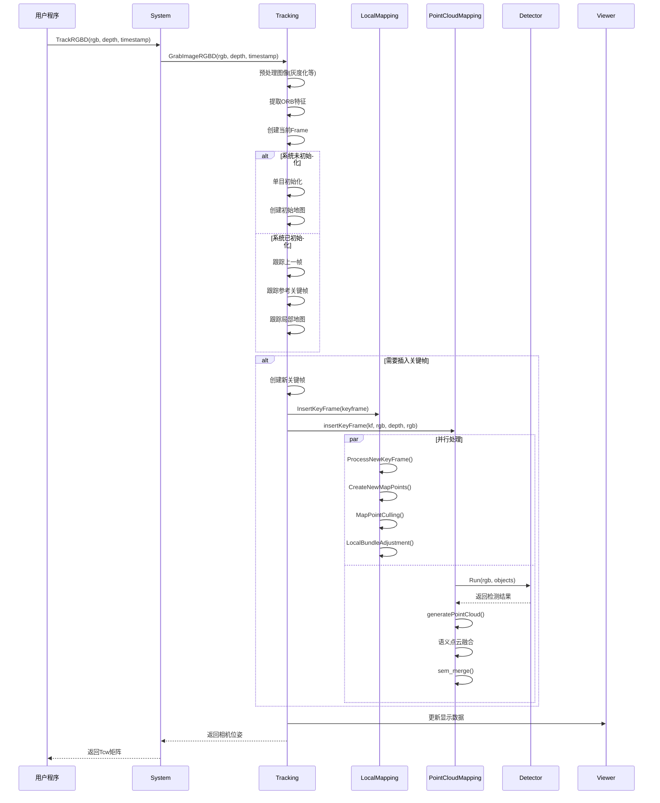
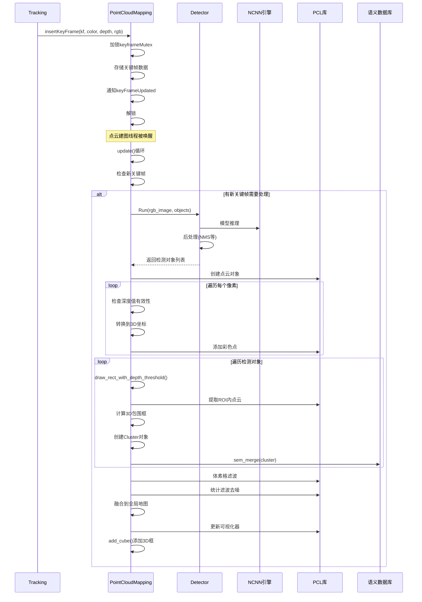
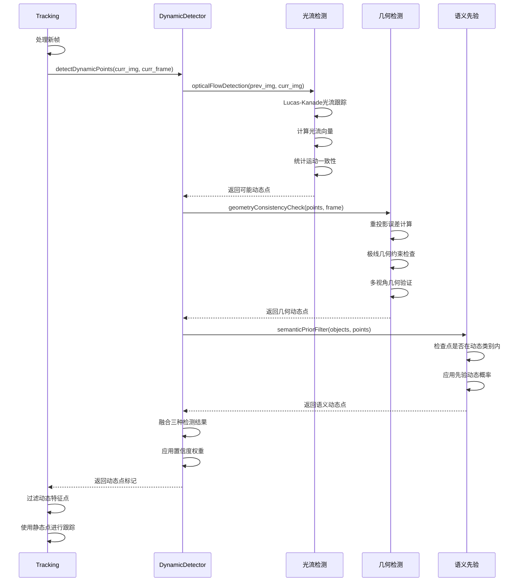

# ORB-SLAM2 SSD语义SLAM系统序列图

## 系统初始化序列图

```mermaid
sequenceDiagram
    participant Main as 主程序
    participant Sys as System
    participant Track as Tracking
    participant LMap as LocalMapping  
    participant Loop as LoopClosing
    participant PCMap as PointCloudMapping
    participant View as Viewer
    participant Det as Detector
    
    Main->>Sys: 创建System对象
    Sys->>Sys: 加载ORB词典
    Sys->>Sys: 读取配置文件
    Sys->>Track: 创建Tracking线程
    Sys->>LMap: 创建LocalMapping线程
    Sys->>Loop: 创建LoopClosing线程
    Sys->>PCMap: 创建PointCloudMapping线程
    Sys->>Det: 初始化语义检测器
    Sys->>View: 创建Viewer线程
    
    par 并行线程启动
        Sys->>LMap: 启动建图线程
    and
        Sys->>Loop: 启动闭环线程  
    and
        Sys->>PCMap: 启动点云建图线程
    and
        Sys->>View: 启动可视化线程
    end
    
    Note over Sys: 系统初始化完成，开始处理输入
```

## RGB-D帧处理主流程序列图



## 语义检测与点云建图序列图



## 动态点检测序列图



## 闭环检测序列图

```mermaid
sequenceDiagram
    participant LMap as LocalMapping
    participant Loop as LoopClosing
    participant KFdb as KeyFrameDatabase
    participant Vocab as ORBVocabulary
    participant Opt as Optimizer
    participant Map as Map
    
    LMap->>Loop: InsertKeyFrame(new_kf)
    Loop->>Loop: 加入候选队列
    
    Loop->>Loop: Run()主循环
    Loop->>Loop: CheckNewKeyFrames()
    
    alt 有新关键帧需要处理
        Loop->>Loop: DetectLoop()
        Loop->>KFdb: DetectLoopCandidates(curr_kf)
        KFdb->>Vocab: 计算BoW相似度
        KFdb-->>Loop: 返回候选关键帧
        
        Loop->>Loop: 时空一致性检查
        Loop->>Loop: 选择最终闭环候选
        
        alt 找到闭环候选
            Loop->>Loop: ComputeSim3()
            Loop->>Loop: Sim3求解器计算相似变换
            Loop->>Loop: RANSAC验证
            
            alt Sim3计算成功
                Loop->>Loop: CorrectLoop()
                Loop->>Loop: 闭环融合
                Loop->>Map: 更新共视图
                Loop->>Opt: 位姿图优化
                
                par 并行执行全局BA
                    Loop->>Opt: RunGlobalBundleAdjustment()
                    Note over Opt: 全局束调整优化
                end
                
                Loop->>Map: 广播地图更新
            end
        end
    end
```

## 局部建图序列图

```mermaid
sequenceDiagram
    participant Track as Tracking
    participant LMap as LocalMapping  
    participant Map as Map
    participant Opt as Optimizer
    participant Loop as LoopClosing
    
    Track->>LMap: InsertKeyFrame(new_keyframe)
    LMap->>LMap: 添加到处理队列
    
    LMap->>LMap: Run()主循环
    LMap->>LMap: CheckNewKeyFrames()
    
    alt 有新关键帧需要处理
        %% 处理新关键帧
        LMap->>LMap: ProcessNewKeyFrame()
        LMap->>LMap: 计算BoW向量
        LMap->>LMap: 更新共视图连接
        LMap->>Map: 更新地图结构
        
        %% 地图点剔除
        LMap->>LMap: MapPointCulling()
        loop 检查每个地图点
            LMap->>LMap: 检查观测质量
            LMap->>LMap: 检查观测数量
            alt 地图点质量差
                LMap->>Map: EraseMapPoint()
            end
        end
        
        %% 创建新地图点
        LMap->>LMap: CreateNewMapPoints()
        LMap->>LMap: 在共视关键帧间三角化
        loop 遍历共视关键帧对
            LMap->>LMap: 特征匹配
            LMap->>LMap: 三角化新点
            LMap->>Map: AddMapPoint()
        end
        
        %% 搜索更多匹配
        LMap->>LMap: SearchInNeighbors()
        LMap->>LMap: 融合重复地图点
        
        %% 局部BA优化
        LMap->>Opt: LocalBundleAdjustment()
        Note over Opt: 局部束调整优化
        
        %% 关键帧剔除
        LMap->>LMap: KeyFrameCulling()
        loop 检查关键帧
            LMap->>LMap: 检查冗余度
            alt 关键帧冗余
                LMap->>Map: EraseKeyFrame()
            end
        end
        
        %% 发送给闭环检测
        LMap->>Loop: InsertKeyFrame(keyframe)
    end
```

## 系统关闭序列图

```mermaid
sequenceDiagram
    participant User as 用户程序
    participant Sys as System
    participant Track as Tracking
    participant LMap as LocalMapping
    participant Loop as LoopClosing  
    participant PCMap as PointCloudMapping
    participant View as Viewer
    
    User->>Sys: Shutdown()
    
    Sys->>Sys: 设置关闭标志
    
    par 并行关闭所有线程
        Sys->>LMap: RequestFinish()
        LMap->>LMap: 完成当前处理
        LMap->>LMap: 线程退出
    and
        Sys->>Loop: RequestFinish()  
        Loop->>Loop: 完成当前处理
        Loop->>Loop: 线程退出
    and
        Sys->>PCMap: shutdown()
        PCMap->>PCMap: 设置shutDownFlag
        PCMap->>PCMap: 保存点云地图
        PCMap->>PCMap: 线程退出
    and
        Sys->>View: RequestFinish()
        View->>View: 关闭显示窗口
        View->>View: 线程退出
    end
    
    Sys->>Sys: 等待所有线程结束
    Sys->>Sys: 清理资源
    Sys-->>User: 关闭完成
    
    alt 保存结果
        User->>Sys: SaveTrajectoryTUM()
        User->>Sys: SaveKeyFrameTrajectoryTUM()
    end
```

## 时序关系说明

### 1. 线程间协调
- 使用互斥锁保证数据一致性
- 条件变量实现线程间通信
- 采用生产者-消费者模式传递数据

### 2. 实时性保证
- 跟踪线程优先级最高，保证实时响应
- 建图和闭环检测在后台异步执行
- 语义处理与几何SLAM并行进行

### 3. 数据流向
- 输入数据从跟踪线程开始流转
- 关键帧数据分发到建图和语义模块
- 优化结果回传更新全局状态

### 4. 错误处理
- 跟踪失败时启动重定位
- 语义检测失败不影响几何SLAM
- 各模块独立的异常处理机制

这种设计保证了系统的实时性、鲁棒性和扩展性。