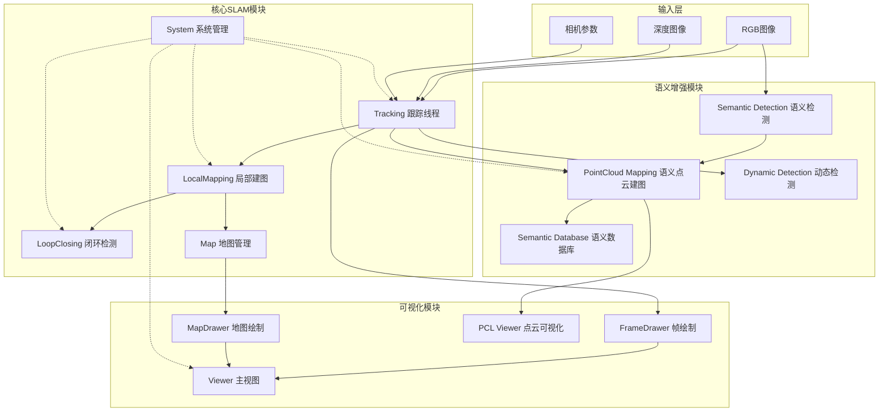

# ORB-SLAM2 SSD语义SLAM系统总体架构

## 系统概述

ORB-SLAM2 SSD语义SLAM系统是基于经典ORB-SLAM2框架的语义增强SLAM系统，集成了实时语义目标检测、点云语义建图和动态环境处理能力。系统采用多线程并行架构，在保证实时性的同时构建包含语义信息的稠密地图。

## 核心特性

- **多传感器支持**: 支持单目、双目、RGB-D相机
- **语义检测**: 基于MobileNetV2-SSD-Lite的实时目标检测
- **语义建图**: 构建包含语义对象信息的3D点云地图  
- **动态环境处理**: 光流和几何一致性检测动态点
- **多线程架构**: 跟踪、建图、闭环检测、语义处理并行执行
- **地图管理**: 支持ORB-SLAM2地图和OctoMap的保存与加载

## 系统架构图

## 主要模块说明

### 1. 系统管理层 (System)
- **功能**: 系统初始化、线程管理、模式切换
- **职责**: 
  - 启动和管理所有子线程
  - 处理不同传感器输入
  - 提供外部API接口
  - 管理系统状态和模式切换

### 2. 跟踪模块 (Tracking)
- **功能**: 实时相机跟踪、特征提取与匹配
- **职责**:
  - 提取ORB特征点
  - 相机姿态估计
  - 关键帧决策
  - 重定位处理

### 3. 局部建图模块 (LocalMapping) 
- **功能**: 局部地图构建与优化
- **职责**:
  - 处理新关键帧
  - 创建新地图点
  - 局部BA优化
  - 关键帧剔除

### 4. 闭环检测模块 (LoopClosing)
- **功能**: 闭环检测与全局优化
- **职责**:
  - 闭环候选检测
  - Sim3计算
  - 全局BA优化
  - 地图一致性维护

### 5. 语义检测模块 (Semantic Detection)
- **功能**: 实时目标检测与语义理解
- **技术**: MobileNetV2-SSD-Lite + NCNN推理引擎
- **职责**:
  - 实时目标检测
  - 语义标签分配
  - 检测结果过滤

### 6. 语义点云建图模块 (PointCloud Mapping)
- **功能**: 语义点云地图构建
- **职责**:
  - RGB-D点云生成
  - 语义信息融合
  - 语义对象聚类
  - 语义数据库维护

### 7. 动态检测模块 (Dynamic Detection)
- **功能**: 动态环境处理
- **方法**: 
  - 几何一致性检测
  - 光流运动检测
  - 语义先验过滤

## 数据流向

1. **感知输入** → RGB图像、深度图像输入系统
2. **特征处理** → ORB特征提取与匹配
3. **位姿估计** → 相机运动估计与跟踪
4. **语义理解** → 并行语义目标检测
5. **地图构建** → 几何地图 + 语义点云地图
6. **优化融合** → 局部与全局地图优化
7. **动态处理** → 动态点检测与过滤
8. **结果输出** → 位姿轨迹 + 语义地图

## 线程架构

系统采用多线程并行处理架构：

- **主线程**: 数据输入与系统控制
- **跟踪线程**: 实时相机跟踪
- **建图线程**: 局部地图构建
- **闭环线程**: 闭环检测与全局优化
- **语义线程**: 语义检测与点云建图
- **可视化线程**: 实时结果显示

## 技术特点

1. **实时性**: 多线程并行处理保证实时性能
2. **鲁棒性**: 动态环境检测提高系统鲁棒性
3. **语义性**: 语义信息增强地图表达能力
4. **完整性**: 支持地图保存加载与轨迹评估
5. **扩展性**: 模块化设计便于功能扩展

## 应用场景

- 室内机器人导航
- 自动驾驶车辆
- AR/VR应用
- 智能监控系统
- 三维重建任务