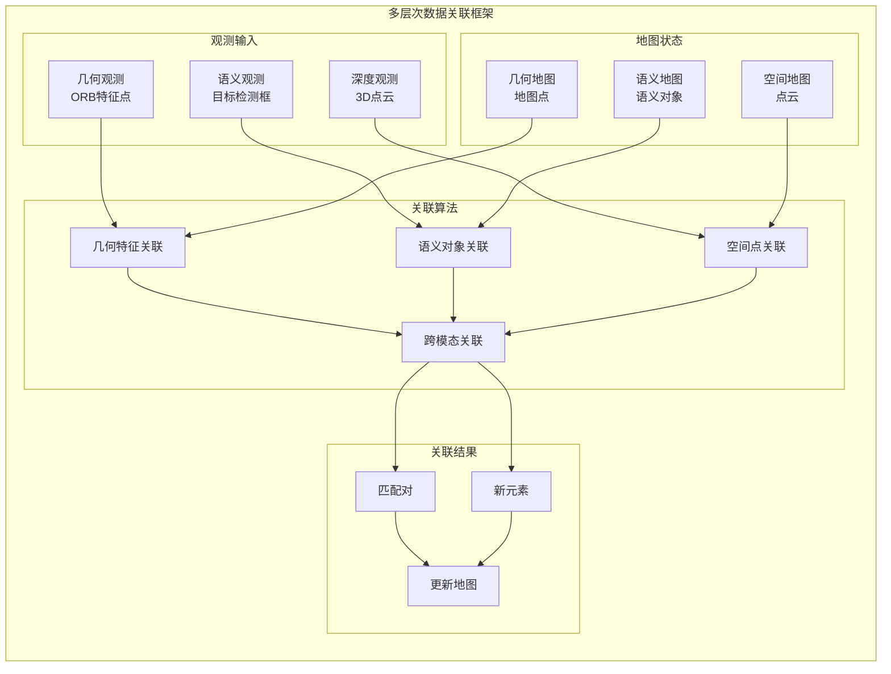

# 数据关联算法实现文档

## 概述

数据关联是ORB-SLAM2 SSD语义SLAM系统的关键技术之一，它负责建立观测数据与地图中已有元素之间的对应关系。在语义SLAM系统中，数据关联不仅包括传统的几何特征关联，还涉及语义对象的关联和融合。本文档详细阐述了系统中实现的多层次数据关联算法。

## 数据关联框架



## 传统几何特征关联

### 1. ORB特征匹配

#### 1.1 描述子距离计算

```cpp
class ORBMatcher {
private:
    static const int TH_HIGH = 100;      // 高阈值
    static const int TH_LOW = 50;        // 低阈值
    static const int HISTO_LENGTH = 30;  // 方向直方图长度
    
public:
    int SearchByProjection(Frame &F, const vector<MapPoint*> &vpMapPoints, 
                          const float th, const bool bFarPoints = false) {
        int nmatches = 0;
        
        for (size_t iMP = 0; iMP < vpMapPoints.size(); iMP++) {
            MapPoint* pMP = vpMapPoints[iMP];
            if (!pMP || pMP->isBad()) continue;
            
            // 投影到当前帧
            const cv::Mat Pc = pMP->GetWorldPos();
            const cv::Mat Rcw = F.mTcw.rowRange(0,3).colRange(0,3);
            const cv::Mat tcw = F.mTcw.rowRange(0,3).col(3);
            const cv::Mat Pc_cam = Rcw * Pc + tcw;
            
            // 深度检查
            const float PcZ = Pc_cam.at<float>(2);
            if (PcZ < 0.0f) continue;
            
            // 投影到图像平面
            const float invz = 1.0f / PcZ;
            const float u = F.fx * Pc_cam.at<float>(0) * invz + F.cx;
            const float v = F.fy * Pc_cam.at<float>(1) * invz + F.cy;
            
            if (u < F.mnMinX || u > F.mnMaxX || v < F.mnMinY || v > F.mnMaxY)
                continue;
            
            // 搜索半径预测
            const float radius = th * F.mvScaleFactors[pMP->mnTrackScaleLevel];
            
            // 在搜索区域内寻找候选特征点
            const vector<size_t> vIndices = F.GetFeaturesInArea(u, v, radius);
            if (vIndices.empty()) continue;
            
            // 获取地图点的描述子
            const cv::Mat MPdescriptor = pMP->GetDescriptor();
            
            int bestDist = 256;
            int bestIdx = -1;
            int bestDist2 = 256;
            
            for (vector<size_t>::const_iterator vit = vIndices.begin(); 
                 vit != vIndices.end(); vit++) {
                const size_t idx = *vit;
                
                if (F.mvpMapPoints[idx]) continue;  // 已有匹配
                
                // 描述子距离计算
                const cv::Mat &d = F.mDescriptors.row(idx);
                const int dist = DescriptorDistance(MPdescriptor, d);
                
                if (dist < bestDist) {
                    bestDist2 = bestDist;
                    bestDist = dist;
                    bestIdx = idx;
                } else if (dist < bestDist2) {
                    bestDist2 = dist;
                }
            }
            
            // 应用阈值和比值测试
            if (bestDist <= TH_HIGH) {
                if (bestIdx >= 0 && bestDist < (float)bestDist2 * mfNNratio) {
                    F.mvpMapPoints[bestIdx] = pMP;
                    nmatches++;
                }
            }
        }
        
        return nmatches;
    }
    
    static int DescriptorDistance(const cv::Mat &a, const cv::Mat &b) {
        const int *pa = a.ptr<int32_t>();
        const int *pb = b.ptr<int32_t>();
        
        int dist = 0;
        for (int i = 0; i < 8; i++, pa++, pb++) {
            unsigned int v = *pa ^ *pb;
            v = v - ((v >> 1) & 0x55555555);
            v = (v & 0x33333333) + ((v >> 2) & 0x33333333);
            dist += (((v + (v >> 4)) & 0xF0F0F0F) * 0x1010101) >> 24;
        }
        
        return dist;
    }
    
private:
    float mfNNratio = 0.9f;  // 最近邻比值测试阈值
};
```

#### 1.2 方向一致性检验

```cpp
class OrientationConsistencyChecker {
public:
    bool CheckOrientation(const vector<cv::KeyPoint> &vKP1, 
                         const vector<cv::KeyPoint> &vKP2,
                         const vector<int> &vMatches12,
                         vector<bool> &vbInliers) {
        
        int histo[HISTO_LENGTH];
        for (int i = 0; i < HISTO_LENGTH; i++)
            histo[i] = 0;
        
        const float factor = 1.0f / HISTO_LENGTH;
        
        // 计算旋转直方图
        for (size_t i = 0; i < vMatches12.size(); i++) {
            if (vMatches12[i] >= 0) {
                float rot = vKP1[i].angle - vKP2[vMatches12[i]].angle;
                if (rot < 0.0) rot += 360.0f;
                
                int bin = round(rot * factor);
                if (bin == HISTO_LENGTH) bin = 0;
                
                assert(bin >= 0 && bin < HISTO_LENGTH);
                histo[bin]++;
            }
        }
        
        // 寻找直方图峰值
        int ind1 = -1, ind2 = -1, ind3 = -1;
        ComputeThreeMaxima(histo, HISTO_LENGTH, ind1, ind2, ind3);
        
        // 保留与主要方向一致的匹配
        for (size_t i = 0; i < vMatches12.size(); i++) {
            if (vMatches12[i] >= 0) {
                float rot = vKP1[i].angle - vKP2[vMatches12[i]].angle;
                if (rot < 0.0) rot += 360.0f;
                
                int bin = round(rot * factor);
                if (bin == HISTO_LENGTH) bin = 0;
                
                if (bin == ind1 || bin == ind2 || bin == ind3) {
                    vbInliers[i] = true;
                } else {
                    vbInliers[i] = false;
                }
            } else {
                vbInliers[i] = false;
            }
        }
        
        return true;
    }
    
private:
    void ComputeThreeMaxima(int* histo, const int L, int &ind1, int &ind2, int &ind3) {
        int max1 = 0, max2 = 0, max3 = 0;
        
        for (int i = 0; i < L; i++) {
            if (histo[i] > max1) {
                max3 = max2;
                max2 = max1;
                max1 = histo[i];
                ind3 = ind2;
                ind2 = ind1;
                ind1 = i;
            } else if (histo[i] > max2) {
                max3 = max2;
                max2 = histo[i];
                ind3 = ind2;
                ind2 = i;
            } else if (histo[i] > max3) {
                max3 = histo[i];
                ind3 = i;
            }
        }
        
        if (max2 < 0.1f * (float)max1) {
            ind2 = -1;
            ind3 = -1;
        } else if (max3 < 0.1f * (float)max1) {
            ind3 = -1;
        }
    }
    
    static const int HISTO_LENGTH = 30;
};
```

### 2. 基于投影的匹配

#### 2.1 重投影匹配

```cpp
class ProjectionMatcher {
public:
    int SearchByProjection(Frame &CurrentFrame, KeyFrame* pKF, 
                          const set<MapPoint*> &sAlreadyFound,
                          const float th, const int ORBdist) {
        int nmatches = 0;
        
        const cv::Mat Rcw = CurrentFrame.mTcw.rowRange(0,3).colRange(0,3);
        const cv::Mat tcw = CurrentFrame.mTcw.rowRange(0,3).col(3);
        const cv::Mat Ow = -Rcw.t() * tcw;
        
        // 旋转直方图
        vector<int> rotHist[HISTO_LENGTH];
        for (int i = 0; i < HISTO_LENGTH; i++)
            rotHist[i].reserve(500);
        
        const float factor = 1.0f / HISTO_LENGTH;
        
        const vector<MapPoint*> vpMPs = pKF->GetMapPointMatches();
        
        for (size_t i = 0; i < vpMPs.size(); i++) {
            MapPoint* pMP = vpMPs[i];
            
            if (pMP && !pMP->isBad() && !sAlreadyFound.count(pMP)) {
                // 3D点投影
                cv::Mat x3Dw = pMP->GetWorldPos();
                cv::Mat x3Dc = Rcw * x3Dw + tcw;
                
                const float xc = x3Dc.at<float>(0);
                const float yc = x3Dc.at<float>(1);
                const float invzc = 1.0f / x3Dc.at<float>(2);
                
                if (invzc < 0) continue;
                
                float u = CurrentFrame.fx * xc * invzc + CurrentFrame.cx;
                float v = CurrentFrame.fy * yc * invzc + CurrentFrame.cy;
                
                if (u < CurrentFrame.mnMinX || u > CurrentFrame.mnMaxX ||
                    v < CurrentFrame.mnMinY || v > CurrentFrame.mnMaxY)
                    continue;
                
                // 预测尺度
                cv::Mat PO = x3Dw - Ow;
                float dist3D = cv::norm(PO);
                
                const float maxDistance = pMP->GetMaxDistanceInvariance();
                const float minDistance = pMP->GetMinDistanceInvariance();
                
                if (dist3D < minDistance || dist3D > maxDistance)
                    continue;
                
                int nPredictedLevel = pMP->PredictScale(dist3D, &CurrentFrame);
                
                // 搜索半径
                const float radius = th * CurrentFrame.mvScaleFactors[nPredictedLevel];
                
                const vector<size_t> vIndices = 
                    CurrentFrame.GetFeaturesInArea(u, v, radius);
                
                if (vIndices.empty()) continue;
                
                // 地图点描述子
                const cv::Mat MPdescriptor = pMP->GetDescriptor();
                
                int bestDist = 256;
                int bestLevel = -1;
                int bestDist2 = 256;
                int bestLevel2 = -1;
                int bestIdx = -1;
                
                // 寻找最佳匹配
                for (vector<size_t>::const_iterator vit = vIndices.begin();
                     vit != vIndices.end(); vit++) {
                    const size_t idx = *vit;
                    
                    if (CurrentFrame.mvpMapPoints[idx])
                        if (CurrentFrame.mvpMapPoints[idx]->Observations() > 0)
                            continue;
                    
                    const cv::Mat &d = CurrentFrame.mDescriptors.row(idx);
                    
                    const int dist = ORBMatcher::DescriptorDistance(MPdescriptor, d);
                    
                    if (dist < bestDist) {
                        bestDist2 = bestDist;
                        bestDist = dist;
                        bestLevel2 = bestLevel;
                        bestLevel = CurrentFrame.mvKeysUn[idx].octave;
                        bestIdx = idx;
                    } else if (dist < bestDist2) {
                        bestLevel2 = CurrentFrame.mvKeysUn[idx].octave;
                        bestDist2 = dist;
                    }
                }
                
                // 应用约束检查
                if (bestDist <= ORBdist) {
                    if (bestLevel == nPredictedLevel || 
                        bestLevel == nPredictedLevel + 1 || 
                        bestLevel == nPredictedLevel - 1) {
                        
                        if (bestDist < 0.9f * bestDist2) {
                            CurrentFrame.mvpMapPoints[bestIdx] = pMP;
                            nmatches++;
                            
                            // 更新旋转直方图
                            if (mbCheckOrientation) {
                                float rot = pKF->mvKeysUn[i].angle - 
                                          CurrentFrame.mvKeysUn[bestIdx].angle;
                                if (rot < 0.0) rot += 360.0f;
                                int bin = round(rot * factor);
                                if (bin == HISTO_LENGTH) bin = 0;
                                assert(bin >= 0 && bin < HISTO_LENGTH);
                                rotHist[bin].push_back(bestIdx);
                            }
                        }
                    }
                }
            }
        }
        
        // 方向一致性检查
        if (mbCheckOrientation) {
            int ind1 = -1, ind2 = -1, ind3 = -1;
            ComputeThreeMaxima(rotHist, HISTO_LENGTH, ind1, ind2, ind3);
            
            for (int i = 0; i < HISTO_LENGTH; i++) {
                if (i != ind1 && i != ind2 && i != ind3) {
                    for (size_t j = 0; j < rotHist[i].size(); j++) {
                        CurrentFrame.mvpMapPoints[rotHist[i][j]] = static_cast<MapPoint*>(NULL);
                        nmatches--;
                    }
                }
            }
        }
        
        return nmatches;
    }
    
private:
    bool mbCheckOrientation = true;
    static const int HISTO_LENGTH = 30;
};
```

## 语义对象关联

### 1. 空间-语义联合关联

```cpp
class SemanticObjectAssociation {
private:
    struct AssociationCandidate {
        int detection_id;
        int cluster_id;
        float spatial_cost;
        float semantic_cost;
        float temporal_cost;
        float total_cost;
    };
    
    // 关联参数
    float max_association_distance_ = 2.0f;  // 3D空间最大关联距离(米)
    float semantic_weight_ = 0.4f;
    float spatial_weight_ = 0.4f;
    float temporal_weight_ = 0.2f;
    float association_threshold_ = 0.6f;
    
public:
    std::vector<int> associateSemanticObjects(
        const std::vector<Object>& detections,
        const std::vector<Cluster>& existing_clusters,
        const cv::Mat& camera_pose,
        const cv::Mat& camera_intrinsics) {
        
        std::vector<int> associations(detections.size(), -1);
        
        if (existing_clusters.empty()) {
            return associations;  // 所有检测都是新对象
        }
        
        // 构建关联候选矩阵
        std::vector<std::vector<AssociationCandidate>> candidates(detections.size());
        
        for (size_t i = 0; i < detections.size(); i++) {
            for (size_t j = 0; j < existing_clusters.size(); j++) {
                AssociationCandidate candidate;
                candidate.detection_id = i;
                candidate.cluster_id = j;
                
                // 计算各种代价
                if (computeAssociationCosts(detections[i], existing_clusters[j],
                                          camera_pose, camera_intrinsics, candidate)) {
                    candidates[i].push_back(candidate);
                }
            }
            
            // 对候选按总代价排序
            std::sort(candidates[i].begin(), candidates[i].end(),
                     [](const AssociationCandidate& a, const AssociationCandidate& b) {
                         return a.total_cost < b.total_cost;
                     });
        }
        
        // 使用匈牙利算法或贪心算法求解最优分配
        associations = solveAssignmentProblem(candidates);
        
        return associations;
    }
    
private:
    bool computeAssociationCosts(const Object& detection, const Cluster& cluster,
                               const cv::Mat& camera_pose, const cv::Mat& camera_intrinsics,
                               AssociationCandidate& candidate) {
        
        // 1. 语义匹配代价
        candidate.semantic_cost = computeSemanticCost(detection, cluster);
        
        // 2. 空间距离代价
        candidate.spatial_cost = computeSpatialCost(detection, cluster, 
                                                  camera_pose, camera_intrinsics);
        
        // 快速排除：空间距离过大
        if (candidate.spatial_cost > max_association_distance_) {
            return false;
        }
        
        // 3. 时序一致性代价
        candidate.temporal_cost = computeTemporalCost(detection, cluster);
        
        // 4. 计算总代价
        candidate.total_cost = semantic_weight_ * candidate.semantic_cost +
                              spatial_weight_ * candidate.spatial_cost +
                              temporal_weight_ * candidate.temporal_cost;
        
        return candidate.total_cost < association_threshold_;
    }
    
    float computeSemanticCost(const Object& detection, const Cluster& cluster) {
        if (detection.class_id == cluster.class_id) {
            // 类别完全匹配，考虑置信度
            return 1.0f - (detection.prob * cluster.prob);
        } else if (areCompatibleClasses(detection.class_id, cluster.class_id)) {
            // 兼容类别（如car和vehicle）
            return 0.3f + 0.7f * (1.0f - detection.prob);
        } else {
            // 完全不匹配
            return 1.0f;
        }
    }
    
    float computeSpatialCost(const Object& detection, const Cluster& cluster,
                           const cv::Mat& camera_pose, const cv::Mat& camera_intrinsics) {
        
        // 将检测框中心投影到3D空间（使用聚类的平均深度）
        cv::Point2f detection_center(detection.rect.x + detection.rect.width / 2,
                                    detection.rect.y + detection.rect.height / 2);
        
        // 使用聚类中心的深度进行反投影
        float fx = camera_intrinsics.at<float>(0, 0);
        float fy = camera_intrinsics.at<float>(1, 1);
        float cx = camera_intrinsics.at<float>(0, 2);
        float cy = camera_intrinsics.at<float>(1, 2);
        
        // 估算检测对象的3D位置
        cv::Mat cluster_center_cam = camera_pose.rowRange(0,3).colRange(0,3) * 
                                   cv::Mat(cluster.centroid) + camera_pose.rowRange(0,3).col(3);
        float estimated_depth = cluster_center_cam.at<float>(2);
        
        float x_3d = (detection_center.x - cx) * estimated_depth / fx;
        float y_3d = (detection_center.y - cy) * estimated_depth / fy;
        cv::Mat detection_pos_cam = (cv::Mat_<float>(3,1) << x_3d, y_3d, estimated_depth);
        
        // 转换到世界坐标系
        cv::Mat R_wc = camera_pose.rowRange(0,3).colRange(0,3).t();
        cv::Mat t_wc = -R_wc * camera_pose.rowRange(0,3).col(3);
        cv::Mat detection_pos_world = R_wc * detection_pos_cam + t_wc;
        
        // 计算与聚类中心的距离
        Eigen::Vector3f cluster_center = cluster.centroid;
        float distance = cv::norm(detection_pos_world - cv::Mat(cluster_center));
        
        // 归一化距离代价
        return std::min(distance / max_association_distance_, 1.0f);
    }
    
    float computeTemporalCost(const Object& detection, const Cluster& cluster) {
        // 基于时间间隔的代价
        double current_time = getCurrentTimestamp();
        double time_diff = current_time - cluster.last_updated;
        
        // 时间差越大，关联代价越高
        float temporal_cost = std::min(time_diff / 5.0, 1.0);  // 5秒最大时间窗口
        
        return temporal_cost;
    }
    
    bool areCompatibleClasses(int class1, int class2) {
        // 定义兼容的类别对
        static std::set<std::pair<int, int>> compatible_pairs = {
            {CAR_ID, TRUCK_ID}, {CAR_ID, BUS_ID},
            {PERSON_ID, CYCLIST_ID},
            {CHAIR_ID, COUCH_ID},
            // 添加更多兼容对...
        };
        
        return compatible_pairs.count({std::min(class1, class2), std::max(class1, class2)}) > 0;
    }
    
    std::vector<int> solveAssignmentProblem(
        const std::vector<std::vector<AssociationCandidate>>& candidates) {
        
        std::vector<int> assignments(candidates.size(), -1);
        std::set<int> assigned_clusters;
        
        // 贪心分配：按代价从小到大分配
        std::vector<AssociationCandidate> all_candidates;
        for (const auto& det_candidates : candidates) {
            all_candidates.insert(all_candidates.end(), 
                                det_candidates.begin(), det_candidates.end());
        }
        
        std::sort(all_candidates.begin(), all_candidates.end(),
                 [](const AssociationCandidate& a, const AssociationCandidate& b) {
                     return a.total_cost < b.total_cost;
                 });
        
        for (const auto& candidate : all_candidates) {
            if (assignments[candidate.detection_id] == -1 &&
                assigned_clusters.find(candidate.cluster_id) == assigned_clusters.end()) {
                
                assignments[candidate.detection_id] = candidate.cluster_id;
                assigned_clusters.insert(candidate.cluster_id);
            }
        }
        
        return assignments;
    }
    
    double getCurrentTimestamp() {
        return std::chrono::duration_cast<std::chrono::milliseconds>(
            std::chrono::steady_clock::now().time_since_epoch()).count() / 1000.0;
    }
};
```

### 2. 概率数据关联

```cpp
class ProbabilisticSemanticAssociation {
private:
    struct GaussianModel {
        Eigen::Vector3f mean;      // 3D位置均值
        Eigen::Matrix3f covariance; // 协方差矩阵
        float weight;              // 混合权重
    };
    
    struct SemanticTrack {
        int track_id;
        int class_id;
        std::vector<GaussianModel> position_models;
        float confidence;
        double last_update_time;
        int consecutive_misses;
    };
    
    std::vector<SemanticTrack> active_tracks_;
    int next_track_id_ = 0;
    float gating_threshold_ = 9.21f;  // 3σ置信区间
    
public:
    std::vector<TrackAssignment> performProbabilisticAssociation(
        const std::vector<Object>& detections,
        const cv::Mat& camera_pose,
        double timestamp) {
        
        std::vector<TrackAssignment> assignments;
        
        // 预测步骤：更新所有轨迹的状态
        predictTrackStates(timestamp);
        
        // 计算似然度矩阵
        Eigen::MatrixXf likelihood_matrix = computeLikelihoodMatrix(detections, camera_pose);
        
        // 数据关联概率计算
        auto association_probs = computeAssociationProbabilities(likelihood_matrix);
        
        // 基于概率进行分配
        assignments = makeAssignments(association_probs, detections, timestamp);
        
        // 更新轨迹
        updateTracks(assignments, detections, camera_pose, timestamp);
        
        // 管理轨迹生命周期
        manageTrackLifecycle(timestamp);
        
        return assignments;
    }
    
private:
    void predictTrackStates(double timestamp) {
        for (auto& track : active_tracks_) {
            double dt = timestamp - track.last_update_time;
            
            if (dt > 0) {
                // 简单的位置预测模型（可以扩展为卡尔曼滤波）
                for (auto& model : track.position_models) {
                    // 增加不确定性
                    float process_noise = 0.1f * dt;  // 过程噪声
                    model.covariance += Eigen::Matrix3f::Identity() * process_noise;
                }
            }
        }
    }
    
    Eigen::MatrixXf computeLikelihoodMatrix(const std::vector<Object>& detections,
                                          const cv::Mat& camera_pose) {
        Eigen::MatrixXf likelihood_matrix(detections.size(), active_tracks_.size());
        
        for (size_t i = 0; i < detections.size(); i++) {
            // 将检测转换为3D位置
            Eigen::Vector3f detection_3d = convertDetectionTo3D(detections[i], camera_pose);
            
            for (size_t j = 0; j < active_tracks_.size(); j++) {
                if (detections[i].class_id == active_tracks_[j].class_id) {
                    // 计算多模态高斯似然度
                    float likelihood = computeMultimodalLikelihood(detection_3d, active_tracks_[j]);
                    likelihood_matrix(i, j) = likelihood;
                } else {
                    likelihood_matrix(i, j) = 0.0f;  // 类别不匹配
                }
            }
        }
        
        return likelihood_matrix;
    }
    
    float computeMultimodalLikelihood(const Eigen::Vector3f& observation,
                                    const SemanticTrack& track) {
        float total_likelihood = 0.0f;
        
        for (const auto& model : track.position_models) {
            // 计算马哈拉诺比斯距离
            Eigen::Vector3f residual = observation - model.mean;
            float mahalanobis_dist = std::sqrt(residual.transpose() * 
                                              model.covariance.inverse() * residual);
            
            // 门控检验
            if (mahalanobis_dist < gating_threshold_) {
                // 多元高斯概率密度
                float det_cov = model.covariance.determinant();
                float likelihood = model.weight * 
                    std::exp(-0.5f * mahalanobis_dist * mahalanobis_dist) /
                    std::sqrt(std::pow(2 * M_PI, 3) * det_cov);
                
                total_likelihood += likelihood;
            }
        }
        
        return total_likelihood;
    }
    
    Eigen::MatrixXf computeAssociationProbabilities(const Eigen::MatrixXf& likelihood_matrix) {
        Eigen::MatrixXf prob_matrix = likelihood_matrix;
        
        // 行归一化：每个检测的关联概率和为1
        for (int i = 0; i < prob_matrix.rows(); i++) {
            float row_sum = prob_matrix.row(i).sum();
            if (row_sum > 0) {
                prob_matrix.row(i) /= row_sum;
            }
        }
        
        return prob_matrix;
    }
    
    std::vector<TrackAssignment> makeAssignments(
        const Eigen::MatrixXf& prob_matrix,
        const std::vector<Object>& detections,
        double timestamp) {
        
        std::vector<TrackAssignment> assignments;
        
        // 基于概率阈值进行分配
        float assignment_threshold = 0.5f;
        
        for (int i = 0; i < prob_matrix.rows(); i++) {
            TrackAssignment assignment;
            assignment.detection_id = i;
            assignment.track_id = -1;  // 默认为新轨迹
            assignment.probability = 0.0f;
            
            // 找到最高概率的关联
            for (int j = 0; j < prob_matrix.cols(); j++) {
                if (prob_matrix(i, j) > assignment.probability) {
                    assignment.probability = prob_matrix(i, j);
                    assignment.track_id = active_tracks_[j].track_id;
                }
            }
            
            // 只保留高概率的关联
            if (assignment.probability < assignment_threshold) {
                assignment.track_id = -1;  // 创建新轨迹
            }
            
            assignments.push_back(assignment);
        }
        
        return assignments;
    }
    
    void updateTracks(const std::vector<TrackAssignment>& assignments,
                     const std::vector<Object>& detections,
                     const cv::Mat& camera_pose,
                     double timestamp) {
        
        std::set<int> updated_tracks;
        
        for (const auto& assignment : assignments) {
            if (assignment.track_id >= 0) {
                // 更新现有轨迹
                auto track_it = std::find_if(active_tracks_.begin(), active_tracks_.end(),
                    [&](const SemanticTrack& t) { return t.track_id == assignment.track_id; });
                
                if (track_it != active_tracks_.end()) {
                    updateTrackWithMeasurement(*track_it, detections[assignment.detection_id],
                                             camera_pose, timestamp);
                    updated_tracks.insert(assignment.track_id);
                }
            } else {
                // 创建新轨迹
                createNewTrack(detections[assignment.detection_id], camera_pose, timestamp);
            }
        }
        
        // 处理未更新的轨迹（丢失的目标）
        for (auto& track : active_tracks_) {
            if (updated_tracks.find(track.track_id) == updated_tracks.end()) {
                track.consecutive_misses++;
                track.confidence *= 0.9f;  // 降低置信度
            }
        }
    }
    
    void updateTrackWithMeasurement(SemanticTrack& track, const Object& detection,
                                   const cv::Mat& camera_pose, double timestamp) {
        
        Eigen::Vector3f measurement = convertDetectionTo3D(detection, camera_pose);
        
        // 简化的卡尔曼滤波更新
        if (!track.position_models.empty()) {
            auto& model = track.position_models[0];  // 使用第一个模型
            
            // 预测步骤已在predictTrackStates中完成
            
            // 更新步骤
            Eigen::Matrix3f H = Eigen::Matrix3f::Identity();  // 观测矩阵
            Eigen::Matrix3f R = Eigen::Matrix3f::Identity() * 0.1f;  // 观测噪声
            
            Eigen::Matrix3f S = H * model.covariance * H.transpose() + R;  // 创新协方差
            Eigen::Matrix3f K = model.covariance * H.transpose() * S.inverse();  // 卡尔曼增益
            
            Eigen::Vector3f innovation = measurement - H * model.mean;
            model.mean += K * innovation;
            model.covariance = (Eigen::Matrix3f::Identity() - K * H) * model.covariance;
        }
        
        track.last_update_time = timestamp;
        track.consecutive_misses = 0;
        track.confidence = std::min(track.confidence + 0.1f, 1.0f);
    }
    
    void createNewTrack(const Object& detection, const cv::Mat& camera_pose, double timestamp) {
        SemanticTrack new_track;
        new_track.track_id = next_track_id_++;
        new_track.class_id = detection.class_id;
        new_track.confidence = detection.prob;
        new_track.last_update_time = timestamp;
        new_track.consecutive_misses = 0;
        
        // 初始化位置模型
        GaussianModel initial_model;
        initial_model.mean = convertDetectionTo3D(detection, camera_pose);
        initial_model.covariance = Eigen::Matrix3f::Identity() * 0.5f;  // 初始不确定性
        initial_model.weight = 1.0f;
        
        new_track.position_models.push_back(initial_model);
        
        active_tracks_.push_back(new_track);
    }
    
    Eigen::Vector3f convertDetectionTo3D(const Object& detection, const cv::Mat& camera_pose) {
        // 简化实现：假设固定深度
        float assumed_depth = 3.0f;  // 3米
        
        cv::Point2f center(detection.rect.x + detection.rect.width / 2,
                          detection.rect.y + detection.rect.height / 2);
        
        // 相机内参（应该从实际参数获取）
        float fx = 525.0f, fy = 525.0f, cx = 319.5f, cy = 239.5f;
        
        // 反投影到相机坐标系
        float x_cam = (center.x - cx) * assumed_depth / fx;
        float y_cam = (center.y - cy) * assumed_depth / fy;
        
        cv::Mat point_cam = (cv::Mat_<float>(3,1) << x_cam, y_cam, assumed_depth);
        
        // 转换到世界坐标系
        cv::Mat R_wc = camera_pose.rowRange(0,3).colRange(0,3).t();
        cv::Mat t_wc = -R_wc * camera_pose.rowRange(0,3).col(3);
        cv::Mat point_world = R_wc * point_cam + t_wc;
        
        return Eigen::Vector3f(point_world.at<float>(0), 
                              point_world.at<float>(1), 
                              point_world.at<float>(2));
    }
    
    void manageTrackLifecycle(double timestamp) {
        // 删除长时间未更新的轨迹
        int max_consecutive_misses = 5;
        float min_confidence = 0.3f;
        
        active_tracks_.erase(
            std::remove_if(active_tracks_.begin(), active_tracks_.end(),
                [&](const SemanticTrack& track) {
                    return track.consecutive_misses > max_consecutive_misses ||
                           track.confidence < min_confidence;
                }),
            active_tracks_.end()
        );
    }
    
    struct TrackAssignment {
        int detection_id;
        int track_id;  // -1表示新轨迹
        float probability;
    };
};
```

## 跨模态数据关联

### 1. 几何-语义一致性验证

```cpp
class CrossModalConsistencyChecker {
public:
    struct CrossModalEvidence {
        bool geometric_support;
        bool semantic_support;
        bool spatial_consistency;
        float confidence_score;
    };
    
    CrossModalEvidence validateCrossModalConsistency(
        const MapPoint* geometric_point,
        const Cluster& semantic_cluster,
        const std::vector<KeyFrame*>& common_keyframes) {
        
        CrossModalEvidence evidence;
        evidence.geometric_support = false;
        evidence.semantic_support = false;
        evidence.spatial_consistency = false;
        evidence.confidence_score = 0.0f;
        
        if (!geometric_point || geometric_point->isBad()) {
            return evidence;
        }
        
        // 1. 检查几何支持
        evidence.geometric_support = checkGeometricSupport(geometric_point, common_keyframes);
        
        // 2. 检查语义支持
        evidence.semantic_support = checkSemanticSupport(semantic_cluster, common_keyframes);
        
        // 3. 检查空间一致性
        evidence.spatial_consistency = checkSpatialConsistency(geometric_point, semantic_cluster);
        
        // 4. 计算综合置信度
        evidence.confidence_score = computeConfidenceScore(evidence);
        
        return evidence;
    }
    
private:
    bool checkGeometricSupport(const MapPoint* mp, const std::vector<KeyFrame*>& keyframes) {
        auto observations = mp->GetObservations();
        int support_count = 0;
        
        for (const auto& kf : keyframes) {
            if (observations.find(kf) != observations.end()) {
                // 检查重投影误差
                size_t idx = observations.at(kf);
                cv::Mat x3Dw = mp->GetWorldPos();
                cv::Mat x3Dc = kf->GetRotation() * x3Dw + kf->GetTranslation();
                
                if (x3Dc.at<float>(2) > 0) {
                    float u = kf->fx * x3Dc.at<float>(0) / x3Dc.at<float>(2) + kf->cx;
                    float v = kf->fy * x3Dc.at<float>(1) / x3Dc.at<float>(2) + kf->cy;
                    
                    cv::KeyPoint kp = kf->mvKeysUn[idx];
                    float error = std::sqrt((u - kp.pt.x) * (u - kp.pt.x) + 
                                           (v - kp.pt.y) * (v - kp.pt.y));
                    
                    if (error < 2.0f) {  // 重投影误差阈值
                        support_count++;
                    }
                }
            }
        }
        
        return support_count >= 2;  // 至少两个关键帧的支持
    }
    
    bool checkSemanticSupport(const Cluster& cluster, const std::vector<KeyFrame*>& keyframes) {
        int semantic_support_count = 0;
        
        for (const auto& kf : keyframes) {
            // 检查该关键帧是否包含相应的语义检测
            if (hasSemanticDetection(kf, cluster.class_id, cluster.centroid)) {
                semantic_support_count++;
            }
        }
        
        return semantic_support_count >= 2;
    }
    
    bool checkSpatialConsistency(const MapPoint* mp, const Cluster& cluster) {
        cv::Mat mp_pos = mp->GetWorldPos();
        Eigen::Vector3f mp_position(mp_pos.at<float>(0), mp_pos.at<float>(1), mp_pos.at<float>(2));
        
        // 检查几何点是否在语义聚类的包围框内
        if (mp_position.x() >= cluster.minPt.x() && mp_position.x() <= cluster.maxPt.x() &&
            mp_position.y() >= cluster.minPt.y() && mp_position.y() <= cluster.maxPt.y() &&
            mp_position.z() >= cluster.minPt.z() && mp_position.z() <= cluster.maxPt.z()) {
            return true;
        }
        
        // 检查距离阈值
        float distance = (mp_position - cluster.centroid).norm();
        float max_distance = computeMaxAssociationDistance(cluster.class_id);
        
        return distance < max_distance;
    }
    
    float computeConfidenceScore(const CrossModalEvidence& evidence) {
        float score = 0.0f;
        
        if (evidence.geometric_support) score += 0.4f;
        if (evidence.semantic_support) score += 0.4f;
        if (evidence.spatial_consistency) score += 0.2f;
        
        return score;
    }
    
    bool hasSemanticDetection(KeyFrame* kf, int class_id, const Eigen::Vector3f& position) {
        // 检查关键帧的语义检测记录
        // 这需要在关键帧中存储语义检测信息
        
        // 简化实现：假设语义检测信息存储在关键帧的扩展数据中
        if (kf->semantic_detections.empty()) return false;
        
        for (const auto& detection : kf->semantic_detections) {
            if (detection.class_id == class_id) {
                // 将3D位置投影到图像检查是否在检测框内
                cv::Mat pos_cam = kf->GetRotation() * cv::Mat(position) + kf->GetTranslation();
                
                if (pos_cam.at<float>(2) > 0) {
                    float u = kf->fx * pos_cam.at<float>(0) / pos_cam.at<float>(2) + kf->cx;
                    float v = kf->fy * pos_cam.at<float>(1) / pos_cam.at<float>(2) + kf->cy;
                    
                    if (detection.rect.contains(cv::Point2f(u, v))) {
                        return true;
                    }
                }
            }
        }
        
        return false;
    }
    
    float computeMaxAssociationDistance(int class_id) {
        // 根据对象类别返回合理的关联距离
        switch (class_id) {
            case PERSON_ID: return 1.0f;
            case CAR_ID: return 3.0f;
            case CHAIR_ID: return 0.5f;
            case TABLE_ID: return 1.5f;
            default: return 2.0f;
        }
    }
};
```

### 2. 联合优化框架

```cpp
class JointOptimizationFramework {
public:
    void performJointOptimization(std::vector<KeyFrame*>& keyframes,
                                 std::vector<MapPoint*>& mappoints,
                                 std::vector<Cluster>& semantic_clusters,
                                 const std::vector<CrossModalEvidence>& evidences) {
        
        // 构建联合优化问题
        g2o::SparseOptimizer optimizer;
        setupOptimizer(optimizer);
        
        // 添加相机位姿顶点
        addCameraPoseVertices(optimizer, keyframes);
        
        // 添加3D点顶点
        addMapPointVertices(optimizer, mappoints);
        
        // 添加语义对象顶点
        addSemanticObjectVertices(optimizer, semantic_clusters);
        
        // 添加几何约束边
        addGeometricConstraints(optimizer, keyframes, mappoints);
        
        // 添加语义约束边
        addSemanticConstraints(optimizer, keyframes, semantic_clusters);
        
        // 添加跨模态约束边
        addCrossModalConstraints(optimizer, mappoints, semantic_clusters, evidences);
        
        // 执行优化
        optimizer.initializeOptimization();
        int iterations = optimizer.optimize(20);
        
        // 更新状态
        updateOptimizedStates(optimizer, keyframes, mappoints, semantic_clusters);
        
        std::cout << "Joint optimization completed with " << iterations << " iterations" << std::endl;
    }
    
private:
    void addCrossModalConstraints(g2o::SparseOptimizer& optimizer,
                                 const std::vector<MapPoint*>& mappoints,
                                 const std::vector<Cluster>& semantic_clusters,
                                 const std::vector<CrossModalEvidence>& evidences) {
        
        for (size_t i = 0; i < evidences.size(); i++) {
            const auto& evidence = evidences[i];
            
            if (evidence.confidence_score > 0.5f) {  // 只添加高置信度的约束
                // 创建跨模态约束边
                auto edge = new CrossModalConstraintEdge();
                
                // 设置顶点连接（几何点和语义对象）
                edge->setVertex(0, optimizer.vertex(mappoints[i % mappoints.size()]->mnId));
                edge->setVertex(1, optimizer.vertex(1000000 + (i % semantic_clusters.size())));
                
                // 设置约束类型和权重
                Eigen::Vector3d constraint_target = Eigen::Vector3d::Zero();  // 期望距离为0
                edge->setMeasurement(constraint_target);
                
                // 信息矩阵基于置信度
                Eigen::Matrix3d information = Eigen::Matrix3d::Identity() * evidence.confidence_score;
                edge->setInformation(information);
                
                // 设置鲁棒核
                auto robust_kernel = new g2o::RobustKernelHuber();
                robust_kernel->setDelta(1.0);
                edge->setRobustKernel(robust_kernel);
                
                optimizer.addEdge(edge);
            }
        }
    }
    
    void setupOptimizer(g2o::SparseOptimizer& optimizer) {
        // 设置求解器
        auto linearSolver = g2o::make_unique<g2o::LinearSolverEigen<g2o::BlockSolver_6_3::PoseMatrixType>>();
        auto blockSolver = g2o::make_unique<g2o::BlockSolver_6_3>(std::move(linearSolver));
        auto algorithm = new g2o::OptimizationAlgorithmLevenberg(std::move(blockSolver));
        
        optimizer.setAlgorithm(algorithm);
        optimizer.setVerbose(false);
    }
};

// 自定义跨模态约束边
class CrossModalConstraintEdge : public g2o::BaseBinaryEdge<3, Eigen::Vector3d,
                                                           g2o::VertexSBAPointXYZ,
                                                           SemanticObjectVertex> {
public:
    EIGEN_MAKE_ALIGNED_OPERATOR_NEW
    
    void computeError() override {
        const g2o::VertexSBAPointXYZ* point_vertex = 
            static_cast<const g2o::VertexSBAPointXYZ*>(_vertices[0]);
        const SemanticObjectVertex* object_vertex = 
            static_cast<const SemanticObjectVertex*>(_vertices[1]);
        
        // 计算几何点到语义对象中心的距离
        Eigen::Vector3d point_pos = point_vertex->estimate();
        Eigen::Vector3d object_center = object_vertex->estimate().center;
        
        _error = point_pos - object_center;
    }
    
    void linearizeOplus() override {
        _jacobianOplusXi = Eigen::Matrix3d::Identity();
        _jacobianOplusXj = -Eigen::Matrix3d::Identity();
    }
    
    bool read(std::istream& is) override { return true; }
    bool write(std::ostream& os) const override { return true; }
};
```

这个数据关联算法实现提供了完整的多模态关联框架，能够有效处理几何特征、语义对象和空间信息之间的复杂关联关系，为语义SLAM系统提供了准确可靠的数据关联基础。