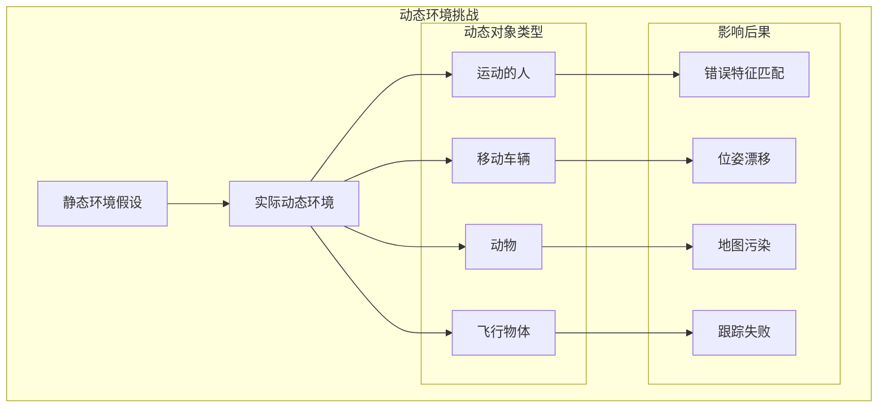

# 动态环境处理实现文档

## 概述

动态环境处理是ORB-SLAM2 SSD语义SLAM系统的关键创新特性之一。传统SLAM系统假设环境是静态的，但在真实世界中，环境中经常存在运动的人、车辆等动态对象。本文档详细描述了系统如何检测、处理和滤除动态元素，以提高SLAM系统在动态环境中的鲁棒性和精度。

## 动态环境挑战分析

### 1. 问题定义



### 2. 动态性分析

**动态对象特征**:
- **时变性**: 位置随时间变化
- **非刚性**: 人体等可变形对象
- **多样性**: 不同运动模式和速度
- **相互作用**: 动态对象间的遮挡和交互

**系统影响**:
- **特征匹配**: 动态区域的特征点违反运动假设
- **三角化**: 动态点的深度估计不准确
- **优化**: BA优化时引入错误约束
- **闭环检测**: 动态变化影响场景识别

## 多层次动态检测策略

### 1. 几何一致性检测

#### 1.1 多视角几何约束

```cpp
class GeometricConsistencyDetector {
private:
    float epipolar_threshold_ = 1.0f;
    float fundamental_inlier_ratio_ = 0.7f;
    int min_track_length_ = 3;
    
public:
    std::vector<bool> detectDynamicPoints(const std::vector<KeyFrame*>& keyframes,
                                         const std::vector<MapPoint*>& mappoints) {
        std::vector<bool> is_dynamic(mappoints.size(), false);
        
        for (size_t i = 0; i < mappoints.size(); i++) {
            MapPoint* mp = mappoints[i];
            if (mp->isBad()) continue;
            
            // 获取该地图点的观测
            auto observations = mp->GetObservations();
            if (observations.size() < min_track_length_) continue;
            
            // 检查多视角几何一致性
            if (!checkMultiViewConsistency(mp, observations)) {
                is_dynamic[i] = true;
            }
        }
        
        return is_dynamic;
    }
    
private:
    bool checkMultiViewConsistency(MapPoint* mp, 
                                  const std::map<KeyFrame*, size_t>& observations) {
        std::vector<KeyFrame*> keyframes;
        std::vector<cv::Point2f> points_2d;
        
        // 收集观测数据
        for (auto& obs : observations) {
            keyframes.push_back(obs.first);
            cv::KeyPoint kp = obs.first->mvKeysUn[obs.second];
            points_2d.push_back(kp.pt);
        }
        
        int inlier_count = 0;
        int total_pairs = 0;
        
        // 检查所有关键帧对
        for (size_t i = 0; i < keyframes.size(); i++) {
            for (size_t j = i + 1; j < keyframes.size(); j++) {
                total_pairs++;
                
                // 计算基础矩阵
                cv::Mat F = ComputeF12(keyframes[i], keyframes[j]);
                
                // 检查极线约束
                cv::Vec3f line = F * cv::Vec3f(points_2d[j].x, points_2d[j].y, 1.0f);
                float distance = std::abs(line[0] * points_2d[i].x + 
                                        line[1] * points_2d[i].y + line[2]) /
                               std::sqrt(line[0] * line[0] + line[1] * line[1]);
                
                if (distance < epipolar_threshold_) {
                    inlier_count++;
                }
            }
        }
        
        // 判断一致性
        return (float)inlier_count / total_pairs > fundamental_inlier_ratio_;
    }
    
    cv::Mat ComputeF12(KeyFrame* kf1, KeyFrame* kf2) {
        // 计算两个关键帧之间的基础矩阵
        cv::Mat R1w = kf1->GetRotation();
        cv::Mat t1w = kf1->GetTranslation();
        cv::Mat R2w = kf2->GetRotation();
        cv::Mat t2w = kf2->GetTranslation();
        
        cv::Mat R12 = R1w * R2w.t();
        cv::Mat t12 = -R1w * R2w.t() * t2w + t1w;
        
        cv::Mat t12x = (cv::Mat_<float>(3,3) << 
                       0, -t12.at<float>(2), t12.at<float>(1),
                       t12.at<float>(2), 0, -t12.at<float>(0),
                       -t12.at<float>(1), t12.at<float>(0), 0);
        
        cv::Mat K1 = kf1->mK;
        cv::Mat K2 = kf2->mK;
        
        return K1.t().inv() * t12x * R12 * K2.inv();
    }
};
```

#### 1.2 重投影误差统计分析

```cpp
class ReprojectionErrorAnalyzer {
private:
    float error_threshold_ratio_ = 2.0f;  // 2倍标准差
    int min_observations_ = 5;
    
public:
    std::vector<bool> analyzeReprojectionErrors(const std::vector<MapPoint*>& mappoints) {
        std::vector<bool> is_dynamic(mappoints.size(), false);
        
        for (size_t i = 0; i < mappoints.size(); i++) {
            MapPoint* mp = mappoints[i];
            if (mp->isBad()) continue;
            
            auto observations = mp->GetObservations();
            if (observations.size() < min_observations_) continue;
            
            // 计算重投影误差统计
            std::vector<float> errors;
            for (auto& obs : observations) {
                KeyFrame* kf = obs.first;
                size_t idx = obs.second;
                
                cv::Mat x3Dw = mp->GetWorldPos();
                cv::Mat x3Dc = kf->GetRotation() * x3Dw + kf->GetTranslation();
                
                float xc = x3Dc.at<float>(0);
                float yc = x3Dc.at<float>(1);
                float invzc = 1.0f / x3Dc.at<float>(2);
                
                float u = kf->fx * xc * invzc + kf->cx;
                float v = kf->fy * yc * invzc + kf->cy;
                
                cv::KeyPoint kp = kf->mvKeysUn[idx];
                float error = std::sqrt((u - kp.pt.x) * (u - kp.pt.x) + 
                                       (v - kp.pt.y) * (v - kp.pt.y));
                errors.push_back(error);
            }
            
            // 统计分析
            float mean_error = std::accumulate(errors.begin(), errors.end(), 0.0f) / errors.size();
            
            float variance = 0.0f;
            for (float error : errors) {
                variance += (error - mean_error) * (error - mean_error);
            }
            variance /= errors.size();
            float std_dev = std::sqrt(variance);
            
            // 异常检测
            int outlier_count = 0;
            for (float error : errors) {
                if (error > mean_error + error_threshold_ratio_ * std_dev) {
                    outlier_count++;
                }
            }
            
            if ((float)outlier_count / errors.size() > 0.3f) {
                is_dynamic[i] = true;
            }
        }
        
        return is_dynamic;
    }
};
```

### 2. 光流运动检测

#### 2.1 Lucas-Kanade光流跟踪

```cpp
class OpticalFlowDetector {
private:
    cv::Size window_size_ = cv::Size(21, 21);
    int max_level_ = 3;
    cv::TermCriteria criteria_ = cv::TermCriteria(
        cv::TermCriteria::COUNT | cv::TermCriteria::EPS, 30, 0.01);
    float motion_threshold_ = 5.0f;
    
public:
    std::vector<bool> detectDynamicByOpticalFlow(const cv::Mat& prev_image,
                                                const cv::Mat& curr_image,
                                                const std::vector<cv::Point2f>& prev_points,
                                                const cv::Mat& camera_motion) {
        std::vector<cv::Point2f> curr_points;
        std::vector<uchar> status;
        std::vector<float> errors;
        
        // Lucas-Kanade光流跟踪
        cv::calcOpticalFlowPyrLK(prev_image, curr_image, prev_points, curr_points,
                                status, errors, window_size_, max_level_, criteria_);
        
        std::vector<bool> is_dynamic(prev_points.size(), false);
        
        // 计算相机运动引起的预期光流
        std::vector<cv::Point2f> expected_motion = 
            computeExpectedMotion(prev_points, camera_motion);
        
        for (size_t i = 0; i < prev_points.size(); i++) {
            if (!status[i]) {
                is_dynamic[i] = true;  // 跟踪失败可能表示动态
                continue;
            }
            
            // 计算实际光流
            cv::Point2f actual_flow = curr_points[i] - prev_points[i];
            cv::Point2f expected_flow = expected_motion[i];
            
            // 计算运动不一致性
            cv::Point2f motion_diff = actual_flow - expected_flow;
            float motion_magnitude = cv::norm(motion_diff);
            
            if (motion_magnitude > motion_threshold_) {
                is_dynamic[i] = true;
            }
        }
        
        return is_dynamic;
    }
    
private:
    std::vector<cv::Point2f> computeExpectedMotion(
        const std::vector<cv::Point2f>& points,
        const cv::Mat& camera_motion) {
        
        std::vector<cv::Point2f> expected_motion(points.size());
        
        // 从相机运动矩阵提取旋转和平移
        cv::Mat R = camera_motion.rowRange(0, 3).colRange(0, 3);
        cv::Mat t = camera_motion.rowRange(0, 3).col(3);
        
        // 假设平均深度 (可以用实际深度替换)
        float avg_depth = 3.0f;
        
        for (size_t i = 0; i < points.size(); i++) {
            // 将像素坐标转换为相机坐标
            float x = (points[i].x - cx_) / fx_;
            float y = (points[i].y - cy_) / fy_;
            
            cv::Mat point_3d = (cv::Mat_<float>(3, 1) << x * avg_depth, 
                                                        y * avg_depth, 
                                                        avg_depth);
            
            // 应用相机运动
            cv::Mat transformed = R * point_3d + t;
            
            // 重投影到图像平面
            float u_new = fx_ * transformed.at<float>(0) / transformed.at<float>(2) + cx_;
            float v_new = fy_ * transformed.at<float>(1) / transformed.at<float>(2) + cy_;
            
            expected_motion[i] = cv::Point2f(u_new - points[i].x, v_new - points[i].y);
        }
        
        return expected_motion;
    }
    
    float fx_ = 525.0f, fy_ = 525.0f, cx_ = 319.5f, cy_ = 239.5f;  // 相机内参
};
```

#### 2.2 稠密光流分析

```cpp
class DenseOpticalFlowAnalyzer {
public:
    cv::Mat computeDenseOpticalFlow(const cv::Mat& prev_gray, 
                                   const cv::Mat& curr_gray) {
        cv::Mat flow;
        
        // 使用Farneback算法计算稠密光流
        cv::calcOpticalFlowPyrLK(prev_gray, curr_gray, flow, 
                                0.5, 3, 15, 3, 5, 1.2, 0);
        
        return flow;
    }
    
    cv::Mat analyzeDynamicRegions(const cv::Mat& flow, 
                                 const cv::Mat& camera_motion) {
        cv::Mat dynamic_mask = cv::Mat::zeros(flow.size(), CV_8UC1);
        
        for (int y = 0; y < flow.rows; y++) {
            for (int x = 0; x < flow.cols; x++) {
                cv::Point2f flow_vec = flow.at<cv::Point2f>(y, x);
                
                // 计算预期的相机运动引起的光流
                cv::Point2f expected_flow = computeExpectedFlowAt(x, y, camera_motion);
                
                // 计算运动不一致性
                cv::Point2f motion_diff = flow_vec - expected_flow;
                float motion_magnitude = cv::norm(motion_diff);
                
                if (motion_magnitude > flow_threshold_) {
                    dynamic_mask.at<uchar>(y, x) = 255;
                }
            }
        }
        
        // 形态学操作去除噪声
        cv::Mat kernel = cv::getStructuringElement(cv::MORPH_ELLIPSE, cv::Size(5, 5));
        cv::morphologyEx(dynamic_mask, dynamic_mask, cv::MORPH_OPEN, kernel);
        cv::morphologyEx(dynamic_mask, dynamic_mask, cv::MORPH_CLOSE, kernel);
        
        return dynamic_mask;
    }
    
private:
    float flow_threshold_ = 3.0f;
    
    cv::Point2f computeExpectedFlowAt(int x, int y, const cv::Mat& camera_motion) {
        // 简化实现：基于平均深度估算
        float depth = 3.0f;  // 假设深度
        
        // 相机坐标
        float xc = (x - cx_) * depth / fx_;
        float yc = (y - cy_) * depth / fy_;
        
        // 应用相机运动 (这里简化处理)
        cv::Mat R = camera_motion.rowRange(0, 3).colRange(0, 3);
        cv::Mat t = camera_motion.rowRange(0, 3).col(3);
        
        cv::Mat point = (cv::Mat_<float>(3, 1) << xc, yc, depth);
        cv::Mat transformed = R * point + t;
        
        float u_new = fx_ * transformed.at<float>(0) / transformed.at<float>(2) + cx_;
        float v_new = fy_ * transformed.at<float>(1) / transformed.at<float>(2) + cy_;
        
        return cv::Point2f(u_new - x, v_new - y);
    }
    
    float fx_ = 525.0f, fy_ = 525.0f, cx_ = 319.5f, cy_ = 239.5f;
};
```

### 3. 语义先验检测

#### 3.1 语义类别先验

```cpp
class SemanticPriorDetector {
private:
    // 预定义的动态类别及其运动概率
    std::map<int, float> dynamic_probabilities_ = {
        {PERSON_ID, 0.9f},      // 人：高动态概率
        {CAR_ID, 0.8f},         // 汽车：高动态概率
        {BICYCLE_ID, 0.9f},     // 自行车：高动态概率
        {MOTORCYCLE_ID, 0.9f},  // 摩托车：高动态概率
        {BUS_ID, 0.7f},         // 公交车：中等动态概率
        {TRUCK_ID, 0.6f},       // 卡车：中等动态概率
        {BIRD_ID, 0.95f},       // 鸟类：极高动态概率
        {CAT_ID, 0.8f},         // 猫：高动态概率
        {DOG_ID, 0.8f},         // 狗：高动态概率
        {CHAIR_ID, 0.1f},       // 椅子：低动态概率
        {TABLE_ID, 0.05f},      // 桌子：极低动态概率
        {BOTTLE_ID, 0.3f},      // 瓶子：低-中动态概率
    };
    
    float confidence_threshold_ = 0.5f;
    
public:
    std::vector<bool> detectBySemanticPrior(const std::vector<cv::Point2f>& points,
                                           const std::vector<Object>& detections) {
        std::vector<bool> is_dynamic(points.size(), false);
        
        for (size_t i = 0; i < points.size(); i++) {
            float max_dynamic_prob = 0.0f;
            
            // 检查点是否落在动态对象区域内
            for (const auto& detection : detections) {
                if (detection.prob < confidence_threshold_) continue;
                
                // 检查点是否在检测框内
                if (isPointInRect(points[i], detection.rect)) {
                    auto it = dynamic_probabilities_.find(detection.class_id);
                    if (it != dynamic_probabilities_.end()) {
                        float dynamic_prob = it->second * detection.prob;
                        max_dynamic_prob = std::max(max_dynamic_prob, dynamic_prob);
                    }
                }
            }
            
            // 基于最高动态概率判断
            if (max_dynamic_prob > 0.7f) {
                is_dynamic[i] = true;
            }
        }
        
        return is_dynamic;
    }
    
    // 区域级动态检测
    std::vector<DynamicRegion> detectDynamicRegions(const std::vector<Object>& detections) {
        std::vector<DynamicRegion> dynamic_regions;
        
        for (const auto& detection : detections) {
            if (detection.prob < confidence_threshold_) continue;
            
            auto it = dynamic_probabilities_.find(detection.class_id);
            if (it != dynamic_probabilities_.end() && it->second > 0.5f) {
                DynamicRegion region;
                region.rect = detection.rect;
                region.class_id = detection.class_id;
                region.dynamic_probability = it->second * detection.prob;
                region.confidence = detection.prob;
                
                dynamic_regions.push_back(region);
            }
        }
        
        return dynamic_regions;
    }
    
private:
    bool isPointInRect(const cv::Point2f& point, const cv::Rect_<float>& rect) {
        return point.x >= rect.x && point.x <= rect.x + rect.width &&
               point.y >= rect.y && point.y <= rect.y + rect.height;
    }
    
    struct DynamicRegion {
        cv::Rect_<float> rect;
        int class_id;
        float dynamic_probability;
        float confidence;
    };
};
```

#### 3.2 时序语义一致性

```cpp
class TemporalSemanticConsistency {
private:
    struct SemanticTrack {
        int track_id;
        std::vector<Object> detections;
        std::vector<double> timestamps;
        cv::Point2f velocity;
        bool is_dynamic;
    };
    
    std::vector<SemanticTrack> semantic_tracks_;
    int next_track_id_ = 0;
    float max_association_distance_ = 50.0f;
    float max_time_gap_ = 0.5f;  // 500ms
    
public:
    std::vector<bool> analyzeTemporalConsistency(const std::vector<Object>& current_detections,
                                                double timestamp) {
        std::vector<bool> is_dynamic(current_detections.size(), false);
        
        // 更新语义轨迹
        updateSemanticTracks(current_detections, timestamp);
        
        // 分析每个检测的时序一致性
        for (size_t i = 0; i < current_detections.size(); i++) {
            int track_id = findAssociatedTrack(current_detections[i]);
            
            if (track_id >= 0) {
                SemanticTrack& track = semantic_tracks_[track_id];
                
                // 分析运动模式
                if (track.detections.size() >= 3) {
                    bool dynamic = analyzeDynamicPattern(track);
                    is_dynamic[i] = dynamic;
                    track.is_dynamic = dynamic;
                }
            }
        }
        
        return is_dynamic;
    }
    
private:
    void updateSemanticTracks(const std::vector<Object>& detections, double timestamp) {
        std::vector<bool> associated(detections.size(), false);
        
        // 关联现有轨迹
        for (auto& track : semantic_tracks_) {
            if (track.timestamps.empty()) continue;
            
            double time_gap = timestamp - track.timestamps.back();
            if (time_gap > max_time_gap_) {
                continue;  // 轨迹过期
            }
            
            // 找最近的检测
            int best_match = -1;
            float min_distance = max_association_distance_;
            
            for (size_t i = 0; i < detections.size(); i++) {
                if (associated[i] || detections[i].class_id != track.detections.back().class_id) {
                    continue;
                }
                
                float distance = computeDetectionDistance(detections[i], track.detections.back());
                if (distance < min_distance) {
                    min_distance = distance;
                    best_match = i;
                }
            }
            
            if (best_match >= 0) {
                track.detections.push_back(detections[best_match]);
                track.timestamps.push_back(timestamp);
                associated[best_match] = true;
                
                // 更新速度估计
                updateVelocityEstimate(track);
            }
        }
        
        // 创建新轨迹
        for (size_t i = 0; i < detections.size(); i++) {
            if (!associated[i]) {
                SemanticTrack new_track;
                new_track.track_id = next_track_id_++;
                new_track.detections.push_back(detections[i]);
                new_track.timestamps.push_back(timestamp);
                new_track.velocity = cv::Point2f(0, 0);
                new_track.is_dynamic = false;
                
                semantic_tracks_.push_back(new_track);
            }
        }
    }
    
    bool analyzeDynamicPattern(const SemanticTrack& track) {
        if (track.detections.size() < 3) return false;
        
        // 计算位置变化
        std::vector<float> displacements;
        for (size_t i = 1; i < track.detections.size(); i++) {
            cv::Point2f center1 = getDetectionCenter(track.detections[i-1]);
            cv::Point2f center2 = getDetectionCenter(track.detections[i]);
            
            float displacement = cv::norm(center2 - center1);
            displacements.push_back(displacement);
        }
        
        // 分析运动模式
        float avg_displacement = std::accumulate(displacements.begin(), 
                                               displacements.end(), 0.0f) / displacements.size();
        
        float variance = 0.0f;
        for (float d : displacements) {
            variance += (d - avg_displacement) * (d - avg_displacement);
        }
        variance /= displacements.size();
        
        // 基于运动统计判断动态性
        return avg_displacement > 5.0f || variance > 25.0f;
    }
    
    cv::Point2f getDetectionCenter(const Object& detection) {
        return cv::Point2f(detection.rect.x + detection.rect.width / 2,
                          detection.rect.y + detection.rect.height / 2);
    }
    
    float computeDetectionDistance(const Object& det1, const Object& det2) {
        cv::Point2f center1 = getDetectionCenter(det1);
        cv::Point2f center2 = getDetectionCenter(det2);
        return cv::norm(center1 - center2);
    }
    
    void updateVelocityEstimate(SemanticTrack& track) {
        if (track.detections.size() < 2) return;
        
        cv::Point2f center1 = getDetectionCenter(track.detections[track.detections.size()-2]);
        cv::Point2f center2 = getDetectionCenter(track.detections.back());
        
        double time_diff = track.timestamps.back() - track.timestamps[track.timestamps.size()-2];
        
        track.velocity = (center2 - center1) / time_diff;
    }
    
    int findAssociatedTrack(const Object& detection) {
        for (size_t i = 0; i < semantic_tracks_.size(); i++) {
            if (semantic_tracks_[i].detections.empty()) continue;
            
            const Object& last_detection = semantic_tracks_[i].detections.back();
            if (last_detection.class_id == detection.class_id) {
                float distance = computeDetectionDistance(detection, last_detection);
                if (distance < max_association_distance_) {
                    return i;
                }
            }
        }
        return -1;
    }
};
```

## 动态点融合与决策

### 1. 多源信息融合

```cpp
class DynamicPointFusion {
private:
    struct DynamicEvidence {
        float geometric_score;
        float optical_flow_score;
        float semantic_score;
        float temporal_score;
    };
    
    // 融合权重
    float w_geometric_ = 0.3f;
    float w_optical_flow_ = 0.3f;
    float w_semantic_ = 0.3f;
    float w_temporal_ = 0.1f;
    
public:
    std::vector<bool> fuseDynamicDetections(
        const std::vector<bool>& geometric_dynamic,
        const std::vector<bool>& optical_flow_dynamic,
        const std::vector<bool>& semantic_dynamic,
        const std::vector<float>& geometric_confidence,
        const std::vector<float>& optical_flow_confidence,
        const std::vector<float>& semantic_confidence) {
        
        std::vector<bool> final_decision(geometric_dynamic.size(), false);
        
        for (size_t i = 0; i < geometric_dynamic.size(); i++) {
            DynamicEvidence evidence;
            
            // 计算各种证据得分
            evidence.geometric_score = geometric_dynamic[i] ? 
                geometric_confidence[i] : (1.0f - geometric_confidence[i]);
            evidence.optical_flow_score = optical_flow_dynamic[i] ? 
                optical_flow_confidence[i] : (1.0f - optical_flow_confidence[i]);
            evidence.semantic_score = semantic_dynamic[i] ? 
                semantic_confidence[i] : (1.0f - semantic_confidence[i]);
            
            // 加权融合
            float dynamic_score = w_geometric_ * evidence.geometric_score +
                                w_optical_flow_ * evidence.optical_flow_score +
                                w_semantic_ * evidence.semantic_score;
            
            // 决策阈值
            final_decision[i] = dynamic_score > 0.5f;
        }
        
        return final_decision;
    }
    
    // 贝叶斯融合方法
    std::vector<float> bayesianFusion(const std::vector<DynamicEvidence>& evidences) {
        std::vector<float> dynamic_probabilities(evidences.size());
        
        for (size_t i = 0; i < evidences.size(); i++) {
            // 先验概率（基于环境类型）
            float prior_dynamic = 0.1f;  // 10%的特征点是动态的
            
            // 似然度计算
            float likelihood_dynamic = evidences[i].geometric_score * 
                                     evidences[i].optical_flow_score * 
                                     evidences[i].semantic_score;
                                     
            float likelihood_static = (1.0f - evidences[i].geometric_score) * 
                                    (1.0f - evidences[i].optical_flow_score) * 
                                    (1.0f - evidences[i].semantic_score);
            
            // 贝叶斯更新
            float posterior_dynamic = (likelihood_dynamic * prior_dynamic) /
                (likelihood_dynamic * prior_dynamic + likelihood_static * (1.0f - prior_dynamic));
            
            dynamic_probabilities[i] = posterior_dynamic;
        }
        
        return dynamic_probabilities;
    }
};
```

### 2. 时序一致性滤波

```cpp
class TemporalConsistencyFilter {
private:
    struct PointHistory {
        std::vector<bool> dynamic_history;
        std::vector<double> timestamps;
        int consecutive_dynamic_count;
        int consecutive_static_count;
    };
    
    std::map<int, PointHistory> point_histories_;
    int history_length_ = 5;
    int min_consecutive_for_decision_ = 3;
    
public:
    std::vector<bool> applyTemporalFilter(const std::vector<bool>& current_dynamic,
                                        const std::vector<int>& point_ids,
                                        double timestamp) {
        std::vector<bool> filtered_dynamic = current_dynamic;
        
        for (size_t i = 0; i < current_dynamic.size(); i++) {
            int point_id = point_ids[i];
            
            // 更新历史记录
            updatePointHistory(point_id, current_dynamic[i], timestamp);
            
            // 应用时序滤波
            filtered_dynamic[i] = applyTemporalLogic(point_id);
        }
        
        return filtered_dynamic;
    }
    
private:
    void updatePointHistory(int point_id, bool is_dynamic, double timestamp) {
        PointHistory& history = point_histories_[point_id];
        
        history.dynamic_history.push_back(is_dynamic);
        history.timestamps.push_back(timestamp);
        
        // 维护历史长度
        if (history.dynamic_history.size() > history_length_) {
            history.dynamic_history.erase(history.dynamic_history.begin());
            history.timestamps.erase(history.timestamps.begin());
        }
        
        // 更新连续计数
        if (is_dynamic) {
            history.consecutive_dynamic_count++;
            history.consecutive_static_count = 0;
        } else {
            history.consecutive_static_count++;
            history.consecutive_dynamic_count = 0;
        }
    }
    
    bool applyTemporalLogic(int point_id) {
        const PointHistory& history = point_histories_[point_id];
        
        if (history.dynamic_history.empty()) return false;
        
        // 连续性判断
        if (history.consecutive_dynamic_count >= min_consecutive_for_decision_) {
            return true;
        }
        
        if (history.consecutive_static_count >= min_consecutive_for_decision_) {
            return false;
        }
        
        // 投票机制
        int dynamic_votes = std::count(history.dynamic_history.begin(),
                                     history.dynamic_history.end(), true);
        
        return (float)dynamic_votes / history.dynamic_history.size() > 0.6f;
    }
};
```

## 系统集成与性能优化

### 1. 实时处理优化

```cpp
class RealTimeDynamicProcessor {
private:
    bool enable_geometric_check_ = true;
    bool enable_optical_flow_check_ = true;
    bool enable_semantic_check_ = true;
    
    // 性能监控
    std::chrono::high_resolution_clock::time_point start_time_;
    float processing_time_budget_ = 10.0f;  // 10ms
    
public:
    std::vector<bool> processFrame(const FrameData& frame) {
        start_time_ = std::chrono::high_resolution_clock::now();
        
        std::vector<bool> dynamic_result;
        
        // 自适应处理策略
        if (enable_geometric_check_ && hasTimeRemaining()) {
            auto geometric_result = processGeometric(frame);
            dynamic_result = geometric_result;
        }
        
        if (enable_optical_flow_check_ && hasTimeRemaining()) {
            auto flow_result = processOpticalFlow(frame);
            if (!dynamic_result.empty()) {
                dynamic_result = fuseResults(dynamic_result, flow_result);
            } else {
                dynamic_result = flow_result;
            }
        }
        
        if (enable_semantic_check_ && hasTimeRemaining()) {
            auto semantic_result = processSemantic(frame);
            if (!dynamic_result.empty()) {
                dynamic_result = fuseResults(dynamic_result, semantic_result);
            } else {
                dynamic_result = semantic_result;
            }
        }
        
        return dynamic_result;
    }
    
private:
    bool hasTimeRemaining() {
        auto current_time = std::chrono::high_resolution_clock::now();
        auto elapsed = std::chrono::duration_cast<std::chrono::milliseconds>(
            current_time - start_time_).count();
        return elapsed < processing_time_budget_;
    }
    
    void adaptProcessingStrategy(float average_processing_time) {
        if (average_processing_time > processing_time_budget_) {
            // 处理时间超预算，禁用耗时的检测
            if (enable_optical_flow_check_) {
                enable_optical_flow_check_ = false;
            } else if (enable_geometric_check_) {
                enable_geometric_check_ = false;
            }
        } else if (average_processing_time < processing_time_budget_ * 0.7f) {
            // 处理时间充足，启用更多检测
            if (!enable_geometric_check_) {
                enable_geometric_check_ = true;
            } else if (!enable_optical_flow_check_) {
                enable_optical_flow_check_ = true;
            }
        }
    }
};
```

### 2. 内存优化

```cpp
class MemoryEfficientDynamicDetector {
private:
    // 循环缓冲区用于历史数据
    std::vector<cv::Mat> image_buffer_;
    std::vector<std::vector<cv::Point2f>> point_buffer_;
    size_t buffer_size_ = 3;
    size_t current_index_ = 0;
    
public:
    void updateBuffer(const cv::Mat& image, const std::vector<cv::Point2f>& points) {
        if (image_buffer_.size() < buffer_size_) {
            image_buffer_.push_back(image.clone());
            point_buffer_.push_back(points);
        } else {
            // 覆盖最旧的数据
            image_buffer_[current_index_] = image.clone();
            point_buffer_[current_index_] = points;
            current_index_ = (current_index_ + 1) % buffer_size_;
        }
    }
    
    std::vector<bool> processWithLimitedMemory() {
        if (image_buffer_.size() < 2) {
            return std::vector<bool>();  // 需要至少两帧
        }
        
        // 使用最近的两帧进行处理
        size_t latest_idx = (current_index_ + buffer_size_ - 1) % buffer_size_;
        size_t prev_idx = (latest_idx + buffer_size_ - 1) % buffer_size_;
        
        return processFramePair(image_buffer_[prev_idx], image_buffer_[latest_idx],
                               point_buffer_[prev_idx], point_buffer_[latest_idx]);
    }
    
private:
    std::vector<bool> processFramePair(const cv::Mat& prev_img, const cv::Mat& curr_img,
                                      const std::vector<cv::Point2f>& prev_points,
                                      const std::vector<cv::Point2f>& curr_points) {
        // 实现基于两帧的动态检测
        OpticalFlowDetector flow_detector;
        return flow_detector.detectDynamicByOpticalFlow(prev_img, curr_img, prev_points, cv::Mat());
    }
};
```

这个动态环境处理实现为语义SLAM系统提供了在复杂动态环境中的鲁棒性保证，通过多层次、多模态的动态检测策略，有效提高了系统在真实世界应用中的性能和可靠性。