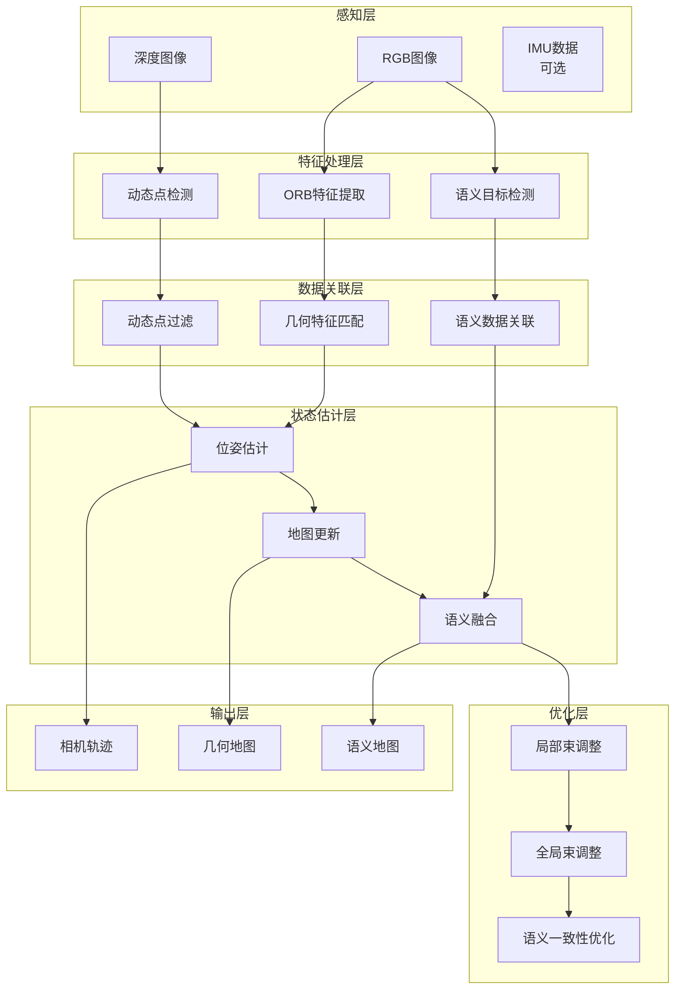

# 语义SLAM实现原理文档

## 概述

本文档详细阐述了ORB-SLAM2 SSD语义SLAM系统的核心实现原理，包括语义信息与几何SLAM的融合机制、动态环境处理策略、数据关联算法等关键技术。系统通过将2D语义理解与3D空间重建相结合，实现了在动态环境中的鲁棒定位与语义建图。

## 系统整体框架



## 核心技术原理

### 1. 语义-几何信息融合

#### 1.1 多模态特征表示

系统采用分层的特征表示方法：

**几何特征层**:
- ORB特征点：提供亚像素级精度的几何约束
- 深度信息：直接获得3D几何结构
- 运动估计：基于光流和多视角几何

**语义特征层**:
- 目标检测框：提供粗粒度的语义区域
- 类别标签：提供高级语义理解
- 置信度信息：量化语义不确定性

**融合策略**:
```python
# 伪代码：多模态特征融合
def multimodal_fusion(geometric_features, semantic_features):
    # 1. 几何约束用于精确定位
    pose_estimate = geometric_slam(geometric_features)
    
    # 2. 语义信息用于场景理解
    semantic_labels = semantic_detection(semantic_features)
    
    # 3. 互相验证和增强
    filtered_geometry = semantic_filter(geometric_features, semantic_labels)
    refined_semantics = geometric_refine(semantic_labels, pose_estimate)
    
    # 4. 联合优化
    joint_state = joint_optimization(filtered_geometry, refined_semantics)
    
    return joint_state
```

#### 1.2 语义约束的几何作用

语义信息在几何SLAM中发挥多重作用：

**特征点过滤**:
```cpp
// 基于语义先验过滤动态特征点
bool isDynamicFeature(const cv::KeyPoint& kp, const Object& detection) {
    if (detection.class_id == PERSON_ID || 
        detection.class_id == CAR_ID || 
        detection.class_id == BICYCLE_ID) {
        // 检查特征点是否在动态对象区域内
        return detection.rect.contains(kp.pt);
    }
    return false;
}

void filterDynamicFeatures(std::vector<cv::KeyPoint>& keypoints,
                          const std::vector<Object>& detections) {
    keypoints.erase(
        std::remove_if(keypoints.begin(), keypoints.end(),
            [&](const cv::KeyPoint& kp) {
                for (const auto& det : detections) {
                    if (isDynamicFeature(kp, det)) return true;
                }
                return false;
            }),
        keypoints.end()
    );
}
```

**数据关联增强**:
```cpp
// 语义信息辅助的数据关联
float computeSemanticSimilarity(const MapPoint* mp, const Object& detection) {
    if (mp->semantic_label == detection.class_id) {
        return 1.0f;  // 类别匹配
    } else if (isCompatibleClass(mp->semantic_label, detection.class_id)) {
        return 0.5f;  // 兼容类别
    }
    return 0.0f;  // 不兼容
}

float enhancedMatchingCost(const MapPoint* mp, const cv::KeyPoint& kp,
                          const Object& detection) {
    float geometric_cost = computeGeometricCost(mp, kp);
    float semantic_cost = 1.0f - computeSemanticSimilarity(mp, detection);
    
    // 加权融合
    return alpha * geometric_cost + (1 - alpha) * semantic_cost;
}
```

### 2. 动态环境处理机制

#### 2.1 多层次动态检测

系统采用三层动态检测策略：

**几何一致性检测**:
```cpp
bool geometricConsistencyCheck(const std::vector<cv::Point2f>& prev_points,
                              const std::vector<cv::Point2f>& curr_points,
                              const cv::Mat& fundamental_matrix) {
    int inlier_count = 0;
    float epipolar_threshold = 1.0f;
    
    for (size_t i = 0; i < prev_points.size(); i++) {
        // 计算点到极线的距离
        cv::Vec3f line = fundamental_matrix * cv::Vec3f(curr_points[i].x, 
                                                       curr_points[i].y, 1.0f);
        float distance = std::abs(line[0] * prev_points[i].x + 
                                 line[1] * prev_points[i].y + line[2]) /
                        std::sqrt(line[0] * line[0] + line[1] * line[1]);
        
        if (distance < epipolar_threshold) {
            inlier_count++;
        }
    }
    
    return (float)inlier_count / prev_points.size() > 0.7f;  // 70%内点阈值
}
```

**光流运动检测**:
```cpp
std::vector<bool> opticalFlowConsistencyCheck(const cv::Mat& prev_img,
                                             const cv::Mat& curr_img,
                                             const std::vector<cv::Point2f>& points) {
    std::vector<cv::Point2f> tracked_points;
    std::vector<uchar> status;
    std::vector<float> errors;
    
    // Lucas-Kanade光流跟踪
    cv::calcOpticalFlowPyrLK(prev_img, curr_img, points, tracked_points,
                            status, errors);
    
    std::vector<bool> is_dynamic(points.size(), false);
    
    // 分析光流向量的一致性
    for (size_t i = 0; i < points.size(); i++) {
        if (status[i]) {
            cv::Point2f motion = tracked_points[i] - points[i];
            float motion_magnitude = cv::norm(motion);
            
            // 基于运动幅度和相机运动估计判断
            if (motion_magnitude > motion_threshold && 
                !isConsistentWithCameraMotion(motion, camera_motion)) {
                is_dynamic[i] = true;
            }
        }
    }
    
    return is_dynamic;
}
```

**语义先验检测**:
```cpp
std::vector<bool> semanticPriorCheck(const std::vector<cv::Point2f>& points,
                                    const std::vector<Object>& detections) {
    std::vector<bool> is_dynamic(points.size(), false);
    
    // 预定义的动态类别
    std::set<int> dynamic_classes = {PERSON_ID, CAR_ID, BICYCLE_ID, 
                                    MOTORCYCLE_ID, BUS_ID, TRUCK_ID};
    
    for (size_t i = 0; i < points.size(); i++) {
        for (const auto& detection : detections) {
            if (dynamic_classes.count(detection.class_id) &&
                detection.rect.contains(points[i]) &&
                detection.prob > 0.7f) {
                is_dynamic[i] = true;
                break;
            }
        }
    }
    
    return is_dynamic;
}
```

#### 2.2 动态点融合决策

```cpp
std::vector<bool> fuseDynamicDetections(const std::vector<bool>& geometric,
                                       const std::vector<bool>& optical_flow,
                                       const std::vector<bool>& semantic) {
    std::vector<bool> final_decision(geometric.size(), false);
    
    for (size_t i = 0; i < geometric.size(); i++) {
        // 投票机制
        int dynamic_votes = 0;
        if (geometric[i]) dynamic_votes++;
        if (optical_flow[i]) dynamic_votes++;
        if (semantic[i]) dynamic_votes++;
        
        // 语义先验权重更高
        if (semantic[i] && dynamic_votes >= 1) {
            final_decision[i] = true;
        } else if (dynamic_votes >= 2) {
            final_decision[i] = true;
        }
    }
    
    return final_decision;
}
```

### 3. 语义数据关联算法

#### 3.1 空间-语义联合关联

```cpp
class SemanticDataAssociation {
private:
    float spatial_weight_ = 0.6f;
    float semantic_weight_ = 0.4f;
    float association_threshold_ = 0.5f;
    
public:
    std::vector<int> associateDetections(const std::vector<Object>& detections,
                                        const std::vector<Cluster>& clusters) {
        std::vector<int> associations(detections.size(), -1);
        
        // 构建匹配矩阵
        cv::Mat cost_matrix(detections.size(), clusters.size(), CV_32F);
        
        for (size_t i = 0; i < detections.size(); i++) {
            for (size_t j = 0; j < clusters.size(); j++) {
                cost_matrix.at<float>(i, j) = computeAssociationCost(
                    detections[i], clusters[j]);
            }
        }
        
        // 匈牙利算法求解最优分配
        std::vector<int> assignment = hungarianAlgorithm(cost_matrix);
        
        // 过滤低质量关联
        for (size_t i = 0; i < assignment.size(); i++) {
            if (assignment[i] >= 0 && 
                cost_matrix.at<float>(i, assignment[i]) < association_threshold_) {
                associations[i] = assignment[i];
            }
        }
        
        return associations;
    }
    
private:
    float computeAssociationCost(const Object& detection, const Cluster& cluster) {
        // 1. 空间距离成本
        cv::Point2f detection_center(detection.rect.x + detection.rect.width/2,
                                    detection.rect.y + detection.rect.height/2);
        
        // 将3D中心投影到图像平面
        cv::Point2f cluster_center_2d = projectToImage(cluster.centroid);
        float spatial_distance = cv::norm(detection_center - cluster_center_2d);
        float spatial_cost = std::min(spatial_distance / 100.0f, 1.0f);  // 归一化
        
        // 2. 语义相似度成本
        float semantic_cost = 1.0f;
        if (detection.class_id == cluster.class_id) {
            semantic_cost = 0.0f;  // 完全匹配
        } else if (isCompatibleClass(detection.class_id, cluster.class_id)) {
            semantic_cost = 0.3f;  // 兼容类别
        }
        
        // 3. 尺寸一致性成本
        float size_difference = computeSizeDifference(detection, cluster);
        float size_cost = std::min(size_difference, 1.0f);
        
        // 4. 时间一致性成本
        float time_cost = computeTemporalCost(detection, cluster);
        
        // 加权融合
        return spatial_weight_ * spatial_cost + 
               semantic_weight_ * semantic_cost +
               0.2f * size_cost + 
               0.2f * time_cost;
    }
};
```

#### 3.2 概率数据关联

```cpp
class ProbabilisticDataAssociation {
private:
    struct Association {
        int detection_id;
        int cluster_id;
        float probability;
    };
    
public:
    std::vector<Association> computeAssociationProbabilities(
        const std::vector<Object>& detections,
        const std::vector<Cluster>& clusters) {
        
        std::vector<Association> associations;
        
        for (size_t i = 0; i < detections.size(); i++) {
            std::vector<float> likelihoods;
            
            // 计算每个聚类的似然度
            for (size_t j = 0; j < clusters.size(); j++) {
                float likelihood = computeLikelihood(detections[i], clusters[j]);
                likelihoods.push_back(likelihood);
            }
            
            // 添加新目标假设
            float new_target_likelihood = computeNewTargetLikelihood(detections[i]);
            likelihoods.push_back(new_target_likelihood);
            
            // 归一化得到概率
            float total = std::accumulate(likelihoods.begin(), likelihoods.end(), 0.0f);
            
            for (size_t j = 0; j < clusters.size(); j++) {
                if (total > 0) {
                    Association assoc;
                    assoc.detection_id = i;
                    assoc.cluster_id = j;
                    assoc.probability = likelihoods[j] / total;
                    
                    if (assoc.probability > 0.1f) {  // 概率阈值
                        associations.push_back(assoc);
                    }
                }
            }
        }
        
        return associations;
    }
    
private:
    float computeLikelihood(const Object& detection, const Cluster& cluster) {
        // 多元高斯似然模型
        Eigen::Vector4f observation(detection.rect.x, detection.rect.y,
                                   detection.rect.width, detection.rect.height);
        Eigen::Vector4f prediction = predictMeasurement(cluster);
        Eigen::Matrix4f covariance = measurementCovariance(cluster);
        
        Eigen::Vector4f residual = observation - prediction;
        float mahalanobis_dist = std::sqrt(residual.transpose() * 
                                          covariance.inverse() * residual);
        
        // 高斯概率密度
        float likelihood = std::exp(-0.5f * mahalanobis_dist * mahalanobis_dist);
        
        // 语义匹配加权
        if (detection.class_id == cluster.class_id) {
            likelihood *= detection.prob * cluster.prob;
        } else {
            likelihood *= 0.1f;  // 语义不匹配惩罚
        }
        
        return likelihood;
    }
};
```

### 4. 语义一致性优化

#### 4.1 语义约束的BA优化

```cpp
class SemanticBundleAdjustment {
public:
    void optimize(std::vector<KeyFrame*>& keyframes,
                  std::vector<MapPoint*>& mappoints,
                  std::vector<Cluster>& semantic_objects) {
        
        // 构建优化器
        g2o::SparseOptimizer optimizer;
        setupOptimizer(optimizer);
        
        // 添加相机位姿顶点
        addCameraPoseVertices(optimizer, keyframes);
        
        // 添加3D点顶点
        addMapPointVertices(optimizer, mappoints);
        
        // 添加语义对象顶点
        addSemanticObjectVertices(optimizer, semantic_objects);
        
        // 添加几何重投影边
        addGeometricEdges(optimizer, keyframes, mappoints);
        
        // 添加语义约束边
        addSemanticConstraintEdges(optimizer, keyframes, semantic_objects);
        
        // 执行优化
        optimizer.initializeOptimization();
        optimizer.optimize(10);
        
        // 更新状态
        updateStates(optimizer, keyframes, mappoints, semantic_objects);
    }
    
private:
    void addSemanticConstraintEdges(g2o::SparseOptimizer& optimizer,
                                   const std::vector<KeyFrame*>& keyframes,
                                   const std::vector<Cluster>& semantic_objects) {
        
        for (const auto& kf : keyframes) {
            for (const auto& detection : kf->semantic_detections) {
                // 找到关联的语义对象
                int object_id = findAssociatedObject(detection, semantic_objects);
                if (object_id >= 0) {
                    // 创建语义约束边
                    auto edge = new SemanticConstraintEdge();
                    edge->setVertex(0, optimizer.vertex(kf->mnId));  // 相机位姿
                    edge->setVertex(1, optimizer.vertex(1000000 + object_id));  // 语义对象
                    
                    // 设置观测值和信息矩阵
                    Eigen::Vector4d measurement(detection.rect.x, detection.rect.y,
                                              detection.rect.width, detection.rect.height);
                    edge->setMeasurement(measurement);
                    
                    Eigen::Matrix4d information = Eigen::Matrix4d::Identity();
                    information *= detection.prob;  // 置信度加权
                    edge->setInformation(information);
                    
                    // 设置鲁棒核
                    auto robust_kernel = new g2o::RobustKernelHuber();
                    robust_kernel->setDelta(sqrt(5.991));  // 95%置信区间
                    edge->setRobustKernel(robust_kernel);
                    
                    optimizer.addEdge(edge);
                }
            }
        }
    }
};

// 自定义语义约束边
class SemanticConstraintEdge : public g2o::BaseBinaryEdge<4, Eigen::Vector4d,
                                                         g2o::VertexSE3Expmap,
                                                         SemanticObjectVertex> {
public:
    void computeError() override {
        const g2o::VertexSE3Expmap* camera = 
            static_cast<const g2o::VertexSE3Expmap*>(_vertices[0]);
        const SemanticObjectVertex* object = 
            static_cast<const SemanticObjectVertex*>(_vertices[1]);
        
        // 计算语义对象在图像中的投影
        Eigen::Vector4d predicted = projectSemanticObject(camera->estimate(),
                                                          object->estimate());
        
        // 计算重投影误差
        _error = _measurement - predicted;
    }
    
private:
    Eigen::Vector4d projectSemanticObject(const g2o::SE3Quat& camera_pose,
                                         const SemanticObject& object) {
        // 将3D语义对象投影到图像平面
        // 这里简化为包围框的投影
        Eigen::Vector3d center_3d = object.center;
        Eigen::Vector3d size_3d = object.size;
        
        // 相机坐标系转换
        Eigen::Vector3d center_cam = camera_pose.inverse() * center_3d;
        
        // 投影到图像平面
        float fx = 525.0f, fy = 525.0f, cx = 319.5f, cy = 239.5f;
        float u = fx * center_cam.x() / center_cam.z() + cx;
        float v = fy * center_cam.y() / center_cam.z() + cy;
        
        // 估算投影尺寸
        float depth = center_cam.z();
        float width_2d = fx * size_3d.x() / depth;
        float height_2d = fy * size_3d.y() / depth;
        
        return Eigen::Vector4d(u - width_2d/2, v - height_2d/2, width_2d, height_2d);
    }
};
```

#### 4.2 语义一致性检验

```cpp
class SemanticConsistencyChecker {
public:
    bool checkConsistency(const std::vector<Cluster>& semantic_objects,
                         const std::vector<KeyFrame*>& keyframes) {
        
        for (const auto& object : semantic_objects) {
            if (!checkSpatialConsistency(object)) return false;
            if (!checkTemporalConsistency(object, keyframes)) return false;
            if (!checkSemanticConsistency(object)) return false;
        }
        
        return true;
    }
    
private:
    bool checkSpatialConsistency(const Cluster& object) {
        // 检查3D包围框的合理性
        Eigen::Vector3f size = object.maxPt - object.minPt;
        
        // 根据类别检查尺寸合理性
        auto size_range = getExpectedSizeRange(object.class_id);
        
        return (size.x() >= size_range.min_size.x() && size.x() <= size_range.max_size.x() &&
                size.y() >= size_range.min_size.y() && size.y() <= size_range.max_size.y() &&
                size.z() >= size_range.min_size.z() && size.z() <= size_range.max_size.z());
    }
    
    bool checkTemporalConsistency(const Cluster& object,
                                 const std::vector<KeyFrame*>& keyframes) {
        // 检查对象在时间序列上的一致性
        std::vector<Observation> observations = 
            getObjectObservations(object, keyframes);
        
        if (observations.size() < 2) return true;  // 单次观测无法验证
        
        // 检查位置变化的合理性
        for (size_t i = 1; i < observations.size(); i++) {
            float distance = cv::norm(observations[i].position - observations[i-1].position);
            float time_diff = observations[i].timestamp - observations[i-1].timestamp;
            float velocity = distance / time_diff;
            
            // 根据类别判断合理的运动速度
            float max_velocity = getMaxVelocity(object.class_id);
            if (velocity > max_velocity) {
                return false;  // 运动速度不合理
            }
        }
        
        return true;
    }
    
    bool checkSemanticConsistency(const Cluster& object) {
        // 检查语义标签的一致性
        if (object.prob < 0.3f) {
            return false;  // 置信度过低
        }
        
        // 检查类别的空间合理性
        if (object.class_id == PERSON_ID) {
            // 人的高度应该在合理范围内
            float height = object.maxPt.y() - object.minPt.y();
            return height > 1.0f && height < 2.5f;
        } else if (object.class_id == CAR_ID) {
            // 汽车的尺寸检查
            Eigen::Vector3f size = object.maxPt - object.minPt;
            return size.x() > 2.0f && size.x() < 6.0f &&
                   size.y() > 1.0f && size.y() < 2.5f &&
                   size.z() > 1.5f && size.z() < 3.0f;
        }
        
        return true;
    }
};
```

### 5. 系统鲁棒性机制

#### 5.1 多层次失效保护

```cpp
class RobustnessManager {
public:
    void handleSystemFailure(FailureType type, FailureLevel level) {
        switch (type) {
            case TRACKING_FAILURE:
                handleTrackingFailure(level);
                break;
            case SEMANTIC_FAILURE:
                handleSemanticFailure(level);
                break;
            case MAPPING_FAILURE:
                handleMappingFailure(level);
                break;
        }
    }
    
private:
    void handleTrackingFailure(FailureLevel level) {
        switch (level) {
            case MINOR:
                // 降低语义权重，依赖几何特征
                semantic_weight_ *= 0.5f;
                break;
            case MODERATE:
                // 启动重定位，暂停语义处理
                system_->RequestRelocalization();
                pause_semantic_processing_ = true;
                break;
            case SEVERE:
                // 重置系统
                system_->Reset();
                break;
        }
    }
    
    void handleSemanticFailure(FailureLevel level) {
        switch (level) {
            case MINOR:
                // 跳过当前帧的语义处理
                skip_semantic_frames_ = 1;
                break;
            case MODERATE:
                // 降级为纯几何SLAM
                semantic_enabled_ = false;
                temporal_counter_ = 0;
                break;
            case SEVERE:
                // 禁用语义功能
                permanently_disable_semantic_ = true;
                break;
        }
    }
};
```

#### 5.2 自适应参数调整

```cpp
class AdaptiveParameterManager {
private:
    struct SystemMetrics {
        float tracking_quality;
        float semantic_quality;
        float processing_time;
        int dynamic_ratio;
    };
    
public:
    void updateParameters(const SystemMetrics& metrics) {
        // 根据系统性能动态调整参数
        
        if (metrics.tracking_quality < 0.7f) {
            // 跟踪质量差，降低语义权重
            semantic_weight_ = std::max(0.1f, semantic_weight_ - 0.1f);
        } else if (metrics.tracking_quality > 0.9f) {
            // 跟踪质量好，增加语义权重
            semantic_weight_ = std::min(0.8f, semantic_weight_ + 0.05f);
        }
        
        if (metrics.processing_time > time_budget_) {
            // 处理时间超预算，降低处理精度
            downscale_factor_ = std::min(4.0f, downscale_factor_ * 1.2f);
            detection_threshold_ = std::min(0.8f, detection_threshold_ + 0.05f);
        }
        
        if (metrics.dynamic_ratio > 0.5f) {
            // 动态环境，增强动态检测
            dynamic_detection_threshold_ = std::max(0.3f, 
                                                   dynamic_detection_threshold_ - 0.05f);
        }
    }
    
private:
    float semantic_weight_ = 0.4f;
    float downscale_factor_ = 1.0f;
    float detection_threshold_ = 0.5f;
    float dynamic_detection_threshold_ = 0.5f;
    float time_budget_ = 33.0f;  // 30 FPS
};
```

## 性能优化策略

### 1. 计算复杂度分析

**时间复杂度**:
- ORB特征提取: O(n) where n = 图像像素数
- 语义检测: O(1) 固定网络推理时间
- 数据关联: O(m×k) where m = 检测数，k = 聚类数
- 束调整: O((p+l)³) where p = 位姿数，l = 路标数

**空间复杂度**:
- 特征存储: O(f×d) where f = 特征数，d = 描述子维度
- 点云存储: O(n×c) where n = 点数，c = 颜色通道
- 语义数据库: O(s×a) where s = 语义对象数，a = 属性数

### 2. 实时性优化

```cpp
// 并行处理流水线
class ParallelProcessingPipeline {
public:
    void processFrame(const FrameData& frame) {
        // 启动并行任务
        auto geometric_task = std::async(std::launch::async, 
            [this, &frame]() { return processGeometric(frame); });
        
        auto semantic_task = std::async(std::launch::async,
            [this, &frame]() { return processSemantic(frame); });
        
        auto dynamic_task = std::async(std::launch::async,
            [this, &frame]() { return processDynamic(frame); });
        
        // 等待结果并融合
        auto geometric_result = geometric_task.get();
        auto semantic_result = semantic_task.get();
        auto dynamic_result = dynamic_task.get();
        
        // 融合处理
        fuseResults(geometric_result, semantic_result, dynamic_result);
    }
};
```

### 3. 内存优化

```cpp
// 智能内存管理
class MemoryManager {
public:
    void optimizeMemoryUsage() {
        // 1. 点云降采样
        downsamplePointClouds();
        
        // 2. 历史数据清理
        cleanupHistoricalData();
        
        // 3. 缓存管理
        manageCacheSize();
    }
    
private:
    void downsamplePointClouds() {
        for (auto& cloud : point_clouds_) {
            if (cloud->size() > max_points_per_cloud_) {
                pcl::VoxelGrid<PointT> voxel_filter;
                voxel_filter.setInputCloud(cloud);
                voxel_filter.setLeafSize(adaptive_voxel_size_, 
                                        adaptive_voxel_size_, 
                                        adaptive_voxel_size_);
                voxel_filter.filter(*cloud);
            }
        }
    }
};
```

这个实现原理文档详细阐述了语义SLAM系统的核心技术，为开发者提供了深入理解系统工作机制的技术基础。