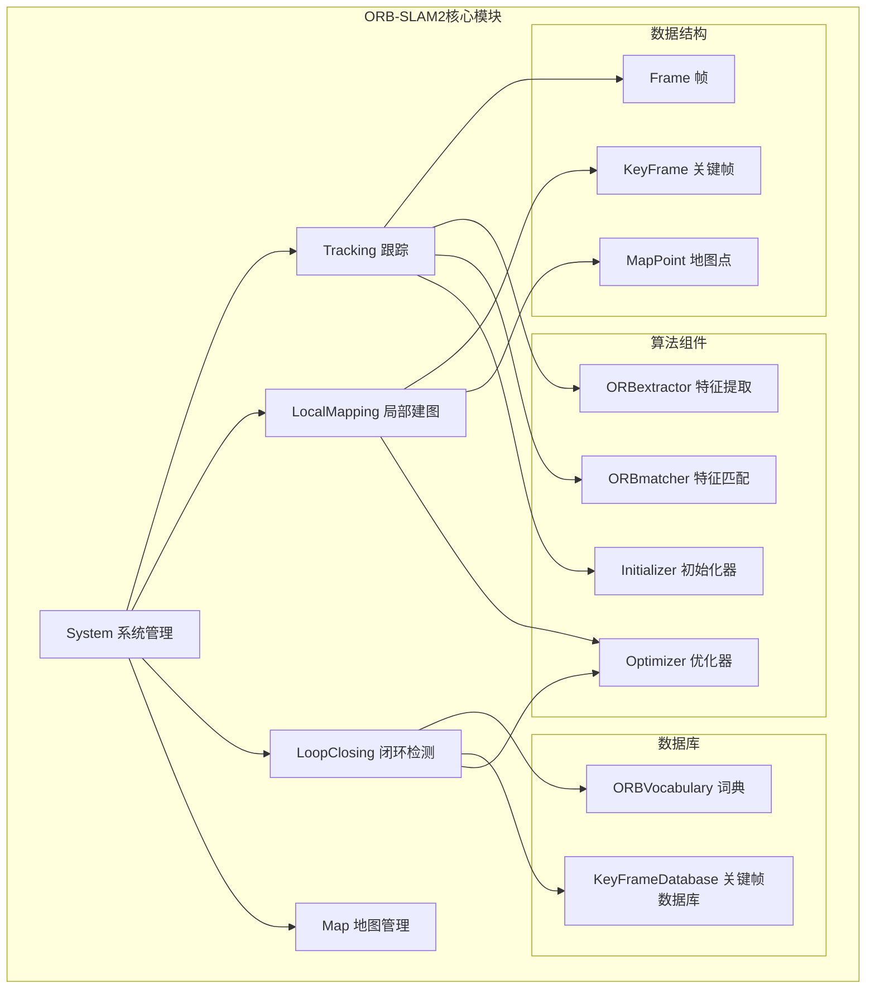

# ORB-SLAM2核心模块文档

## 模块概述

ORB-SLAM2核心模块是整个语义SLAM系统的基础，提供了经典的单目/双目/RGB-D SLAM功能。这些模块经过扩展以支持语义增强功能，但保持了原有的鲁棒性和实时性。

## 核心模块架构图



## 各模块详细说明

### 1. System (系统管理模块)

**文件位置**: `include/System.h`, `src/System.cc`

**主要功能**:
- 系统初始化和配置管理
- 多线程协调和生命周期管理
- 外部API接口提供
- 传感器类型适配

**核心成员变量**:
```cpp
eSensor mSensor;                    // 传感器类型 (单目/双目/RGB-D)
ORBVocabulary* mpVocabulary;        // ORB词典
KeyFrameDatabase* mpKeyFrameDatabase; // 关键帧数据库
Map* mpMap;                         // 地图对象
Tracking* mpTracker;                // 跟踪器
LocalMapping* mpLocalMapper;        // 局部建图器
LoopClosing* mpLoopCloser;         // 闭环检测器
shared_ptr<PointCloudMapping> mpPointCloudMapping; // 语义点云建图
```

**主要接口方法**:
- `cv::Mat TrackRGBD(const cv::Mat &im, const cv::Mat &depthmap, const double &timestamp)`
- `cv::Mat TrackStereo(const cv::Mat &imLeft, const cv::Mat &imRight, const double &timestamp)`
- `cv::Mat TrackMonocular(const cv::Mat &im, const double &timestamp)`
- `void ActivateLocalizationMode()` / `void DeactivateLocalizationMode()`
- `void Shutdown()`

**设计特点**:
- 单例模式，全局唯一系统入口
- 多线程管理，各功能模块并行运行
- 模式切换支持（SLAM模式 ↔ 定位模式）

### 2. Tracking (跟踪模块)

**文件位置**: `include/Tracking.h`, `src/Tracking.cc`

**主要功能**:
- 实时相机位姿估计
- ORB特征提取和匹配
- 关键帧选择策略
- 跟踪失败后的重定位

**核心成员变量**:
```cpp
eTrackingState mState;              // 跟踪状态
Frame mCurrentFrame;                // 当前帧
cv::Mat mImGray;                    // 灰度图
cv::Mat mImDepth;                   // 深度图 (语义SLAM扩展)
cv::Mat mImRGB;                     // 彩色图 (语义SLAM扩展)
ORBextractor* mpORBextractorLeft;   // 左目/单目特征提取器
ORBextractor* mpORBextractorRight;  // 右目特征提取器
shared_ptr<PointCloudMapping> mpPointCloudMapping; // 点云建图接口
```

**跟踪状态机**:
```cpp
enum eTrackingState{
    SYSTEM_NOT_READY = -1,    // 系统未就绪
    NO_IMAGES_YET = 0,        // 未接收图像
    NOT_INITIALIZED = 1,      // 未初始化
    OK = 2,                   // 正常跟踪
    LOST = 3                  // 跟踪丢失
};
```

**主要算法流程**:
1. **特征提取**: 使用ORB提取关键点和描述子
2. **初始匹配**: 与上一帧或参考关键帧匹配
3. **位姿估计**: 通过PnP或运动模型估计相机位姿
4. **局部地图跟踪**: 与局部地图点匹配优化位姿
5. **关键帧决策**: 根据条件决定是否创建新关键帧

**语义SLAM扩展**:
- 保存RGB和深度图像用于语义处理
- 向点云建图模块传递关键帧数据
- 支持动态点过滤功能

### 3. LocalMapping (局部建图模块)

**文件位置**: `include/LocalMapping.h`, `src/LocalMapping.cc`

**主要功能**:
- 处理新关键帧
- 创建新地图点
- 局部束调整优化
- 冗余关键帧剔除

**核心成员变量**:
```cpp
list<KeyFrame*> mlNewKeyFrames;     // 新关键帧队列
bool mbAbortBA;                     // 束调整中断标志
bool mbStopped;                     // 停止标志
bool mbStopRequested;               // 停止请求标志
bool mbNotStop;                     // 不停止标志
bool mbAcceptKeyFrames;             // 接受关键帧标志
```

**主要处理流程**:

1. **ProcessNewKeyFrame()**: 处理新关键帧
   - 计算BoW向量
   - 更新共视图连接
   - 插入关键帧到地图

2. **CreateNewMapPoints()**: 创建新地图点
   - 在相邻关键帧间进行特征匹配
   - 三角化恢复3D点
   - 验证地图点质量

3. **MapPointCulling()**: 地图点剔除
   - 检查观测质量
   - 剔除低质量地图点

4. **SearchInNeighbors()**: 搜索邻域匹配
   - 在相邻关键帧间搜索更多匹配
   - 融合重复地图点

5. **LocalBundleAdjustment()**: 局部束调整
   - 优化局部关键帧和地图点
   - 保持地图一致性

6. **KeyFrameCulling()**: 关键帧剔除
   - 检测冗余关键帧
   - 剔除不必要的关键帧

### 4. LoopClosing (闭环检测模块)

**文件位置**: `include/LoopClosing.h`, `src/LoopClosing.cc`

**主要功能**:
- 检测闭环候选
- 计算闭环约束
- 执行闭环校正
- 全局束调整优化

**核心成员变量**:
```cpp
queue<KeyFrame*> mlpLoopKeyFrameQueue;  // 闭环关键帧队列
bool mbResetRequested;                   // 重置请求
bool mbFinishRequested;                  // 结束请求
bool mbRunningGBA;                       // 全局BA运行状态
```

**闭环检测流程**:

1. **DetectLoop()**: 闭环检测
   - 使用BoW词典计算相似度
   - 时空一致性验证
   - 选择闭环候选

2. **ComputeSim3()**: 计算Sim3变换
   - 特征匹配
   - RANSAC求解Sim3
   - 验证几何一致性

3. **CorrectLoop()**: 闭环校正
   - 闭环融合
   - 更新共视图
   - 启动全局束调整

4. **RunGlobalBundleAdjustment()**: 全局束调整
   - 优化所有关键帧位姿
   - 优化所有地图点位置
   - 保证全局一致性

### 5. Map (地图管理模块)

**文件位置**: `include/Map.h`, `src/Map.cc`

**主要功能**:
- 存储关键帧和地图点
- 管理地图元素的增删
- 提供地图查询接口

**核心数据结构**:
```cpp
set<MapPoint*> mspMapPoints;        // 地图点集合
set<KeyFrame*> mspKeyFrames;        // 关键帧集合
vector<KeyFrame*> mvpKeyFrameOrigins; // 起始关键帧
long unsigned int mnMaxKFid;        // 最大关键帧ID
```

**主要接口**:
- `void AddKeyFrame(KeyFrame* pKF)`: 添加关键帧
- `void AddMapPoint(MapPoint* pMP)`: 添加地图点  
- `void EraseKeyFrame(KeyFrame* pKF)`: 删除关键帧
- `void EraseMapPoint(MapPoint* pMP)`: 删除地图点
- `vector<KeyFrame*> GetAllKeyFrames()`: 获取所有关键帧
- `vector<MapPoint*> GetAllMapPoints()`: 获取所有地图点

### 6. Frame & KeyFrame (帧数据结构)

**Frame** (普通帧):
- 临时性数据结构，处理单帧图像
- 包含特征点、描述子、相机位姿等信息
- 用于实时跟踪处理

**KeyFrame** (关键帧):
- 持久性数据结构，作为地图节点
- 包含BoW向量、共视关系等额外信息
- 用于建图、闭环检测等

**核心成员**:
```cpp
// Frame
long unsigned int mnId;             // 帧ID
double mTimeStamp;                  // 时间戳
cv::Mat mTcw;                      // 相机位姿
vector<cv::KeyPoint> mvKeys;        // 关键点
cv::Mat mDescriptors;              // 描述子
vector<MapPoint*> mvpMapPoints;     // 匹配的地图点

// KeyFrame (继承Frame)
DBoW2::BowVector mBowVec;          // BoW向量
map<KeyFrame*,int> mConnectedKeyFrameWeights; // 共视关系
```

### 7. MapPoint (地图点)

**文件位置**: `include/MapPoint.h`, `src/MapPoint.cc`

**主要功能**:
- 表示3D地图点
- 维护观测关系
- 计算描述子和方向

**核心成员**:
```cpp
long unsigned int mnId;             // 地图点ID
cv::Mat mWorldPos;                  // 3D世界坐标
map<KeyFrame*,size_t> mObservations; // 观测关系
int mnVisible;                      // 可见次数
int mnFound;                        // 找到次数
cv::Mat mDescriptor;                // 代表性描述子
```

## 模块间协作机制

### 线程同步
- 使用`mutex`和`condition_variable`实现线程安全
- 关键数据结构访问需要加锁保护
- 采用生产者-消费者模式传递数据

### 数据流向
1. **Tracking** → **LocalMapping**: 关键帧队列
2. **LocalMapping** → **LoopClosing**: 关键帧队列
3. **LoopClosing** → **Map**: 全局优化结果
4. **所有模块** → **Map**: 增删地图元素

### 错误处理
- 跟踪失败时自动重定位
- 优化过程可被中断
- 模块异常不影响其他模块运行

## 性能特点

### 实时性
- 特征提取和匹配高度优化
- 多线程并行处理
- 自适应阈值调整

### 鲁棒性  
- 多种跟踪策略
- 重定位机制
- 动态调整策略

### 准确性
- 精确的特征匹配
- 束调整优化
- 闭环约束校正

这些核心模块为语义SLAM系统提供了坚实的几何基础，确保了系统的实时性和鲁棒性。