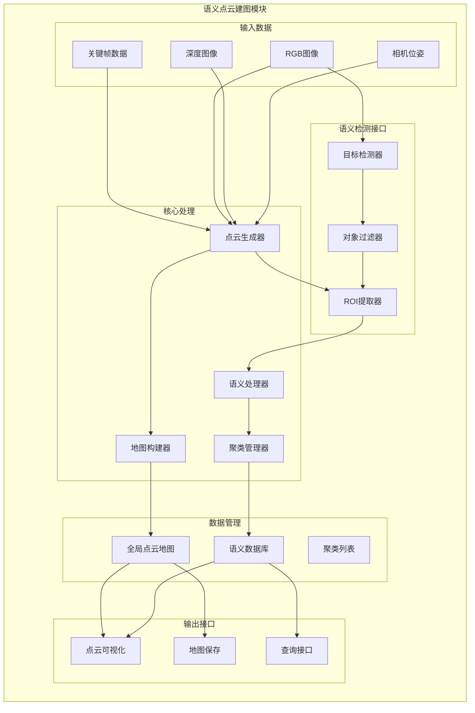

# 语义点云建图模块文档

## 模块概述

语义点云建图模块是整个语义SLAM系统的核心创新部分，负责将2D语义检测结果与3D点云数据融合，构建包含语义信息的稠密地图。该模块接收来自跟踪线程的关键帧数据，结合语义检测结果，生成具有语义标签的3D点云地图，并维护语义对象数据库。

## 模块架构



## 核心类详解

### 1. PointCloudMapping类 (主控制器)

**文件位置**: `include/pointcloudmapping.h`, `src/pointcloudmapping.cc`

**类定义**:
```cpp
class PointCloudMapping {
public:
    typedef pcl::PointXYZRGB PointT;           // 点类型定义
    typedef pcl::PointCloud<PointT> PointCloud; // 点云类型定义
    
    // 构造函数
    PointCloudMapping(double resolution_);
    
    // 核心接口
    void insertKeyFrame(KeyFrame* kf, cv::Mat& color, cv::Mat& depth, cv::Mat& imgRGB);
    void shutdown();
    void viewer();
    void update();
    
protected:
    // 核心处理方法
    PointCloud::Ptr generatePointCloud(KeyFrame* kf, cv::Mat& color, cv::Mat& depth);
    void draw_rect_with_depth_threshold(cv::Mat bgr_img, cv::Mat depth_img, 
                                       const cv::Rect_<float>& rect, 
                                       const cv::Scalar& scalar,
                                       pcl::PointIndices& indices);
    void sem_merge(Cluster cluster);
    void add_cube(void);
    
private:
    // 数据成员
    PointCloud::Ptr globalMap;                    // 全局点云地图
    std::shared_ptr<thread> viewerThread;         // 可视化线程
    std::vector<Cluster> clusters;                // 语义聚类列表
    std::shared_ptr<Detector> ncnn_detector_ptr;  // 语义检测器
    
    // 线程同步
    condition_variable keyFrameUpdated;           // 关键帧更新条件变量
    mutex keyFrameUpdateMutex;                    // 更新互斥锁
    mutex keyframeMutex;                          // 关键帧互斥锁
    mutex shutDownMutex;                          // 关闭互斥锁
    bool shutDownFlag;                            // 关闭标志
    
    // 数据队列
    std::vector<KeyFrame*> keyframes;             // 关键帧队列
    std::vector<cv::Mat> colorImgs;               // 灰度图队列
    std::vector<cv::Mat> depthImgs;               // 深度图队列
    std::vector<cv::Mat> RGBImgs;                 // RGB图队列
    
    // 处理参数
    double resolution;                            // 体素分辨率
    pcl::VoxelGrid<PointT> voxel;                // 体素滤波器
    pcl::ExtractIndices<PointT> extract_indices; // 索引提取器
    pcl::StatisticalOutlierRemoval<PointT> stat; // 统计滤波器
};
```

### 2. Cluster类 (语义聚类)

**数据结构定义**:
```cpp
typedef struct Cluster {
    std::string object_name;     // 物体类别名称
    int class_id;                // 类别ID
    float prob;                  // 平均置信度
    Eigen::Vector3f minPt;       // 包围框最小点
    Eigen::Vector3f maxPt;       // 包围框最大点
    Eigen::Vector3f centroid;    // 中心点坐标
    
    // 扩展属性
    pcl::PointIndices indices;   // 点云索引
    int point_count;             // 点数量
    float volume;                // 体积
    int observation_count;       // 观测次数
    double last_updated;         // 最后更新时间
    
    // 操作符重载
    bool operator==(const std::string& x) {
        return object_name == x;
    }
    
    // 工具方法
    void updateBounds(const Eigen::Vector3f& point);
    float calculateVolume() const;
    Eigen::Vector3f getCenter() const;
} Cluster;
```

## 核心算法流程

### 1. 关键帧处理主流程

```cpp
void PointCloudMapping::insertKeyFrame(KeyFrame* kf, cv::Mat& color, 
                                       cv::Mat& depth, cv::Mat& imgRGB) {
    // 1. 线程安全的数据存储
    unique_lock<mutex> lck(keyframeMutex);
    keyframes.push_back(kf);
    colorImgs.push_back(color.clone());
    depthImgs.push_back(depth.clone());
    RGBImgs.push_back(imgRGB.clone());
    
    // 2. 通知处理线程
    keyFrameUpdated.notify_one();
}

void PointCloudMapping::update() {
    while (!shutDownFlag) {
        {
            unique_lock<mutex> lck_shutdown(shutDownMutex);
            if (shutDownFlag) break;
        }
        
        {
            unique_lock<mutex> lck_keyframeupdate(keyFrameUpdateMutex);
            keyFrameUpdated.wait(lck_keyframeupdate);
        }
        
        // 处理新关键帧
        size_t N = 0;
        {
            unique_lock<mutex> lck(keyframeMutex);
            N = keyframes.size();
        }
        
        // 处理每个新关键帧
        for (size_t i = lastKeyframeSize; i < N; i++) {
            processKeyFrame(i);
        }
        lastKeyframeSize = N;
    }
}
```

### 2. 点云生成算法

```cpp
PointCloud::Ptr PointCloudMapping::generatePointCloud(KeyFrame* kf, 
                                                       cv::Mat& color, 
                                                       cv::Mat& depth) {
    PointCloud::Ptr tmp(new PointCloud());
    
    // 获取相机内参
    float fx = kf->fx;
    float fy = kf->fy;
    float cx = kf->cx;
    float cy = kf->cy;
    float depth_scale = 1000.0f;  // 深度比例因子
    
    // 获取相机位姿
    cv::Mat Tcw = kf->GetPose();
    cv::Mat Rwc = Tcw.rowRange(0,3).colRange(0,3).t();
    cv::Mat twc = -Rwc * Tcw.rowRange(0,3).col(3);
    
    // 逐像素处理
    for (int m = 0; m < depth.rows; m += 3) {      // 降采样提高效率
        for (int n = 0; n < depth.cols; n += 3) {
            float d = depth.ptr<float>(m)[n];
            
            // 深度有效性检查
            if (d < 0.01 || d > 10.0) continue;
            
            // 像素坐标转相机坐标
            float z = d / depth_scale;
            float x = (n - cx) * z / fx;
            float y = (m - cy) * z / fy;
            
            // 相机坐标转世界坐标
            cv::Mat point_cam = (cv::Mat_<float>(3,1) << x, y, z);
            cv::Mat point_world = Rwc * point_cam + twc;
            
            // 创建彩色点
            PointT p;
            p.x = point_world.at<float>(0);
            p.y = point_world.at<float>(1);
            p.z = point_world.at<float>(2);
            
            // 添加颜色信息
            cv::Vec3b color_bgr = color.at<cv::Vec3b>(m, n);
            p.b = color_bgr[0];
            p.g = color_bgr[1];
            p.r = color_bgr[2];
            
            tmp->points.push_back(p);
        }
    }
    
    // 设置点云属性
    tmp->height = 1;
    tmp->width = tmp->points.size();
    tmp->is_dense = false;
    
    return tmp;
}
```

### 3. 语义信息融合算法

```cpp
void PointCloudMapping::processKeyFrame(size_t index) {
    // 1. 获取数据
    KeyFrame* kf = keyframes[index];
    cv::Mat color = colorImgs[index];
    cv::Mat depth = depthImgs[index];
    cv::Mat rgb = RGBImgs[index];
    
    // 2. 语义检测
    std::vector<Object> objects;
    ncnn_detector_ptr->Run(rgb, objects);
    
    // 3. 生成点云
    PointCloud::Ptr cloud = generatePointCloud(kf, color, depth);
    
    // 4. 处理每个检测对象
    for (const auto& obj : objects) {
        // 过滤低置信度检测
        if (obj.prob < 0.5f) continue;
        
        // 提取ROI内的点云
        pcl::PointIndices indices;
        draw_rect_with_depth_threshold(rgb, depth, obj.rect, 
                                      cv::Scalar(255, 0, 0), indices);
        
        if (indices.indices.size() < 50) continue;  // 点数过少跳过
        
        // 创建语义聚类
        Cluster cluster;
        cluster.object_name = obj.object_name;
        cluster.class_id = obj.class_id;
        cluster.prob = obj.prob;
        cluster.indices = indices;
        cluster.point_count = indices.indices.size();
        
        // 计算包围框和中心点
        calculateBoundingBox(cloud, indices, cluster);
        
        // 融合到语义数据库
        sem_merge(cluster);
    }
    
    // 5. 更新全局地图
    updateGlobalMap(cloud);
}
```

### 4. ROI点云提取算法

```cpp
void PointCloudMapping::draw_rect_with_depth_threshold(
    cv::Mat bgr_img, cv::Mat depth_img, 
    const cv::Rect_<float>& rect, const cv::Scalar& scalar,
    pcl::PointIndices& indices) {
    
    indices.indices.clear();
    
    // 转换为像素坐标
    int x1 = std::max(0, (int)(rect.x * bgr_img.cols));
    int y1 = std::max(0, (int)(rect.y * bgr_img.rows));
    int x2 = std::min(bgr_img.cols-1, (int)((rect.x + rect.width) * bgr_img.cols));
    int y2 = std::min(bgr_img.rows-1, (int)((rect.y + rect.height) * bgr_img.rows));
    
    // 计算深度统计信息用于过滤
    std::vector<float> depths;
    for (int v = y1; v <= y2; v++) {
        for (int u = x1; u <= x2; u++) {
            float d = depth_img.at<float>(v, u);
            if (d > 0.01 && d < 10.0) {
                depths.push_back(d);
            }
        }
    }
    
    if (depths.empty()) return;
    
    // 计算深度中位数和标准差
    std::sort(depths.begin(), depths.end());
    float median_depth = depths[depths.size()/2];
    float depth_threshold = 0.3f;  // 深度阈值
    
    // 提取有效深度范围内的点
    for (int v = y1; v <= y2; v++) {
        for (int u = x1; u <= x2; u++) {
            float d = depth_img.at<float>(v, u);
            
            // 深度过滤
            if (d < 0.01 || d > 10.0) continue;
            if (std::abs(d - median_depth) > depth_threshold) continue;
            
            // 计算点云索引 (需要与点云生成保持一致)
            int point_index = (v/3) * (bgr_img.cols/3) + (u/3);
            indices.indices.push_back(point_index);
        }
    }
}
```

### 5. 语义对象融合算法

```cpp
void PointCloudMapping::sem_merge(Cluster new_cluster) {
    bool merged = false;
    
    // 1. 搜索已存在的相似对象
    for (auto& existing_cluster : clusters) {
        // 类别匹配检查
        if (existing_cluster.class_id != new_cluster.class_id) continue;
        
        // 空间距离检查
        float distance = (existing_cluster.centroid - new_cluster.centroid).norm();
        float merge_threshold = 0.5f;  // 融合距离阈值
        
        if (distance < merge_threshold) {
            // 2. 执行融合
            mergeSemanticObjects(existing_cluster, new_cluster);
            merged = true;
            break;
        }
    }
    
    // 3. 如果没有找到相似对象，添加新对象
    if (!merged) {
        new_cluster.observation_count = 1;
        new_cluster.last_updated = getCurrentTime();
        clusters.push_back(new_cluster);
    }
}

void PointCloudMapping::mergeSemanticObjects(Cluster& existing, 
                                            const Cluster& new_obj) {
    // 1. 更新置信度 (加权平均)
    float total_obs = existing.observation_count + 1;
    existing.prob = (existing.prob * existing.observation_count + new_obj.prob) / total_obs;
    
    // 2. 更新包围框 (扩展)
    existing.minPt = existing.minPt.cwiseMin(new_obj.minPt);
    existing.maxPt = existing.maxPt.cwiseMax(new_obj.maxPt);
    
    // 3. 更新中心点 (加权平均)
    existing.centroid = (existing.centroid * existing.observation_count + 
                        new_obj.centroid) / total_obs;
    
    // 4. 更新统计信息
    existing.observation_count++;
    existing.last_updated = getCurrentTime();
    existing.point_count += new_obj.point_count;
    existing.volume = calculateVolume(existing.minPt, existing.maxPt);
}
```

## 可视化与交互

### 1. PCL可视化

```cpp
void PointCloudMapping::viewer() {
    // 创建PCL可视化器
    pcl_viewer_prt = std::make_shared<pcl::visualization::PCLVisualizer>("3D Viewer");
    pcl_viewer_prt->setBackgroundColor(0, 0, 0);
    pcl_viewer_prt->addCoordinateSystem(1.0);
    pcl_viewer_prt->initCameraParameters();
    
    while (!shutDownFlag) {
        {
            unique_lock<mutex> lck_shutdown(shutDownMutex);
            if (shutDownFlag) break;
        }
        
        // 更新点云显示
        if (!globalMap->empty()) {
            pcl_viewer_prt->removeAllPointClouds();
            pcl_viewer_prt->addPointCloud<PointT>(globalMap, "global_map");
        }
        
        // 更新语义对象显示
        add_cube();
        
        pcl_viewer_prt->spinOnce(100);
        std::this_thread::sleep_for(std::chrono::milliseconds(100));
    }
}

void PointCloudMapping::add_cube() {
    // 移除旧的语义框
    for (int i = 0; i < clusters.size(); i++) {
        std::string cube_id = "cube_" + std::to_string(i);
        pcl_viewer_prt->removeShape(cube_id);
    }
    
    // 添加新的语义框
    for (size_t i = 0; i < clusters.size(); i++) {
        const auto& cluster = clusters[i];
        
        // 创建包围框
        pcl_viewer_prt->addCube(
            cluster.minPt.x(), cluster.maxPt.x(),
            cluster.minPt.y(), cluster.maxPt.y(),
            cluster.minPt.z(), cluster.maxPt.z(),
            colors_[cluster.class_id % colors_.size()].val[0] / 255.0,
            colors_[cluster.class_id % colors_.size()].val[1] / 255.0,
            colors_[cluster.class_id % colors_.size()].val[2] / 255.0,
            "cube_" + std::to_string(i)
        );
        
        // 添加文本标签
        pcl_viewer_prt->addText3D(
            cluster.object_name + " (" + std::to_string(cluster.prob) + ")",
            pcl::PointXYZ(cluster.centroid.x(), 
                         cluster.centroid.y(), 
                         cluster.centroid.z() + 0.2),
            0.1, 1.0, 1.0, 1.0,
            "text_" + std::to_string(i)
        );
    }
}
```

## 性能优化策略

### 1. 内存管理优化

```cpp
// 使用智能指针管理内存
typedef std::shared_ptr<PointCloud> PointCloudPtr;

// 点云降采样减少内存占用
pcl::VoxelGrid<PointT> voxel_filter;
voxel_filter.setInputCloud(cloud);
voxel_filter.setLeafSize(resolution, resolution, resolution);
voxel_filter.filter(*cloud);
```

### 2. 计算效率优化

```cpp
// 并行点云处理
#pragma omp parallel for
for (int i = 0; i < num_points; i++) {
    // 点云处理代码
}

// 空间索引加速搜索
pcl::search::KdTree<PointT>::Ptr tree(new pcl::search::KdTree<PointT>);
tree->setInputCloud(cloud);
```

### 3. 实时性优化

```cpp
// 异步处理策略
std::thread processing_thread([this]() {
    while (!shutDownFlag) {
        if (hasNewData()) {
            processLatestFrame();
        }
        std::this_thread::sleep_for(std::chrono::milliseconds(10));
    }
});
```

## 数据持久化

### 1. 地图保存

```cpp
void PointCloudMapping::saveMap(const std::string& filename) {
    // 保存点云地图
    pcl::io::savePCDFileBinary(filename + "_pointcloud.pcd", *globalMap);
    
    // 保存语义信息
    saveSemanticDatabase(filename + "_semantic.json");
}

void PointCloudMapping::saveSemanticDatabase(const std::string& filename) {
    // 使用JSON格式保存语义数据库
    json semantic_data;
    for (const auto& cluster : clusters) {
        json obj;
        obj["name"] = cluster.object_name;
        obj["class_id"] = cluster.class_id;
        obj["confidence"] = cluster.prob;
        obj["center"] = {cluster.centroid.x(), cluster.centroid.y(), cluster.centroid.z()};
        obj["min_pt"] = {cluster.minPt.x(), cluster.minPt.y(), cluster.minPt.z()};
        obj["max_pt"] = {cluster.maxPt.x(), cluster.maxPt.y(), cluster.maxPt.z()};
        obj["point_count"] = cluster.point_count;
        obj["volume"] = cluster.volume;
        semantic_data.push_back(obj);
    }
    
    std::ofstream file(filename);
    file << semantic_data.dump(2);
}
```

### 2. 地图加载

```cpp
void PointCloudMapping::loadMap(const std::string& filename) {
    // 加载点云地图
    pcl::io::loadPCDFile(filename + "_pointcloud.pcd", *globalMap);
    
    // 加载语义信息
    loadSemanticDatabase(filename + "_semantic.json");
}
```

这个语义点云建图模块是整个语义SLAM系统的核心创新，它将2D语义理解与3D空间重建有机结合，为机器人导航和场景理解提供了丰富的语义地图表示。