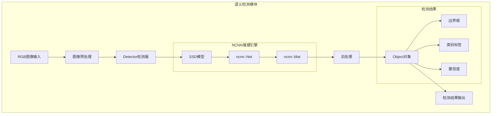
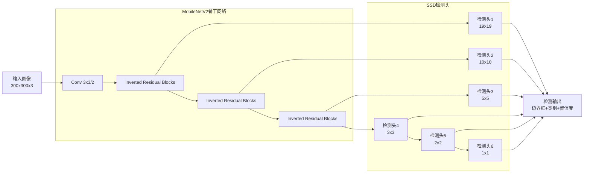

# 语义检测模块文档

## 模块概述

语义检测模块是整个语义SLAM系统的核心语义理解组件，负责对输入的RGB图像进行实时目标检测，识别场景中的语义对象。该模块基于MobileNetV2-SSD-Lite网络架构，使用NCNN推理引擎实现高效的移动端部署。

## 模块架构



## 核心组件详解

### 1. Detector类 (检测器核心)

**文件位置**: `src/ncnn_dect.h`, `src/ncnn_dect.cpp`

**类定义**:
```cpp
class Detector {
public:
    Detector();                    // 构造函数，初始化网络
    ~Detector();                   // 析构函数，释放资源
    
    // 核心检测接口
    void Run(const cv::Mat& bgr_img, std::vector<Object>& objects);
    
    // 可视化接口
    void Show(const cv::Mat& bgr_img, std::vector<Object>& objects);
    
private:
    ncnn::Net* det_net_ptr;        // NCNN网络指针
    ncnn::Mat* net_in_ptr;         // 网络输入张量指针
    
    // 私有方法
    cv::Mat preprocess(const cv::Mat& img);
    void postprocess(const ncnn::Mat& out, std::vector<Object>& objects);
};
```

**核心成员变量**:
- `ncnn::Net* det_net_ptr`: NCNN推理网络对象
- `ncnn::Mat* net_in_ptr`: 网络输入数据容器
- 静态配置参数：输入尺寸、类别数、置信度阈值等

### 2. Object类 (检测结果)

**数据结构定义**:
```cpp
typedef struct Object {
    cv::Rect_<float> rect;      // 检测框坐标 (x, y, width, height)
    std::string object_name;    // 物体类别名称
    int class_id;               // 类别ID
    float prob;                 // 置信度概率
    
    // 构造函数
    Object() : class_id(-1), prob(0.0f) {}
    Object(cv::Rect_<float> r, std::string name, int id, float confidence)
        : rect(r), object_name(name), class_id(id), prob(confidence) {}
        
    // 比较操作符 (用于排序)
    bool operator>(const Object& other) const {
        return prob > other.prob;
    }
} Object;
```

**字段说明**:
- `rect`: 边界框，使用相对坐标表示
- `object_name`: 物体类别名称（如"person", "chair", "table"等）
- `class_id`: 对应COCO数据集的类别ID
- `prob`: 检测置信度，范围[0, 1]

## 检测流程详解

### 1. 网络初始化

```cpp
Detector::Detector() {
    // 1. 创建NCNN网络对象
    det_net_ptr = new ncnn::Net();
    
    // 2. 加载模型参数和权重
    det_net_ptr->load_param("mobilenetv2_ssdlite.param");
    det_net_ptr->load_model("mobilenetv2_ssdlite.bin");
    
    // 3. 配置优化选项
    det_net_ptr->opt.use_vulkan_compute = false;  // 是否使用GPU加速
    det_net_ptr->opt.num_threads = 4;             // CPU线程数
    
    // 4. 初始化输入张量
    net_in_ptr = new ncnn::Mat();
}
```

### 2. 图像预处理

**预处理步骤**:
```cpp
cv::Mat Detector::preprocess(const cv::Mat& img) {
    cv::Mat processed;
    
    // 1. 尺寸调整到网络输入尺寸 (通常为300x300或416x416)
    cv::resize(img, processed, cv::Size(INPUT_WIDTH, INPUT_HEIGHT));
    
    // 2. 颜色空间转换 (BGR -> RGB)
    cv::cvtColor(processed, processed, cv::COLOR_BGR2RGB);
    
    // 3. 数据类型转换和归一化
    processed.convertTo(processed, CV_32F, 1.0/255.0);
    
    // 4. 均值减法和标准差除法 (ImageNet标准化)
    cv::Scalar mean(0.485, 0.456, 0.406);
    cv::Scalar std(0.229, 0.224, 0.225);
    processed = (processed - mean) / std;
    
    return processed;
}
```

### 3. 网络推理

**NCNN推理过程**:
```cpp
void Detector::Run(const cv::Mat& bgr_img, std::vector<Object>& objects) {
    // 1. 图像预处理
    cv::Mat input_img = preprocess(bgr_img);
    
    // 2. 转换为NCNN Mat格式
    *net_in_ptr = ncnn::Mat::from_pixels(
        input_img.data, ncnn::Mat::PIXEL_RGB, 
        INPUT_WIDTH, INPUT_HEIGHT
    );
    
    // 3. 创建网络提取器
    ncnn::Extractor ex = det_net_ptr->create_extractor();
    
    // 4. 输入数据到网络
    ex.input("input", *net_in_ptr);
    
    // 5. 执行前向推理
    ncnn::Mat out;
    ex.extract("output", out);  // 输出层名称可能不同
    
    // 6. 后处理得到检测结果
    postprocess(out, objects);
}
```

### 4. 结果后处理

**后处理流程**:
```cpp
void Detector::postprocess(const ncnn::Mat& out, std::vector<Object>& objects) {
    objects.clear();
    
    // 1. 解析网络输出 (SSD格式: [batch, num_detections, 6])
    // 输出格式: [class_id, confidence, x1, y1, x2, y2]
    
    const float* output_data = (const float*)out.data;
    int num_detections = out.h;  // 检测框数量
    
    for (int i = 0; i < num_detections; i++) {
        // 2. 提取检测信息
        float confidence = output_data[i * 6 + 1];
        int class_id = (int)output_data[i * 6 + 0];
        
        // 3. 置信度过滤
        if (confidence < CONFIDENCE_THRESHOLD) continue;
        
        // 4. 边界框坐标 (相对坐标转绝对坐标)
        float x1 = output_data[i * 6 + 2] * bgr_img.cols;
        float y1 = output_data[i * 6 + 3] * bgr_img.rows;
        float x2 = output_data[i * 6 + 4] * bgr_img.cols;
        float y2 = output_data[i * 6 + 5] * bgr_img.rows;
        
        // 5. 创建检测对象
        Object obj;
        obj.rect = cv::Rect_<float>(x1, y1, x2-x1, y2-y1);
        obj.class_id = class_id;
        obj.object_name = getClassName(class_id);
        obj.prob = confidence;
        
        objects.push_back(obj);
    }
    
    // 6. 非极大值抑制 (NMS)
    applyNMS(objects, NMS_THRESHOLD);
    
    // 7. 结果排序 (按置信度降序)
    std::sort(objects.begin(), objects.end(), std::greater<Object>());
}
```

## 网络架构详解

### MobileNetV2-SSD-Lite网络

**网络特点**:
- **轻量化**: 专为移动端优化，参数量小
- **高效性**: 使用深度可分离卷积减少计算量
- **实时性**: 在CPU上可达到实时检测速度
- **准确性**: 在精度和速度间达到良好平衡

**网络结构**:


### 支持的目标类别

基于COCO数据集，支持80个常见目标类别：

**人物相关**: person
**车辆相关**: bicycle, car, motorcycle, airplane, bus, train, truck, boat
**交通设施**: traffic light, fire hydrant, stop sign, parking meter
**动物**: bird, cat, dog, horse, sheep, cow, elephant, bear, zebra, giraffe
**家具**: chair, couch, potted plant, bed, dining table, toilet, tv, laptop, mouse, remote, keyboard, cell phone
**厨房用品**: microwave, oven, toaster, sink, refrigerator
**食物**: banana, apple, sandwich, orange, broccoli, carrot, hot dog, pizza, donut, cake
**运动用品**: frisbee, skis, snowboard, sports ball, kite, baseball bat, baseball glove, skateboard, surfboard, tennis racket
**日用品**: bottle, wine glass, cup, fork, knife, spoon, bowl, scissors, teddy bear, hair drier, toothbrush
**等等...**

## 性能优化

### 1. NCNN引擎优化

**CPU优化**:
```cpp
// 设置CPU线程数
det_net_ptr->opt.num_threads = cv::getNumberOfCPUs();

// 开启内存池优化
det_net_ptr->opt.use_packing_layout = true;

// 开启卷积优化
det_net_ptr->opt.use_winograd_convolution = true;
det_net_ptr->opt.use_sgemm_convolution = true;
```

**内存优化**:
```cpp
// 使用轻量级模型
det_net_ptr->opt.lightmode = true;

// 减少内存拷贝
det_net_ptr->opt.use_fp16_packed = true;
det_net_ptr->opt.use_fp16_storage = true;
```

### 2. 算法优化

**检测阈值调整**:
```cpp
const float CONFIDENCE_THRESHOLD = 0.5f;  // 置信度阈值
const float NMS_THRESHOLD = 0.4f;         // NMS阈值
```

**输入尺寸优化**:
- 较小输入(300x300): 速度快，精度稍低
- 较大输入(416x416): 精度高，速度稍慢

### 3. 并行化处理

**多线程检测**:
```cpp
// 在单独线程中执行检测，避免阻塞主线程
std::thread detection_thread([&]() {
    detector.Run(image, objects);
});
```

## 集成接口

### 与点云建图模块的接口

```cpp
// 在PointCloudMapping中调用
void PointCloudMapping::insertKeyFrame(KeyFrame* kf, cv::Mat& color, 
                                       cv::Mat& depth, cv::Mat& imgRGB) {
    // 1. 执行语义检测
    std::vector<Object> objects;
    ncnn_detector_ptr->Run(imgRGB, objects);
    
    // 2. 生成点云
    PointCloud::Ptr cloud = generatePointCloud(kf, color, depth);
    
    // 3. 语义信息融合
    for (const auto& obj : objects) {
        // 提取ROI内点云并创建语义聚类
        processSemanticObject(obj, cloud);
    }
}
```

### 错误处理

**检测失败处理**:
```cpp
try {
    detector.Run(image, objects);
} catch (const std::exception& e) {
    // 检测失败时跳过语义处理，不影响几何SLAM
    std::cerr << "Detection failed: " << e.what() << std::endl;
    objects.clear();  // 清空结果，继续几何处理
}
```

## 配置参数

### 模型配置
```cpp
// 模型文件路径
const std::string MODEL_PARAM = "models/mobilenetv2_ssdlite.param";
const std::string MODEL_BIN = "models/mobilenetv2_ssdlite.bin";

// 网络输入参数
const int INPUT_WIDTH = 300;
const int INPUT_HEIGHT = 300;
const int NUM_CLASSES = 80;

// 检测参数
const float CONFIDENCE_THRESHOLD = 0.5f;
const float NMS_THRESHOLD = 0.4f;
const int MAX_DETECTIONS = 100;
```

### 运行时配置
```cpp
// 性能配置
const int NUM_THREADS = 4;
const bool USE_GPU = false;
const bool ENABLE_OPTIMIZATION = true;

// 可视化配置
const bool SHOW_DETECTION = false;
const bool SAVE_RESULTS = false;
```

这个语义检测模块为整个语义SLAM系统提供了实时、准确的目标检测能力，是连接2D语义理解和3D空间建图的重要桥梁。