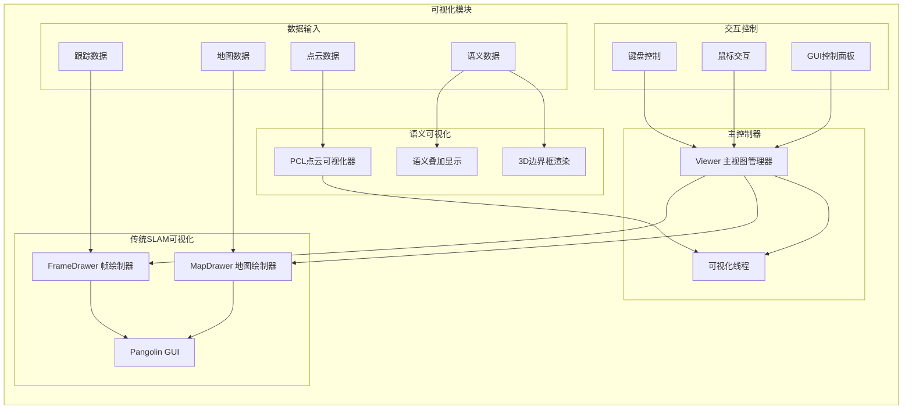

# 可视化模块文档

## 模块概述

可视化模块负责整个语义SLAM系统的实时显示和用户交互功能。该模块集成了多种可视化技术，包括传统的ORB-SLAM2 Pangolin界面、PCL点云可视化、以及语义信息的3D展示。通过多线程架构，实现了不同类型数据的并行可视化更新。

## 模块架构



## 核心组件详解

### 1. Viewer类 (主视图管理器)

**文件位置**: `include/Viewer.h`, `src/Viewer.cc`

**类定义**:
```cpp
class Viewer {
public:
    Viewer(System* pSystem, FrameDrawer* pFrameDrawer, MapDrawer* pMapDrawer, 
           const string &strSettingPath);
    
    // 主要接口
    void Run();
    void RequestFinish();
    void RequestStop();
    bool isFinished();
    bool isStopped();
    void Release();
    
private:
    // 渲染方法
    void DrawFrame();
    void DrawMapPoints();
    void DrawKeyFrames(const bool bDrawKF, const bool bDrawGraph);
    void DrawCurrentCamera(pangolin::OpenGlMatrix &Twc);
    void FollowCamera(pangolin::OpenGlRenderState& s_cam);
    void GetCurrentOpenGLCameraMatrix(pangolin::OpenGlMatrix &M);
    
    // 成员变量
    System* mpSystem;
    FrameDrawer* mpFrameDrawer;
    MapDrawer* mpMapDrawer;
    
    // 控制标志
    bool mbFinishRequested;
    bool mbFinished;
    bool mbStopped;
    bool mbStopRequested;
    
    // 显示参数
    float mImageWidth, mImageHeight;
    float mViewpointX, mViewpointY, mViewpointZ, mViewpointF;
    
    // 线程同步
    std::mutex mMutexFinish;
    std::mutex mMutexStop;
};
```

**主要功能**:
- 管理Pangolin窗口和OpenGL渲染
- 协调多种可视化组件
- 处理用户交互事件
- 控制视图模式切换

### 2. FrameDrawer类 (帧绘制器)

**文件位置**: `include/FrameDrawer.h`, `src/FrameDrawer.cc`

**主要功能**:
- 绘制当前帧的特征点
- 显示跟踪状态信息
- 渲染运动轨迹
- 叠加语义检测结果

**核心成员变量**:
```cpp
class FrameDrawer {
private:
    // 当前帧数据
    Frame mCurrentFrame;
    vector<cv::KeyPoint> mvCurrentKeys;
    vector<bool> mvbMap, mvbVO;
    
    // 跟踪状态
    int mState;
    vector<cv::KeyPoint> mvIniKeys;
    vector<int> mvIniMatches;
    int mnTracked, mnTrackedVO;
    
    // 显示参数
    bool mbOnlyTracking;
    
    // 线程同步
    std::mutex mMutex;
};
```

**绘制功能实现**:
```cpp
cv::Mat FrameDrawer::DrawFrame() {
    cv::Mat im;
    vector<cv::KeyPoint> vIniKeys;
    vector<int> vMatches;
    vector<cv::KeyPoint> vCurrentKeys;
    vector<bool> vbVO, vbMap;
    int state;
    
    // 线程安全地获取数据
    {
        unique_lock<mutex> lock(mMutex);
        state = mState;
        if (mState == Tracking::SYSTEM_NOT_READY)
            mState = Tracking::NO_IMAGES_YET;
        
        mIm.copyTo(im);
        
        if (mState == Tracking::NOT_INITIALIZED) {
            vCurrentKeys = mvCurrentKeys;
            vIniKeys = mvIniKeys;
            vMatches = mvIniMatches;
        } else if (mState == Tracking::OK) {
            vCurrentKeys = mvCurrentKeys;
            vbVO = mvbVO;
            vbMap = mvbMap;
        } else if (mState == Tracking::LOST) {
            vCurrentKeys = mvCurrentKeys;
        }
    }
    
    // 创建彩色图像
    if (im.channels() < 3)
        cvtColor(im, im, CV_GRAY2BGR);
    
    // 根据跟踪状态绘制不同内容
    if (state == Tracking::NOT_INITIALIZED) {
        // 绘制初始化特征点匹配
        for (unsigned int i = 0; i < vMatches.size(); i++) {
            if (vMatches[i] >= 0) {
                cv::line(im, vIniKeys[i].pt, vCurrentKeys[vMatches[i]].pt,
                        cv::Scalar(0, 255, 0));
            }
        }
    } else if (state == Tracking::OK) {
        // 绘制跟踪特征点
        mnTracked = 0;
        mnTrackedVO = 0;
        const float r = 5;
        
        for (int i = 0; i < N; i++) {
            if (vbVO[i] || vbMap[i]) {
                cv::Point2f pt1, pt2;
                pt1.x = vCurrentKeys[i].pt.x - r;
                pt1.y = vCurrentKeys[i].pt.y - r;
                pt2.x = vCurrentKeys[i].pt.x + r;
                pt2.y = vCurrentKeys[i].pt.y + r;
                
                if (vbMap[i]) {
                    cv::rectangle(im, pt1, pt2, cv::Scalar(0, 255, 0));
                    cv::circle(im, vCurrentKeys[i].pt, 2, cv::Scalar(0, 255, 0), -1);
                    mnTracked++;
                } else {
                    cv::rectangle(im, pt1, pt2, cv::Scalar(255, 0, 0));
                    cv::circle(im, vCurrentKeys[i].pt, 2, cv::Scalar(255, 0, 0), -1);
                    mnTrackedVO++;
                }
            }
        }
    }
    
    // 绘制状态信息
    cv::Mat imWithInfo;
    DrawTextInfo(im, state, imWithInfo);
    
    return imWithInfo;
}
```

### 3. MapDrawer类 (地图绘制器)

**文件位置**: `include/MapDrawer.h`, `src/MapDrawer.cc`

**主要功能**:
- 绘制3D地图点
- 渲染关键帧位姿
- 显示共视图连接
- 绘制相机轨迹

**核心方法**:
```cpp
void MapDrawer::DrawMapPoints() {
    const vector<MapPoint*> &vpMPs = mpMap->GetAllMapPoints();
    const vector<MapPoint*> &vpRefMPs = mpMap->GetReferenceMapPoints();
    
    set<MapPoint*> spRefMPs(vpRefMPs.begin(), vpRefMPs.end());
    
    if (vpMPs.empty()) return;
    
    // 绘制所有地图点
    glPointSize(mPointSize);
    glBegin(GL_POINTS);
    glColor3f(0.0, 0.0, 0.0);
    
    for (size_t i = 0, iend = vpMPs.size(); i < iend; i++) {
        if (vpMPs[i]->isBad() || spRefMPs.count(vpMPs[i]))
            continue;
        cv::Mat pos = vpMPs[i]->GetWorldPos();
        glVertex3f(pos.at<float>(0), pos.at<float>(1), pos.at<float>(2));
    }
    glEnd();
    
    // 绘制参考地图点
    glPointSize(mPointSize);
    glBegin(GL_POINTS);
    glColor3f(1.0, 0.0, 0.0);
    
    for (set<MapPoint*>::iterator sit = spRefMPs.begin(); 
         sit != spRefMPs.end(); sit++) {
        if ((*sit)->isBad()) continue;
        cv::Mat pos = (*sit)->GetWorldPos();
        glVertex3f(pos.at<float>(0), pos.at<float>(1), pos.at<float>(2));
    }
    glEnd();
}

void MapDrawer::DrawKeyFrames(const bool bDrawKF, const bool bDrawGraph) {
    const float &w = mKeyFrameSize;
    const float h = w * 0.75;
    const float z = w * 0.6;
    
    const vector<KeyFrame*> vpKFs = mpMap->GetAllKeyFrames();
    
    if (bDrawKF) {
        for (size_t i = 0; i < vpKFs.size(); i++) {
            KeyFrame* pKF = vpKFs[i];
            cv::Mat Twc = pKF->GetPoseInverse().t();
            
            glPushMatrix();
            glMultMatrixf(Twc.ptr<GLfloat>(0));
            
            // 绘制关键帧
            glLineWidth(mKeyFrameLineWidth);
            glColor3f(0.0f, 0.0f, 1.0f);
            glBegin(GL_LINES);
            
            // 绘制相机框架
            glVertex3f(0, 0, 0);
            glVertex3f(w, h, z);
            glVertex3f(0, 0, 0);
            glVertex3f(w, -h, z);
            glVertex3f(0, 0, 0);
            glVertex3f(-w, -h, z);
            glVertex3f(0, 0, 0);
            glVertex3f(-w, h, z);
            
            glVertex3f(w, h, z);
            glVertex3f(w, -h, z);
            glVertex3f(-w, h, z);
            glVertex3f(-w, -h, z);
            glVertex3f(-w, h, z);
            glVertex3f(w, h, z);
            glVertex3f(-w, -h, z);
            glVertex3f(w, -h, z);
            
            glEnd();
            glPopMatrix();
        }
    }
    
    if (bDrawGraph) {
        // 绘制共视图连接
        glLineWidth(mGraphLineWidth);
        glColor4f(0.0f, 1.0f, 0.0f, 0.6f);
        glBegin(GL_LINES);
        
        for (size_t i = 0; i < vpKFs.size(); i++) {
            const vector<KeyFrame*> vCovKFs = vpKFs[i]->GetCovisiblesByWeight(100);
            cv::Mat Ow = vpKFs[i]->GetCameraCenter();
            
            if (!vCovKFs.empty()) {
                for (vector<KeyFrame*>::const_iterator vit = vCovKFs.begin(); 
                     vit != vCovKFs.end(); vit++) {
                    if ((*vit)->mnId < vpKFs[i]->mnId) continue;
                    cv::Mat Ow2 = (*vit)->GetCameraCenter();
                    glVertex3f(Ow.at<float>(0), Ow.at<float>(1), Ow.at<float>(2));
                    glVertex3f(Ow2.at<float>(0), Ow2.at<float>(1), Ow2.at<float>(2));
                }
            }
        }
        glEnd();
    }
}
```

### 4. PCL点云可视化

**功能扩展**:
```cpp
class PCLViewer {
public:
    PCLViewer() {
        // 初始化PCL可视化器
        viewer = std::make_shared<pcl::visualization::PCLVisualizer>("3D Viewer");
        viewer->setBackgroundColor(0, 0, 0);
        viewer->addCoordinateSystem(1.0);
        viewer->initCameraParameters();
        
        // 设置点云显示属性
        viewer->setPointCloudRenderingProperties(
            pcl::visualization::PCL_VISUALIZER_POINT_SIZE, 1, "global_cloud");
        viewer->setPointCloudRenderingProperties(
            pcl::visualization::PCL_VISUALIZER_OPACITY, 0.8, "global_cloud");
    }
    
    void updatePointCloud(const PointCloudMapping::PointCloud::Ptr& cloud) {
        std::lock_guard<std::mutex> lock(viewer_mutex_);
        
        if (!cloud->empty()) {
            viewer->removePointCloud("global_cloud");
            
            // 添加彩色点云
            pcl::visualization::PointCloudColorHandlerRGBField<PointT> rgb(cloud);
            viewer->addPointCloud<PointT>(cloud, rgb, "global_cloud");
        }
    }
    
    void updateSemanticObjects(const std::vector<Cluster>& clusters) {
        std::lock_guard<std::mutex> lock(viewer_mutex_);
        
        // 清除旧的语义对象
        removeAllSemanticObjects();
        
        // 添加新的语义对象
        for (size_t i = 0; i < clusters.size(); i++) {
            const auto& cluster = clusters[i];
            
            // 添加3D边界框
            std::string cube_id = "semantic_cube_" + std::to_string(i);
            viewer->addCube(
                cluster.minPt.x(), cluster.maxPt.x(),
                cluster.minPt.y(), cluster.maxPt.y(), 
                cluster.minPt.z(), cluster.maxPt.z(),
                getSemanticColor(cluster.class_id).r / 255.0,
                getSemanticColor(cluster.class_id).g / 255.0,
                getSemanticColor(cluster.class_id).b / 255.0,
                cube_id
            );
            
            // 设置边界框属性
            viewer->setShapeRenderingProperties(
                pcl::visualization::PCL_VISUALIZER_REPRESENTATION,
                pcl::visualization::PCL_VISUALIZER_REPRESENTATION_WIREFRAME,
                cube_id
            );
            viewer->setShapeRenderingProperties(
                pcl::visualization::PCL_VISUALIZER_LINE_WIDTH, 3, cube_id);
            
            // 添加文本标签
            std::string text_id = "semantic_text_" + std::to_string(i);
            std::string label = cluster.object_name + 
                              " (" + std::to_string(int(cluster.prob * 100)) + "%)";
            viewer->addText3D(
                label,
                pcl::PointXYZ(cluster.centroid.x(), 
                             cluster.centroid.y(), 
                             cluster.centroid.z() + 0.3),
                0.1, 1.0, 1.0, 1.0, text_id
            );
        }
    }
    
    void spinOnce() {
        viewer->spinOnce(100);
    }
    
private:
    std::shared_ptr<pcl::visualization::PCLVisualizer> viewer;
    std::mutex viewer_mutex_;
    
    cv::Scalar getSemanticColor(int class_id) {
        // 为不同类别返回不同颜色
        static std::vector<cv::Scalar> colors = {
            cv::Scalar(255, 0, 0),    // 红色 - person
            cv::Scalar(0, 255, 0),    // 绿色 - chair
            cv::Scalar(0, 0, 255),    // 蓝色 - table
            cv::Scalar(255, 255, 0),  // 黄色 - car
            cv::Scalar(255, 0, 255),  // 品红 - bicycle
            cv::Scalar(0, 255, 255),  // 青色 - bottle
            // ... 更多颜色
        };
        return colors[class_id % colors.size()];
    }
    
    void removeAllSemanticObjects() {
        // 移除所有语义相关的可视化对象
        for (int i = 0; i < 1000; i++) {  // 假设最多1000个对象
            viewer->removeShape("semantic_cube_" + std::to_string(i));
            viewer->removeText3D("semantic_text_" + std::to_string(i));
        }
    }
};
```

## 用户交互功能

### 1. 键盘控制

```cpp
void Viewer::handleKeyboardInput() {
    // 在Pangolin事件循环中处理键盘输入
    if (pangolin::Pushed(pangolin::KeyboardKey::Space)) {
        // 暂停/继续
        mbPaused = !mbPaused;
    }
    
    if (pangolin::Pushed(pangolin::KeyboardKey::KeyR)) {
        // 重置视图
        resetView();
    }
    
    if (pangolin::Pushed(pangolin::KeyboardKey::KeyS)) {
        // 保存当前视图
        saveCurrentView();
    }
    
    if (pangolin::Pushed(pangolin::KeyboardKey::KeyM)) {
        // 切换地图显示模式
        switchMapMode();
    }
    
    if (pangolin::Pushed(pangolin::KeyboardKey::KeyT)) {
        // 切换轨迹显示
        mbDrawTrajectory = !mbDrawTrajectory;
    }
    
    if (pangolin::Pushed(pangolin::KeyboardKey::KeyC)) {
        // 切换语义显示
        mbShowSemantic = !mbShowSemantic;
    }
}
```

### 2. GUI控制面板

```cpp
void Viewer::createGUIPanel() {
    // 创建控制面板
    pangolin::CreatePanel("ui")
        .SetBounds(0.0, 1.0, 0.0, pangolin::Attach::Pix(175));
    
    // 添加控制变量
    pangolin::Var<bool> menuFollowCamera("ui.Follow Camera", true, true);
    pangolin::Var<bool> menuShowPoints("ui.Show Points", true, true);
    pangolin::Var<bool> menuShowKeyFrames("ui.Show KeyFrames", true, true);
    pangolin::Var<bool> menuShowGraph("ui.Show Graph", true, true);
    pangolin::Var<bool> menuShowSemantic("ui.Show Semantic", true, true);
    pangolin::Var<bool> menuLocalizationMode("ui.Localization Mode", false, true);
    pangolin::Var<bool> menuReset("ui.Reset", false, false);
    
    // 语义显示控制
    pangolin::Var<float> semanticAlpha("ui.Semantic Alpha", 0.7, 0.0, 1.0);
    pangolin::Var<bool> showBoundingBoxes("ui.Show Bounding Boxes", true, true);
    pangolin::Var<bool> showSemanticLabels("ui.Show Labels", true, true);
    
    // 点云显示控制
    pangolin::Var<float> pointSize("ui.Point Size", 2.0, 1.0, 10.0);
    pangolin::Var<float> keyFrameSize("ui.KeyFrame Size", 0.05, 0.01, 0.1);
}
```

### 3. 视图模式切换

```cpp
void Viewer::switchMapMode() {
    mMapMode = (mMapMode + 1) % 4;  // 4种显示模式
    
    switch (mMapMode) {
        case 0:  // 仅显示ORB-SLAM2地图
            mbShowORBMap = true;
            mbShowPointCloud = false;
            mbShowSemantic = false;
            break;
        case 1:  // 仅显示点云地图
            mbShowORBMap = false;
            mbShowPointCloud = true;
            mbShowSemantic = false;
            break;
        case 2:  // 仅显示语义信息
            mbShowORBMap = false;
            mbShowPointCloud = false;
            mbShowSemantic = true;
            break;
        case 3:  // 显示所有信息
            mbShowORBMap = true;
            mbShowPointCloud = true;
            mbShowSemantic = true;
            break;
    }
}
```

## 性能优化

### 1. 渲染优化

```cpp
// 使用VBO加速渲染
class RenderingOptimizer {
private:
    GLuint vbo_points_;
    GLuint vbo_keyframes_;
    bool use_vbo_;
    
public:
    void updatePointCloudVBO(const std::vector<cv::Point3f>& points) {
        if (!use_vbo_) return;
        
        glBindBuffer(GL_ARRAY_BUFFER, vbo_points_);
        glBufferData(GL_ARRAY_BUFFER, 
                    points.size() * sizeof(cv::Point3f),
                    points.data(), GL_DYNAMIC_DRAW);
    }
    
    void renderPointsFromVBO(size_t count) {
        glBindBuffer(GL_ARRAY_BUFFER, vbo_points_);
        glEnableClientState(GL_VERTEX_ARRAY);
        glVertexPointer(3, GL_FLOAT, 0, 0);
        glDrawArrays(GL_POINTS, 0, count);
        glDisableClientState(GL_VERTEX_ARRAY);
    }
};
```

### 2. 级别细节(LOD)渲染

```cpp
void Viewer::renderWithLOD() {
    float distance = calculateViewDistance();
    
    if (distance < 10.0f) {
        // 近距离：显示所有细节
        renderFullDetail();
    } else if (distance < 50.0f) {
        // 中距离：显示主要特征
        renderMediumDetail();
    } else {
        // 远距离：仅显示关键信息
        renderLowDetail();
    }
}
```

### 3. 异步更新

```cpp
void Viewer::asyncUpdate() {
    // 在单独线程中准备渲染数据
    std::thread update_thread([this]() {
        while (!mbFinishRequested) {
            if (needsUpdate()) {
                prepareRenderingData();
            }
            std::this_thread::sleep_for(std::chrono::milliseconds(16)); // 60 FPS
        }
    });
    update_thread.detach();
}
```

## 扩展功能

### 1. 截图和录制

```cpp
void Viewer::saveScreenshot(const std::string& filename) {
    // 获取当前framebuffer内容
    int width = pangolin::DisplayBase().v.w;
    int height = pangolin::DisplayBase().v.h;
    
    std::vector<unsigned char> buffer(width * height * 3);
    glReadPixels(0, 0, width, height, GL_RGB, GL_UNSIGNED_BYTE, buffer.data());
    
    // 翻转图像（OpenGL坐标系）
    cv::Mat image(height, width, CV_8UC3, buffer.data());
    cv::flip(image, image, 0);
    cv::cvtColor(image, image, cv::COLOR_RGB2BGR);
    
    cv::imwrite(filename, image);
}

void Viewer::startVideoRecording(const std::string& filename) {
    // 使用OpenCV VideoWriter录制视频
    cv::Size size(pangolin::DisplayBase().v.w, pangolin::DisplayBase().v.h);
    video_writer_.open(filename, cv::VideoWriter::fourcc('M','J','P','G'), 30, size);
    recording_ = true;
}
```

### 2. 多视图显示

```cpp
void Viewer::setupMultipleViews() {
    // 创建多个视图窗口
    pangolin::View& d_cam = pangolin::CreateDisplay()
        .SetBounds(0.5, 1.0, 0.0, 0.5, -640.0f/480.0f)
        .SetHandler(new pangolin::Handler3D(s_cam));
    
    pangolin::View& d_plot = pangolin::CreatePlotter("plot")
        .SetBounds(0.0, 0.5, 0.0, 0.5);
    
    pangolin::View& d_image = pangolin::CreateDisplay()
        .SetBounds(0.5, 1.0, 0.5, 1.0)
        .SetAspect(640.0f/480.0f);
        
    pangolin::View& d_semantic = pangolin::CreateDisplay()
        .SetBounds(0.0, 0.5, 0.5, 1.0)
        .SetAspect(640.0f/480.0f);
}
```

这个可视化模块为用户提供了丰富的视觉反馈和交互功能，使得复杂的语义SLAM系统变得直观易懂，便于调试和演示。